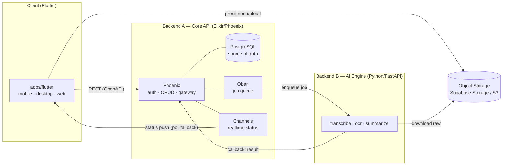
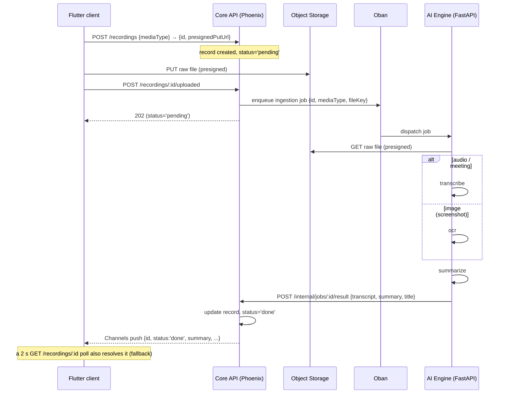

# Matome — Architecture

> Status: agreed · Last updated: 2026-06-20
> One Flutter client, one Elixir Core API, one external Python AI engine, one
> ingestion contract.
>
> **History.** The client tier was originally three JS/TS apps (Expo RN, Next.js,
> Tauri) over a generated TypeScript API client. They were consolidated into a
> single Flutter codebase — see
> [ADR-0001](decisions/ADR-0001-consolidate-to-flutter.md). The backend topology
> below is unchanged from that consolidation.

---

## 1. Principles

1. **Thin client.** The app only *captures* (record / pick a file), *uploads raw bytes*, and *reads results*. It never runs transcription, OCR, summarization, or any AI.
2. **The backend owns all processing.** Audio transcription, image OCR, and summarization happen server-side. Adding a media type or model is a backend change — the client doesn't ship.
3. **Server is the source of truth.** Records live in the Core API's Postgres. The client's local Drift (SQLite) store is an offline mirror, reconciled against the Core — not the authority.
4. **One ingestion contract for every media type.** Audio, meeting recordings, conversation screenshots, and future formats flow through one `upload → pending → process → done` path. The client is media-agnostic.
5. **Owned backends, one client language.** Core API is Elixir; the AI engine is Python. The client is Dart/Flutter.
6. **Contract-first.** The Core API publishes a REST (OpenAPI) surface; the Flutter client consumes it through its own Dart HTTP layer (`dio`). Ingestion status is pushed over **Phoenix Channels** (`RecordingStatusChannel`), which the client races against a periodic `GET /recordings/:id` poll as a fallback.

---

## 2. System overview



Plain-text fallback:

```
[Flutter client]
   |  \________ presigned upload ________→ [Object Storage: Supabase/S3]
   |                                              ^
   | REST (OpenAPI)                               | download raw
   v                                              |
[Backend A — Phoenix] ── Postgres (SoR)           |
   |   Oban (queue) ──enqueue──→ [Backend B — FastAPI] ──┘
   |                                   |
   |   ←──────── callback: result ─────┘
   └── Channels push (pending→processing→done) ──→ client (poll fallback)
```

**Hard rule:** the client talks only to the Core API + Storage. Only the Core API talks to the AI Engine. The AI Engine is never client-facing.

---

## 3. Backend A — Core API (Elixir / Phoenix)

Owns everything except AI.

| Concern | Choice |
|---|---|
| Framework | **Phoenix** |
| Language | **Elixir** (BEAM) |
| DB | **Supabase Postgres** (managed) — Ecto connects directly via connection string; system of record |
| ORM | **Ecto** |
| Auth | **Guardian** (JWT access + refresh), argon2 password hashing — users table in Postgres. Authz is app-level (no Supabase Auth/RLS). |
| Authorization | app-level scoping by `owner_id` (Ecto query scopes / policies) |
| Job queue | **Oban** (Postgres-backed) — dispatch + retry of AI jobs, no separate Redis |
| Realtime | **Phoenix Channels** + PubSub (`RecordingStatusChannel` on `user:*`) — push `pending→processing→done` to the client |
| Object storage | **Supabase Storage** — Core issues presigned PUT/GET URLs |
| API surface | REST, documented as **OpenAPI** (`open_api_spex`) |

Responsibilities: register/login, issue tokens, CRUD on matomes/recordings/spaces/contacts/notes, create the `pending` record, issue presigned upload URLs, enqueue ingestion jobs (Oban), receive AI results via internal callback.

---

## 4. Backend B — AI Engine (Python / FastAPI)

> **Lives in its own repository — NOT in this monorepo.** This repo integrates it purely via its HTTP contract (job dispatch + result callback) and ships a local mock at `services/ai-stub` for development. See [ai-engine-contract.md](ai-engine-contract.md).

Stateless processors. Only the Core API reaches it (service token, private network).

| Concern | Choice |
|---|---|
| Framework | **FastAPI** (Python) |
| Processors | `transcribe` (audio→text), `ocr` (image→text), `summarize` (text→summary) |
| Media access | downloads raw bytes from Object Storage via presigned GET |
| Result return | HTTP **callback** to the Core API (`/internal/jobs/:id/result`) |
| Auth | service token, never exposed to the client |

This is the home of the heavy ML (whisper, vision/OCR, LLM summarization). It stores nothing durable; the Core API is the SoR.

---

## 5. Client (Flutter)

A single Flutter codebase (`apps/flutter`) targets mobile, Linux desktop, and web. `apps/flutter_widgetbook` is an isolated design catalog.

| Layer (`lib/`) | Responsibility |
|---|---|
| `app/` | go_router routes, the shell scaffold, auth guard |
| `core/` | Drift DB, HTTP (`dio`), config, theme, providers, observability |
| `features/` | feature modules (matome, home/inbox, auth, recording, calendar, contacts, spaces, satori) |
| `ui/` | shared widgets (cards, badges, dialogs) |
| `i18n/` | slang translations (en/ja) |

- **State**: Riverpod. Controllers are `StateNotifier`s behind providers.
- **Persistence**: Drift (SQLite), offline-first — the UI watches the DB; an upload queue syncs local → Core in the background.
- **Capture**: native mic recording on mobile/desktop; loopback meeting capture on Linux desktop (ffmpeg); file import (audio/image) on every platform.
- **Design system**: Flutter `ThemeExtension`s governed by Widgetbook — see [ADR-0002](decisions/ADR-0002-flutter-design-system-foundation.md).

### Capability matrix
| Capability | Mobile | Desktop | Web |
|---|---|---|---|
| Record audio (mic) | ✅ | ✅ | ⚠️ platform-dependent |
| Record meeting (loopback) | ❌ | ✅ Linux (ffmpeg) | ❌ |
| Import file (audio/image) | ✅ | ✅ | ✅ |
| Read / search / organize | ✅ | ✅ | ✅ |
| Offline mirror (Drift) | ✅ | ✅ | ⚠️ online-first |

---

## 6. Contract

- **REST**: the Core API publishes an **OpenAPI** surface (`open_api_spex`). The Flutter client consumes it through a hand-written Dart HTTP layer (`dio`) under `lib/core/http`.
- **Realtime**: **Phoenix Channels** — the Core's `RecordingStatusChannel` (`user:*` socket) pushes ingestion status; the Flutter client (`lib/features/recordings/recording_status_socket.dart`) subscribes, and `recording_result_waiter.dart` races that channel against a 2 s `GET /recordings/:id` poll fallback.
- **Internal A↔B**: Core enqueues via Oban; the AI engine calls back over an authenticated internal endpoint. Not part of the public API.

---

## 7. Ingestion pipeline (the upload feature)

One path for every media type.



- **Statuses**: `pending → processing → done | failed`. The client renders each (with `failed` + retry).
- **mediaType**: `audio | meeting | image | (future: video, pdf)`. The client sets it at upload; the AI Engine routes on it.
- **Retry**: on processor error the Core sets `status='failed'`; client retry re-enqueues server-side (Oban), never processes locally.

---

## 8. Data model

The server-authoritative store lives in the Core's Postgres; the client mirrors it in Drift. The central entity is the **Matome** — a per-happening collection of items (recordings) that files into a space and syncs to the cloud (see [ADR-0003](decisions/ADR-0003-matome-central-entity.md) for the full entity model, [ADR-0004](decisions/ADR-0004-identity-permissions-triage.md) for identity/permissions/triage, and [matome-lifecycle.md](matome-lifecycle.md) for its cradle-to-grave flow).

Recordings (the items) carry, in essence:

```
recordings
  id            uuid pk          -- Core id; local rows keep a rec_local_<uuid> until reconciled
  owner_id      uuid (users)
  matome_id     uuid (matomes)   -- the collection this item belongs to
  title         text
  summary       text
  transcript    text
  media_type    text             -- 'audio' | 'meeting' | 'image' | ...
  storage_key   text             -- object key in the media bucket
  status        text             -- 'pending'|'processing'|'done'|'failed'
  ...
```

- Authorization is enforced in Ecto query scopes by `owner_id`.
- The client's Drift store is a per-user offline mirror, reconciled against the Core. A row is "on cloud" once it reconciles to a Core id; a matome's sync state rolls up from its items.

---

## 9. What lives where

| Concern | Home |
|---|---|
| Transcribe / OCR / summarize | AI Engine, dispatched by the Core (Oban) |
| create→process→update orchestration | Core API |
| Capture (record / import) | Flutter client |
| Offline mirror + upload queue | Flutter client (Drift) |

The client keeps: capture, presigned upload, creating the `pending` record, and reading/reconciling. Only processing lives on the backend.

---

## 10. Monorepo layout

```
matome/
├── apps/
│   ├── flutter/             # The client — mobile, Linux desktop, web
│   └── flutter_widgetbook/  # Isolated Widgetbook design catalog
├── services/
│   ├── api/                 # Backend A — Elixir/Phoenix (own toolchain)
│   └── ai-stub/             # Local Node mock of the AI engine (Backend B is a separate repo)
├── supabase/                # Local Postgres + S3 storage for dev
└── .docs/
```

The toolchain is managed by [mise](https://mise.jdx.dev/) (`mise run up`, `mise run flutter-*`). `services/ai-stub` is the only remaining Node component; everything client-side is Flutter and the Core is Elixir.

---

## 11. Design system

Canonical tokens originate in Figma (`LxpS0mmXZHPZ17qLufN7wB`): colors (light/dark), spacing, radius, typography. They are bound in Flutter as `ThemeExtension`s (`MatomeColors`, etc.) under `lib/core/theme`, exercised and governed by the Widgetbook catalog in `apps/flutter_widgetbook` and the `mise run flutter-design-system-check` gate. See [ADR-0002](decisions/ADR-0002-flutter-design-system-foundation.md).

---

## 12. History

The migration from the three JS/TS clients to Flutter is recorded in
[ADR-0001](decisions/ADR-0001-consolidate-to-flutter.md), the
[flutter-migration-report](flutter-migration-report.md), the
[flutter-lab-report](flutter-lab-report.md), and the
[parity-matrix](parity-matrix.md). Those documents are kept as the historical
record; this file describes the system as it stands now.

---

## 13. Glossary

- **SoR** — System of Record (authoritative store = Core Postgres).
- **Core API** — Elixir/Phoenix backend: auth, CRUD, storage gateway, orchestration.
- **AI Engine** — Python/FastAPI service running the ML processors; internal-only, separate repo.
- **Matome** — a per-happening collection of items (recordings) that files into a space.
- **Capture** — recording audio or picking a file on the client.

See the full domain glossary in [glossary.md](glossary.md).
