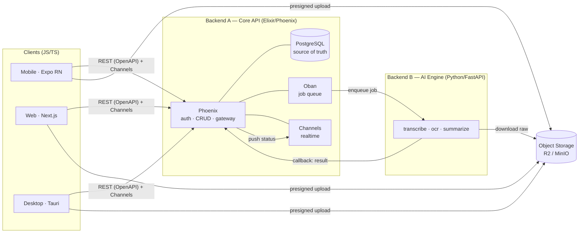
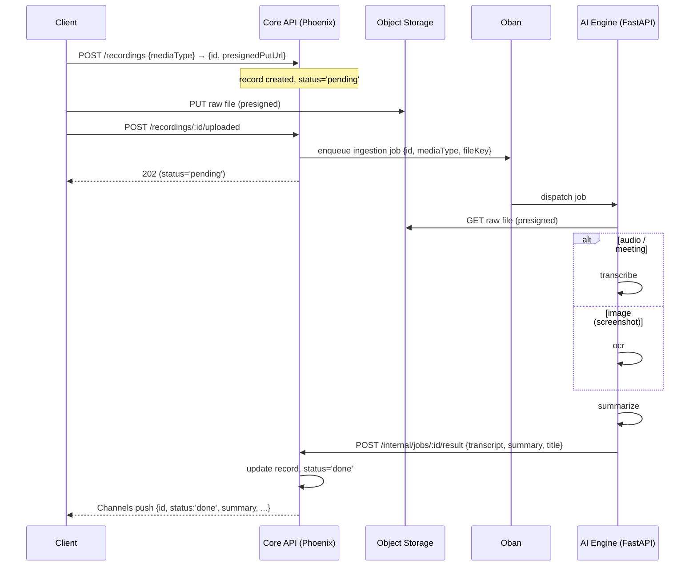

# Matome — Architecture

> Status: agreed · Last updated: 2026-06-04
> Two owned backends (no Supabase/BaaS), three JS/TS clients, one OpenAPI contract.

---

## 1. Principles

1. **Thin clients.** Mobile, web, and desktop only *capture* (record / pick a file), *upload raw bytes*, and *read results*. They never run transcription, OCR, summarization, or any AI.
2. **The backend owns all processing.** Audio transcription, image OCR, video handling, and summarization happen server-side. Adding a media type or model is a backend change — clients don't ship.
3. **Server is the source of truth.** Records live in the Core API's Postgres. Local stores (mobile SQLite, web cache) are offline mirrors, not authorities. This is what lets three clients share one dataset.
4. **One ingestion contract for every media type.** Audio, meeting recordings, conversation screenshots, and future formats flow through one `upload → pending → process → done` path. Clients are media-agnostic.
5. **No JavaScript in the backend.** Core API is Elixir; AI engine is Python. Clients are JS/TS (JS in the front is fine).
6. **Contract-first across languages.** The Core API publishes an OpenAPI spec; the TS client and Dart-free JS clients are generated from it. Realtime via Phoenix Channels.

---

## 2. System overview



Plain-text fallback:

```
[Mobile] [Web] [Desktop]            (JS/TS clients)
   |  \________ presigned upload ________→ [Object Storage: R2/MinIO]
   |                                              ^
   | REST(OpenAPI) + Channels(realtime)           | download raw
   v                                              |
[Backend A — Phoenix] ── Postgres (SoR)           |
   |   Oban (queue) ──enqueue──→ [Backend B — FastAPI] ──┘
   |                                   |
   |   ←──────── callback: result ─────┘
   └── Channels push (pending→processing→done) ──→ clients
```

**Hard rule:** clients talk only to the Core API + Storage. Only the Core API talks to the AI Engine. The AI Engine is never client-facing.

---

## 3. Backend A — Core API (Elixir / Phoenix)

Owns everything except AI. No Supabase.

| Concern | Choice |
|---|---|
| Framework | **Phoenix** |
| Language | **Elixir** (BEAM) |
| DB | **Supabase Postgres** (managed) — Ecto connects directly via connection string; system of record |
| ORM | **Ecto** |
| Auth (own) | **Guardian** (JWT access + refresh), argon2 password hashing — users table in Supabase Postgres. No Supabase Auth/RLS; authz is app-level. |
| Authorization | app-level scoping by `owner_id` (Ecto query scopes / policies) |
| Job queue | **Oban** (Postgres-backed, same Supabase DB) — dispatch + retry of AI jobs, no separate Redis |
| Realtime | **Phoenix Channels** + PubSub — push `pending→processing→done` to clients |
| Object storage | **Supabase Storage** — Core issues presigned PUT/GET URLs |
| API surface | REST, documented as **OpenAPI** (e.g. `open_api_spex`) |

Responsibilities: register/login, issue tokens, CRUD on recordings/spaces/notes, create the `pending` record, issue presigned upload URLs, enqueue ingestion jobs (Oban), receive AI results via internal callback, push status over Channels.

---

## 4. Backend B — AI Engine (Python / FastAPI)

> **Lives in its own repository — NOT in this monorepo.** This repo only owns the clients + Core API + shared packages. The AI Engine is integrated purely via its HTTP contract (job dispatch + result callback). It versions and deploys independently.

Stateless processors. Only the Core API reaches it (service token, private network).

| Concern | Choice |
|---|---|
| Framework | **FastAPI** (Python) |
| Processors | `transcribe` (audio→text), `ocr` (image→text), `summarize` (text→summary) |
| Job intake | consumes from Oban-dispatched jobs (HTTP enqueue) or pulls a queue |
| Media access | downloads raw bytes from Object Storage via presigned GET |
| Result return | HTTP **callback** to the Core API (`/internal/jobs/:id/result`) |
| Auth | service token, never exposed to clients |

This is the home of the heavy ML (whisper, vision/OCR, LLM summarization). It stores nothing durable; the Core API is the SoR.

---

## 5. Clients (JS/TS)

| Client | Stack | Role | Capture |
|---|---|---|---|
| **Mobile** | Expo RN (current app, kept) | full | record audio (mic) + upload |
| **Web** | Next.js (React, SSR/SEO) | review-first | upload |
| **Desktop** | **Tauri** (Rust shell + system webview) reusing the web React | full | record audio (native mic) + upload |

- **Desktop is native, not Electron**: Tauri = Rust core + OS webview (~3–10 MB), native capabilities (mic, fs, drag-drop, notifications) via Tauri commands.
- **Web reuse for desktop**: ship the same React components; desktop loads a static/SPA build (Next `output: 'export'` or a thin Vite shell in `apps/desktop`) inside Tauri.
- The earlier react-native-web "port" of the mobile app is **dropped** in favor of a purpose-built Next.js web app.

### Capability matrix
| Capability | Mobile | Web | Desktop |
|---|---|---|---|
| Record audio | ✅ | ❌ | ✅ |
| Upload file (audio/image/video) | ✅ | ✅ | ✅ |
| Read / search / organize | ✅ | ✅ (primary) | ✅ |
| Offline cache | ✅ SQLite | ⚠️ optional | ⚠️ optional |
| Realtime (Channels) | ✅ | ✅ | ✅ |

---

## 6. Cross-language contract

- **REST**: Core API publishes **OpenAPI**. Generate a **TS client** into `packages/api-client`, consumed by all three clients. One source of truth for request/response shapes.
- **Realtime**: **Phoenix Channels** — official JS client (`phoenix` npm) works in RN, Next.js, and the Tauri webview. Clients subscribe to a per-user channel for record status updates.
- **Internal A↔B**: Core enqueues via Oban; AI calls back over an authenticated internal endpoint. Not part of the public OpenAPI.

---

## 7. Ingestion pipeline (the upload feature)

One path for every media type.



- **Statuses**: `pending → processing → done | failed`. Clients render each (extend `RecordingCard` with `failed` + retry).
- **mediaType**: `audio | meeting | image | (future: video, pdf)`. Client sets it at upload; the AI Engine routes on it.
- **Retry**: on processor error the Core sets `status='failed'`; client retry re-enqueues server-side (Oban), never processes locally.

---

## 8. Data model (Core Postgres, server-authoritative)

```
recordings
  id            uuid pk
  owner_id      uuid (users)
  title         text
  summary       text
  transcript    text
  media_type    text            -- 'audio' | 'meeting' | 'image' | ...
  storage_key   text            -- object key in the media bucket
  status        text            -- 'pending'|'processing'|'done'|'failed'
  error_reason  text null
  duration      text null
  badge         text default 'Inbox'
  workspace_id  uuid null       -- null = inbox
  inserted_at   timestamptz
  updated_at    timestamptz
```

- Authorization is enforced in Ecto query scopes by `owner_id` (no Supabase RLS).
- **Mobile SQLite** keeps a per-user mirror as an **offline cache**, reconciled against the Core API. Not the source of truth.

---

## 9. What moves off the clients

| Removed from clients | New home |
|---|---|
| `services/audioRecordingService.transcribeAudio` (client→AI) | AI Engine, dispatched by Core |
| `services/summarizeService` (client→AI) | AI Engine |
| in-app create→transcribe→summarize→update orchestration | Core API (Oban) |
| `EXPO_PUBLIC_TRANSCRIBE_API_URL` | gone from clients; AI is internal-only |

Clients keep: capture (record/pick), presigned upload, create the `pending` record, read/subscribe. Recording capture stays on mobile/desktop; only processing leaves.

---

## 10. Monorepo layout (polyglot)

```
matome/
├── apps/
│   ├── mobile/          # Expo RN — iOS, Android (current app moves here)
│   ├── web/             # Next.js — desktop browsers, SSR/SEO
│   └── desktop/         # Tauri — macOS, Windows, Linux (reuses web React)
├── services/
│   └── api/             # Backend A — Elixir/Phoenix (outside JS workspace)
│                        # Backend B (AI/FastAPI) is a SEPARATE repo — not here
├── packages/
│   ├── api-client/      # TS client generated from the Core OpenAPI spec
│   ├── ui/              # design tokens (Figma) + shared React primitives
│   └── config/          # shared tsconfig, eslint, tailwind preset
├── .docs/
└── turbo.json           # JS workspaces via bun + Turborepo; Elixir/Python via task wrappers
```

JS/TS apps + packages use bun workspaces + Turborepo. `services/api` (Elixir, mix) lives in this repo and builds with its own toolchain. The real AI Engine is an external Python/FastAPI repo; this monorepo only includes the `services/ai-stub` local integration stub.

---

## 11. Design system

Canonical tokens live in Figma (`LxpS0mmXZHPZ17qLufN7wB`): colors (light/dark), spacing, radius, typography — exported with web `var(--...)` code-syntax.

- `packages/ui` is the single token source: **CSS variables** for web + desktop, and an **RN/UI-Kitten theme** for mobile. One palette, two bindings.
- Components are not shared across the RN/DOM boundary; tokens are. Web and desktop share React components directly.

---

## 12. Migration roadmap

Each phase shippable and reversible.

1. **Workspace conversion** — bun workspaces + Turborepo; move current app → `apps/mobile`; create `packages/{api-client, ui, config}`. Extract design tokens. No behavior change.
2. **Core API (Phoenix)** — scaffold `services/api`: auth (Guardian), Postgres + Ecto schema, recordings CRUD, presigned upload (R2/MinIO), Oban, Channels, OpenAPI spec. Generate `packages/api-client`.
3. **AI Engine contract** — define the HTTP contract and local stub here; scaffold/implement the real Python/FastAPI engine in its external repo. Wire Oban dispatch + result callback from Core against that contract.
4. **Decouple mobile** — replace client-side transcribe/summarize with: create `pending` via Core + presigned upload + Channels subscription. Remove AI URL from client config. Add the **upload feature** (`expo-document-picker`, `expo-image-picker`) on this path.
5. **Web app** — `apps/web` (Next.js) on the Core API: auth, inbox, detail, search, spaces, calendar, upload.
6. **Desktop** — `apps/desktop` (Tauri) reusing the web React; native mic capture so desktop records too.
7. **Retire RN-web path** — drop the web target + hacks (`metro.config` wasm/COEP, secure-store web shim) from `apps/mobile`. Mobile = iOS/Android.

---

## 13. Decisions

**Locked:** Core API = Elixir/Phoenix (Ecto, Guardian, Oban, Channels) · AI = Python/FastAPI **in a separate repo** (HTTP contract only) · **DB + Storage = Supabase** (managed Postgres via Ecto + Supabase Storage; no Supabase Auth/RLS/Edge) · clients = Expo RN + Next.js + Tauri (JS in front is fine) · contract = OpenAPI → generated TS client + Phoenix Channels · desktop native via Tauri (not Electron).

**Open:**
- AI job intake: Oban → HTTP dispatch to the AI repo, vs the AI service pulling a shared queue.
- Desktop bundle: Next `output: 'export'` vs a dedicated Vite React shell.
- Mobile offline writes: read-through cache only, or queue captures for upload-on-reconnect.
- Web SEO: Next.js SSR covers it; decide if a separate marketing site is needed.

---

## 14. Glossary

- **SoR** — System of Record (authoritative store = Core Postgres).
- **Core API** — Elixir/Phoenix backend: auth, CRUD, storage gateway, orchestration.
- **AI Engine** — Python/FastAPI service running the ML processors; internal-only.
- **Capture** — recording audio or picking a file on a client.
