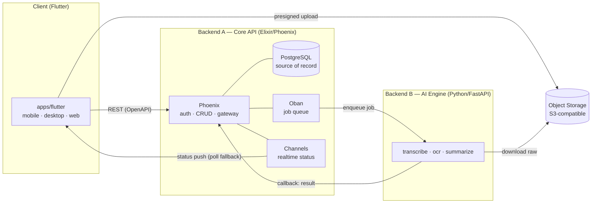
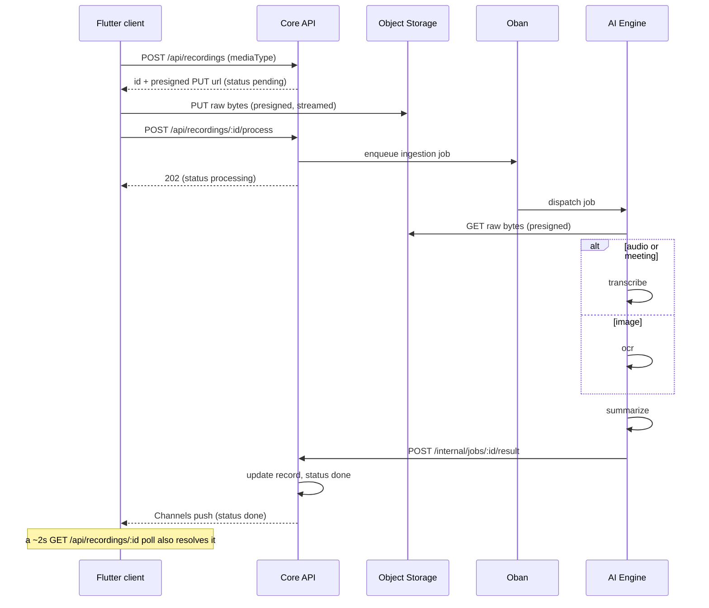

# Matome — Architecture

> Status: agreed · Last updated: 2026-07-03
> One Flutter client, one Elixir Core API, one external Python AI Engine, one
> ingestion contract. This is the single architecture record: the decisions that
> used to live in separate ADRs are folded into §11 (Decision log) so nothing is
> lost. Where code and this doc disagree, the code wins.
>
> Companions: product framing in [`prd.md`](prd.md), requirements in
> [`requirements.md`](requirements.md), behaviour in [`../use-cases.md`](../use-cases.md).
> At-rest encryption (D8, plan #131): design in [`at-rest-key-flow.md`](at-rest-key-flow.md),
> decision record in [ADR-0002](../../services/api/docs/adr/0002-envelope-encryption-key-hierarchy.md),
> honest verification state in [`dod-matrix-1857.md`](dod-matrix-1857.md), forward rollout
> in [`runbook-at-rest-migration.md`](runbook-at-rest-migration.md).

---

## 1. Principles

1. **Thin client.** The app only *captures* (record / pick a file), *uploads raw bytes*, and *reads results*. It never runs transcription, OCR, or summarization.
2. **The backend owns all processing.** Transcription, OCR, and summarization are server-side. Adding a media type or model is a backend change — the client doesn't ship.
3. **Server is the source of record.** Records live in Core's Postgres. The client's Drift (SQLite) store is an offline mirror, reconciled against Core — not the authority.
4. **One ingestion contract for every media type.** Audio, meetings, images, and future formats flow through one `upload → pending → process → done` path. The client is media-agnostic.
5. **Local-first organization, decoupled from sync.** Items are organized on-device; whether they sync is a separate question answered by a single resolver (§5).
6. **Owned backends, one client language.** Core API is Elixir; the AI Engine is Python; the client is Dart/Flutter.
7. **Contract-first.** Core publishes a REST (OpenAPI) surface consumed by the Flutter `dio` layer; ingestion status is pushed over Phoenix Channels, raced against a poll fallback.

---

## 2. System overview



**Hard rule:** the client talks only to Core + Storage. Only Core talks to the AI Engine. The AI Engine is never client-facing.

---

## 3. Backend A — Core API (Elixir / Phoenix)

Owns everything except AI.

| Concern | Choice |
|---|---|
| Framework / language | **Phoenix** / **Elixir** (BEAM) |
| DB | **Postgres** via **Ecto** — system of record (`DATABASE_URL`; local native or managed) |
| Auth | **Guardian** (JWT access + refresh), **Argon2** hashing; users in Postgres. App-level authz (no third-party Auth/RLS). Session auth is layered under a separate **at-rest key envelope** (plan #131 / [ADR-0002](../../services/api/docs/adr/0002-envelope-encryption-key-hierarchy.md)): `POST/GET /keybundle` (+ `/keybundle/recovery`) stores only opaque `wrapped_dek_*` blobs + salts/KDF params — the server never receives the password, the KEK, or the DEK. `auth_secret` (login) and the password-KEK (data-key unwrap) are independent Argon2id derivations of the same password under distinct salts, so a credential the server legitimately sees can never unwrap client data. See §11 D8 below for what of this is implemented+tested vs dark/deferred. |
| Authorization | scoping by `owner_id` (Ecto query scopes) |
| Job queue | **Oban** (Postgres-backed) — dispatch + retry of AI jobs |
| Realtime | **Phoenix Channels** + PubSub (`RecordingStatusChannel` on `user:*`) |
| Object storage | **S3-compatible** (MinIO local / R2 or S3 in prod) — Core issues path-style presigned PUT/GET URLs ([data-plane.md](../../services/api/docs/data-plane.md)) |
| API surface | REST, documented as **OpenAPI** (`open_api_spex`) |

Responsibilities: register/login + tokens; CRUD on matomes / recordings / spaces / contacts; create the `pending` record; issue presigned upload URLs; enqueue ingestion jobs; receive AI results via internal callback; archive/restore.

**Public REST surface (owner-scoped unless noted):** `/api/auth/{register,login,refresh,logout}` (public) + `/api/auth/me`; `/api/spaces` (+ `/search`, `/:id`); `/api/recordings` (+ `/search`, `/:id`, `/:id/process`, `/:id/download-url`, `/:id/contacts`); `/api/matomes` (+ `/search`, `/:id`, `/:id/archive`, `/:id/restore`, `/:id/contacts`); `/api/contacts` (+ `/search`, `/:id`). **Internal:** `POST /internal/jobs/:id/result` (AI callback, service-token).

> Note: the physical `workspaces` table / `workspace_id` FK is the **Space** concept (logical rename); the code keeps the legacy name.

---

## 4. Backend B — AI Engine (Python / FastAPI)

> **Lives in its own repository — NOT in this monorepo.** This repo integrates it via its HTTP contract (job dispatch + result callback) and ships a local mock at `services/ai-stub`.

Stateless processors (`transcribe`, `ocr`, `summarize`). Only Core reaches it (service token, private network). It downloads media via presigned GET and returns one terminal result via callback. It stores nothing durable.

**Contract.** Core → AI: `POST /v1/jobs` `{job_id, recording_id, media_type, storage_key, media:{method:GET,url,expires_at}, callback:{url,method:POST}, metadata}` → `202 {accepted:true}`. AI → Core: `POST /internal/jobs/:job_id/result` with `status:done` (`title, transcript, summary, duration`) or `status:failed` (`error.{code,message}`), both `Bearer <AI_ENGINE_TOKEN>`. Callback is idempotent per `job_id`; `metadata` is advisory and must not be used for authorization. Local stub: `bun run ai:stub` (default `http://127.0.0.1:7002/v1/jobs`).

---

## 5. The local-first organization model (central)

Organization and sync are two independent questions, joined only by the **effective space** resolver.

### Membership lattice (composable)

An item (a `recordings` row — audio, image, file) is in exactly one state, composing freely with the matome/space graph:

```
LOOSE              recording.matomeId = NULL  AND  recording.workspaceId = NULL
IN A MATOME        recording.matomeId set      (the matome may be a DRAFT — no space)
FILED INTO A SPACE recording.workspaceId set, no matome wrapper
```

A **draft matome** has items but no space (`matome.spaceId = NULL`). Nothing forces a matome before a space, or a space before sync.

### Effective space — the single precedence rule

```
effectiveSpace(item) =
    matome.spaceId        if item IS IN A MATOME   (matome WINS)
    else recording.workspaceId                     (filed directly)
    else NULL                                       (loose, or draft matome)
```

- **Matome membership wins.** An item's own `workspaceId` is **shadowed, not cleared**, when it joins a matome; it reappears on leave. Reading `recording.workspaceId` directly is a bug for any item that is (or ever was) in a matome.
- One resolver (`apps/flutter/lib/features/spaces/effective_space.dart`) owns this and is the **sole sync-eligibility authority**. It consumes a Space value object `{id, syncMode, tenancy, ownerId}` and returns a sealed `SyncStatus` (no default arm).

### Inbox = a VIEW

```
INBOX ⟺ effectiveSpace(item) == NULL          (loose items + draft matomes)
```

Inbox is a derived view computed on read — **never** a stored column, boolean, sentinel id, or magic row (no `is_inbox`).

### Sync gate

```
SYNC(item) ⟺ effectiveSpace(item) is a CLOUD space
           ⟺ effectiveSpace(item) != NULL  AND  thatSpace.is_local == false
```

- A Space carries `is_local` (m017, additive, **default local**). A **local** space's items never sync; a **cloud** space's items sync.
- **Filing organizes; landing in a cloud space syncs.** Filing is no longer the sync trigger.
- The decision flows through **one operation-keyed gate**: `SyncPolicy.can(caller, Operation.spaceSync, space)` (`apps/flutter/lib/features/spaces/sync_policy.dart`) — never an inline `if isCloud`, never a fixed role enum. Today it returns `isCloudSynced` (owner ⇒ allow).
- **Promotion** turns a local space cloud — one-way in v1, with itemized consent ("N items will leave this device"), per-item idempotency (keyed on stable/Core id), and a sealed `local → promoting → cloud | failed` state machine with resume (`space_promotion.dart`). State is re-derived from `is_local` + each item's `coreId`, not a new column.

### Two axes, never collapsed (forward-compat)

| Axis | Question | Column | Values | Status |
|---|---|---|---|---|
| **A — sync mode** | does it sync? | `workspaces.is_local` | local \| cloud | **built** (m017) |
| **B — tenancy** | who owns it? | `workspaces.space_type` | personal \| shared \| org | **reserved / unenforced** |

Orthogonal columns, never merged. Invariants couple them: **`local ⟹ personal`**, **`org ⟹ cloud`**; `personal` may be local or cloud. Keying sync off `space_type`, adding an `org_local` cell, or merging the columns is forbidden.

> The whole behaviour is behind `FeatureFlags.localFirstSpaces` (default OFF; single-flip rollback).

---

## 6. Ingestion pipeline (one path for every media type)



- **Statuses:** `pending → processing → done | failed` (client renders each + retry).
- **mediaType:** `audio | meeting | image` (future `video | pdf`); set by the client at upload, routed by the AI Engine.
- **Retry:** on processor error Core sets `failed`; client retry re-enqueues server-side, never processes locally.

---

## 7. Client (Flutter)

A single Flutter codebase (`apps/flutter`) targets mobile, Linux desktop, and web. `apps/flutter_widgetbook` is an isolated design catalog.

| Layer (`lib/`) | Responsibility |
|---|---|
| `app/` | go_router routes, shell scaffold, auth guard |
| `core/` | Drift DB, HTTP (`dio`), config, theme, providers, observability |
| `features/` | feature modules (auth, home/inbox, recording, recordings, matome, details, spaces, contacts, calendar, files, satori, sync) |
| `ui/` | shared widgets |
| `i18n/` | slang translations (en/ja) |

- **State:** Riverpod (`StateNotifier`s behind providers). **Routing:** one flat go_router tree; matome detail is one breakpoint-driven route. **Persistence:** Drift, offline-first — UI watches the DB; an upload queue syncs local → Core in the background.
- **Capture:** mic on mobile/desktop; loopback meeting capture on Linux desktop (ffmpeg); file import everywhere.

### Capability matrix
| Capability | Mobile | Desktop | Web |
|---|---|---|---|
| Record audio (mic) | ✅ | ✅ | ⚠️ platform-dependent |
| Record meeting (loopback) | ❌ | ✅ Linux (ffmpeg) | ❌ |
| Import file (audio/image/doc) | ✅ | ✅ | ✅ |
| Read / search / organize | ✅ | ✅ | ✅ |
| Offline mirror (Drift) | ✅ | ✅ | ⚠️ online-first (in-memory) by default; an encrypted-OPFS-image opt-in path exists (§11 D8) but is not wired into the app's boot provider |

---

## 8. Data model

Server-authoritative store in Core Postgres; mirrored in Drift. The central entity is the **Matome** — a per-happening collection of items.

```
recordings
  id          uuid pk      -- Core id; local rows keep rec_local_<uuid> until reconciled
  owner_id    uuid (users)
  matome_id   uuid (matomes)    -- nullable: item may be loose
  workspace_id uuid (workspaces) -- nullable: filed-directly space (shadowed when in a matome)
  title / summary / transcript / notes  text
  media_type  text          -- audio | meeting | image | ...
  storage_key text
  status      text          -- pending | processing | done | failed
matomes
  id / owner_id / space_id (nullable ⇒ draft) / title / happened_at
  aggregated_summary / summary_stale / archived_at (soft-delete) / core_id
workspaces (= Space)
  id / owner_id / name / is_local (m017) / space_type (m006, reserved)
contacts (+ matome_contacts, space_contacts, matome_shares, space_members)
```

- Authorization is enforced in Ecto query scopes by `owner_id`.
- The Drift store is a per-user offline mirror, reconciled by `core_id`; a Matome's sync chip rolls up from its items (`onDevice → partial → cloud`).

---

## 9. Lifecycle of a Matome (summary)

- **Birth** — minted implicitly when the first item enters (1 item → 1 Matome); local id `mat_local_<uuid>`. No blank-Matome flow.
- **Add items** — photo/file upserted against the existing Matome; summary marked stale.
- **Upload + processing** — per-item ingestion (§6); status `pending_upload → processing → done | failed`.
- **Summary** — aggregated summary is a local deterministic composition of item summaries, regenerated on demand; staleness flips on add/remove/change.
- **Edit** — rename + date/time, local-first then `PATCH` when reconciled.
- **Triage** — file into a Space (§5); only cloud-space items push to Core.
- **Contacts** — tagged via `matome_contacts` with a role.
- **Death** — **archive** (soft-delete, offline-first, Undo restore) is the user-facing path; converges across sync via an adopt-guard on pull + a re-push pass. Hard-delete exists in the data layer but is not a surfaced UI flow.

---

## 10. Monorepo layout

```
matome/
├── apps/
│   ├── flutter/             # The client — mobile, Linux desktop, web
│   └── flutter_widgetbook/  # Isolated Widgetbook design catalog
├── services/
│   ├── api/                 # Backend A — Elixir/Phoenix
│   └── ai-stub/             # Local Node mock of the AI Engine (Backend B is a separate repo)
├── script/                  # Native local data plane (Postgres + MinIO)
└── .docs/
```

Toolchain via [mise](https://mise.jdx.dev/) (`mise run up` = native Postgres + MinIO + Core + AI stub; `mise run flutter-*`). Design tokens originate in Figma (`LxpS0mmXZHPZ17qLufN7wB`), bound as Flutter `ThemeExtension`s under `lib/core/theme`, governed by the Widgetbook catalog + `mise run flutter-design-system-check`.

---

## 11. Decision log (folded from the former ADRs)

The historical decisions, kept here as the durable record:

- **D1 — Consolidate to Flutter.** The client tier was three JS/TS apps (Expo RN, Next.js, Tauri) over a generated TS API client; they were consolidated into one Flutter codebase. Backend topology unchanged. ~~Web is online-only (no at-rest local store).~~ **Superseded by D8 below (plan #131):** web now has an opt-in encrypted-at-rest local store (chunked AES-256-GCM DB image in OPFS); it defaults OFF and is not wired into the app's boot path, so "online-only, in-memory" remains today's *actual default behaviour*, but it is no longer true that no at-rest local store exists at all. See D8 for the honest implemented-vs-dark split.
- **D2 — Design-system foundation.** Canonical tokens in Figma, bound as Flutter `ThemeExtension`s, governed by Widgetbook + the DS-check gate. The app-owned route/Page layer contract and current route inventory live in [`design-system-route-contract.md`](design-system-route-contract.md).
- **D3 — Matome is the central entity.** A Matome is a per-happening, fixed-structure aggregate of items + contacts + summaries + notes. *(Its original forced-Matome invariant — every recording in exactly one Matome — was later repealed by D6.)*
- **D4 — Identity, permissions, triage.** Contacts are owner-owned with an optional `linkedUserId`. Spaces carry `type` (personal/shared/org) + `owner_id`; `space_members` carry RBAC roles; `organizations` may own spaces. **Schema is reserved; behaviour is deferred and unenforced** (sharing, ACLs, multi-user sync, org management). A linked contact's profile is viewable without consent — a recorded, revisitable privacy risk.
- **D5 — Matome detail = letter + responsive panel.** One route renders a stacked "letter" on narrow viewports and letter + persistent side panel at ≥ 900 px via a `LayoutBuilder` (no nested navigator).
- **D6 — Item organization decoupled from sync** (plan #102, the §5 model). Supersedes D3's forced-Matome rule; amends D4's "filing ⟹ sync". Effective-space resolver + one operation-keyed sync gate + two-axis (`is_local` ⟂ `space_type`) model + one-way promotion. **Accepted risk:** local-default means an unsynced item lives only on the device; a device wipe loses it (owner-accepted trade-off of the local-first default).
- **D7 — Master–detail layout (email-style), Settings-controlled** (plan #102, W1). Graduated from the approved Widgetbook proposal `[Proposals]/Master–detail layout`.
  - **Decision:** every collection surface (Inbox, Files, Spaces, Contacts) renders through **one** reusable `MasterDetailScaffold` (`apps/flutter/lib/ui/master_detail_scaffold.dart`) — a master list plus an optional right-hand **reading pane**. Pane visibility is a single GLOBAL persisted setting, `readingPaneProvider` (`ReadingPanePosition { right, off }`), switchable **only** from Settings (no in-screen toggle). Layout uses unified breakpoints (`apps/flutter/lib/core/layout/breakpoints.dart`: `compact < 600` / `medium 600–1024` / `expanded ≥ 1024`); the pane shows only at `expanded` **and** `right`, while `compact` navigates full-screen. The Files reading-pane content is `FileView` (the shared body), **not** the full `FileDetailScreen`. The whole behaviour is gated behind `FeatureFlags.masterDetailLayout` (default **OFF** — a single flag flip is the rollback).
  - **Rejected alternatives:** a left-hand pane (right-hand chosen, email-style); per-surface pane settings (gold-plating — the global setting widens to per-surface additively later if ever needed); an in-screen pane toggle (Settings-only chosen, so the choice is global and stable); embedding the 33 KB multi-`Scaffold` `FileDetailScreen` in the pane (nested-`Scaffold` breakage — use `FileView`, the shared body).
  - **Accepted note:** unifying the legacy `1000` breakpoint onto `1024` is an intentional behaviour change for viewports in the half-open range `[1000, 1024)` (formerly two-pane, now single-pane until `1024`).

- **D8 — Envelope encryption at-rest, client-side** (plan #131 "Parte 1 — unified login + at-rest encryption"). Adopts a three-tier **DEK/KEK/FEK** hierarchy — one random 256-bit DEK per user wrapped independently under a password-KEK, a recovery-KEK, and (native only) a device-keystore KEK; media is encrypted per-file under its own FEK, itself wrapped by the DEK. Full rationale, rejected alternatives, and the frozen wire format: [ADR-0002](../../services/api/docs/adr/0002-envelope-encryption-key-hierarchy.md) + [`at-rest-key-flow.md`](at-rest-key-flow.md) Appendix A. Auth-secret (`Argon2id(password, salt_auth)`, sent to the server) and the password-KEK (`Argon2id(password, salt_enc)`, never leaves the client) are deliberately independent derivations of the same password — see §3's Auth row. The honest cross-platform verification state (what was actually run, on what host, vs. read-from-source) is [`dod-matrix-1857.md`](dod-matrix-1857.md); forward rollout steps and the recovery-posture matrix are [`runbook-at-rest-migration.md`](runbook-at-rest-migration.md).

  **Implemented + tested (this repo, this session, real code path):**
  - Crypto core (`envelope.dart`, `key_material.dart`, `key_unwrapper.dart`) — wrap/unwrap, AEAD framing, tamper detection — one shared `KeyUnwrapper.unwrapDek` core for every backend (password / recovery / device-keystore).
  - Core API `/keybundle` (+ `/keybundle/recovery`) — stores/returns only opaque blobs; verified the server never persists anything but ciphertext + salts/KDF params.
  - Recovery-code enrollment, round-trip, and single-use rotation (Elixir + Flutter).
  - Linux desktop: real SQLCipher build, encrypted DB open, wrong-key fails-closed, offline cold-start — all exercised against a real (throwaway) SQLCipher `.so`, not a mock (spike **#815**, `apps/flutter/tool/spike_815_sqlcipher/DECISION.md` — GO on a **hand-rolled** native connection, not the stock `sqlcipher_flutter_libs` plugin).
  - Media crash-safe re-encrypt migration engine (`media_migration.dart`, task #1856) — per-file state machine with fsync'd atomic swap, verify-before-unlink, resumable crash-replay, and an explicit `rollback()` restoring the plaintext original from a backup + SHA-256 check.
  - Web: an MVP encrypted-DB-image-in-OPFS path (`connection_web.dart`'s `openEncryptedWebConnection`, task #1860/#1861) — whole-image AES-256-GCM codec, offline keybundle cache, hardened CSP + partial SRI as XSS-durability mitigations.

  **Dark / deferred (flag exists, mechanism proven, NOT production-live):**
  - `kSqlCipherEnabled` (native DB) and the media-encryption flag both default **OFF** — no per-platform SQLCipher library is packaged into the real build (Android Gradle / Linux CMake step), and the Android/iOS round-trip has never run on a device or emulator (no hardware available in this environment).
  - No plaintext→encrypted **DB** migration exists yet (media migration does; the DB does not) — flipping `kSqlCipherEnabled` against an existing plaintext `matome.sqlite` fails closed today rather than migrating it.
  - Normal-login `salt_auth` pre-auth bootstrap is unwired — the crypto primitives are proven, the end-to-end *login* flow that would drive them in production is not.
  - Web's `openEncryptedWebConnection` is not called from the app's boot provider (`appDatabaseProvider`) — there is no reachable click-path in the shipped app today; it is unit- and codec-level tested, not exercised in a real browser session in this environment.
  - Mobile (Android/iOS) is entirely unverified end-to-end for at-rest encryption — the Dart-level mechanism is platform-agnostic, which lowers but does not eliminate the risk.
  - `passkey-KEK` and `space-KEK` (multi-user encrypted spaces) are reserved wire-format slots, unimplemented.

  **Accepted, disclosed limits (not gaps — permanent scope boundaries, ADR-0002 "Honest limits"):** Core API still stores recordings/transcripts in plaintext (server-side transcription needs it); the zero-knowledge guarantee is strongest on native and weaker on web (JS is served fresh every load); an active in-session compromise (XSS, malware) can still read the live DEK and decrypted plaintext — envelope encryption defends **at rest**, not a live session.

### Known gaps / next (carry-forward ledger — inherited by P2 planning)

Restated here, not just in a single task's comments, so it survives past the task that raised it. Source: `dod-matrix-1857.md`'s carry-forward ledger (same numbering).

| # | Gap | State |
|---|---|---|
| CF-1 | Normal-login `salt_auth` pre-auth bootstrap unresolved — `AuthRepository.login` can't fetch `salt_auth` before authenticating (the recovery/reset path solved its own version of this; the *normal* login flow did not). | OPEN |
| CF-3 | `kSqlCipherEnabled` stays dark — no production per-platform SQLCipher library packaged for Android/iOS; device/emulator round-trip never run. | OPEN — **ship blocker** for native at-rest GO-LIVE |
| CF-4 | Plaintext-DB → encrypted-DB migration does not exist (media migration does). Flipping the native flag on an existing plaintext `matome.sqlite` fails closed instead of migrating. | OPEN — **ship blocker** |
| CF-6 | Media-encryption flag dark end-to-end — the Core ingestion pipeline is not yet ciphertext-aware. | OPEN |
| CF-7 | The live-recording segment path is still plaintext. | OPEN |
| CF-8 | Web page-level VFS deferred — shipped MVP is whole-image encrypt/decrypt, not per-page (needs a dedicated Worker + SharedArrayBuffer + COOP/COEP). | OPEN |
| CF-9 | `WebOpfsBlobStore` end-to-end has not been independently re-proven in a real browser this session; the only real-Chromium confirmation on record is from task #1860's own session. | OPEN |
| CF-10 | `FeatureFlags.godMode` weakens the web CSP; unchanged by plan #131. | OPEN |

P2 planning starts from this table, not from a clean slate — closing CF-3/CF-4 is the prerequisite for any native at-rest GO-LIVE; the rest are sequencing decisions, not unknowns.

### Forward-compat seams (deferred org / admin / data-policy / SSO / RBAC)

Plan #102 leaves **seams, not features**, so the deferred work plugs in without a rewrite:

- **Resolver seam** — the Space value object already carries `tenancy` + `ownerId` (constants today), so org-spaces add one branch.
- **Authorization seam** — guarding is **operation-keyed** (`SyncPolicy.can(caller, Operation, space)`), a client mirror of a future Core **Bodyguard/PDP** seam. Roles/operations are future **DATA**, not enums — custom roles add zero call-site changes. The sealed sync-status type makes a new state (`orgManaged`/`policyBlocked`) a compile error at every switch.
- **Identity seam** — `owner_id` is a stable user id (not email), so SSO-linked identities map cleanly.
- **Deferred configurable-RBAC** — the full data-driven model (users × groups × custom roles × operations + a PDP + an engine choice: OpenFGA/Oso/Casbin/hand-rolled) is a **separate deferred plan** (tag `#future-plan`). #102 adopts only the seam.

---

## 12. Glossary (essentials)

- **Matome** — a per-happening collection of items (recordings); the central entity. *(Distinct from the `Matome*` brand/theme namespace.)*
- **Space** — a container of Matomes (table `workspaces`); `is_local` (sync mode) + `space_type` (tenancy).
- **Item / recording** — a child of a Matome (audio / meeting / image), or a loose/directly-filed file.
- **Loose item** — no matome and no space → Inbox, never syncs.
- **Draft matome** — a matome with no space → Inbox, unsynced until filed.
- **Inbox** — the VIEW of everything whose effective space is NULL. (Banned synonym: **"unfiled"**.)
- **Local / Cloud space** — `is_local` true/false; sync ⟺ effective space is a cloud space.
- **Capture** — recording audio or picking a file on the client.
- **SoR** — system of record (Core Postgres).
- **Master–detail** — the email-style layout (D7) where a collection surface is a master list plus an optional reading pane; implemented by `MasterDetailScaffold`.
- **Reading pane** — the optional right-hand detail pane of a master–detail surface; visible only at `expanded` + `right`. (Code: the `right` arm of `MasterDetailScaffold`.)
- **`MasterDetailScaffold`** — the one reusable widget every collection surface renders through (`apps/flutter/lib/ui/master_detail_scaffold.dart`).
- **`readingPaneProvider`** — the single GLOBAL persisted Riverpod provider holding the reading-pane setting (`apps/flutter/lib/core/settings/reading_pane.dart`); Settings-only.
- **`ReadingPanePosition`** — the pane-position enum, `{ right, off }` (defined in `master_detail_scaffold.dart`).
- **DEK / KEK / FEK** (D8) — the envelope-encryption key hierarchy: one **D**ata **E**ncryption **K**ey per user (decrypts the local DB + media); a set of independent **K**ey **E**ncryption **K**eys (password / recovery / device-keystore) that each wrap the same DEK; a per-file **F**ile **E**ncryption **K**ey wrapped by the DEK. Full detail: [ADR-0002](../../services/api/docs/adr/0002-envelope-encryption-key-hierarchy.md), [`at-rest-key-flow.md`](at-rest-key-flow.md).
- **`/keybundle`** — the Core API endpoint pair storing/returning only opaque `wrapped_dek_*` blobs + salts/KDF params for a user; the server cannot unwrap a DEK from it (D8).
