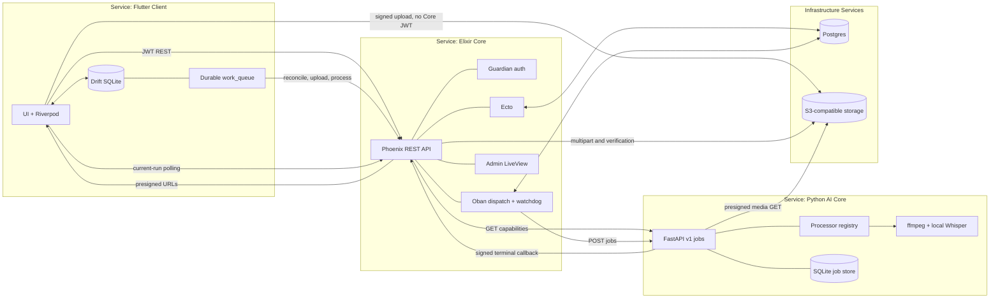
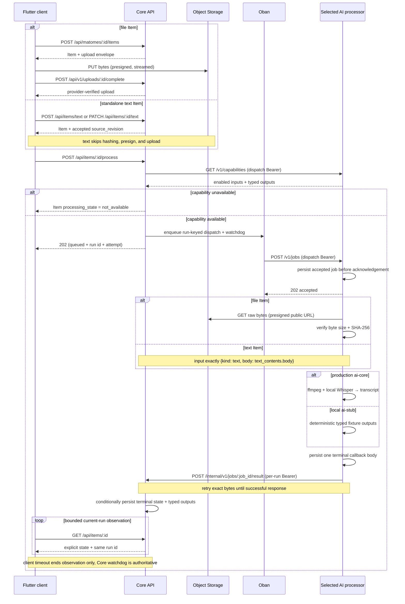
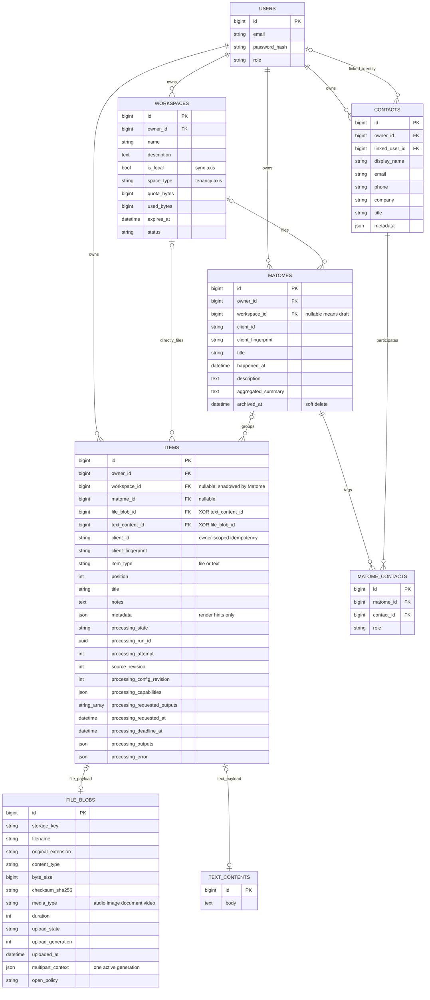

# Matome — Architecture

> Status: implemented architecture record · Last updated: 2026-07-20
> One Flutter client, one Elixir Core API, one in-repo Python AI Core, one
> ingestion contract. This is the single architecture record: the decisions that
> used to live in separate ADRs are folded into §11 (Decision log) so nothing is
> lost. Where code and this doc disagree, the code wins.
>
> Companions: product framing in [`prd.md`](prd.md), requirements in
> [`requirements.md`](requirements.md), behaviour in [`../use-cases.md`](../use-cases.md).
> At-rest encryption (D8, plan #131): design in [`at-rest-key-flow.md`](at-rest-key-flow.md),
> decision record in [ADR-0002](../../services/api/docs/adr/0002-envelope-encryption-key-hierarchy.md),
> honest verification state in [`dod-matrix-1857.md`](dod-matrix-1857.md), forward rollout
> in [`runbook-at-rest-migration.md`](runbook-at-rest-migration.md).

---

## 1. Principles

1. **No inference in the client.** Flutter owns capture, local organization, durable offline intent, upload, and result presentation. It never runs transcription, OCR, model summarization, or other inference.
2. **The backend owns all processing.** AI work is server-side. Production currently implements audio transcription only; OCR, summarization, title generation, document extraction, embeddings, and classification remain capability-gated future processors.
3. **Authority follows sync intent.** Core Postgres is authoritative for reconciled cloud records. Drift is the durable local authority for content deliberately kept on-device and the offline mirror for records that reconcile with Core.
4. **One processing contract for every input kind.** Audio, meetings, images, documents, and text use explicit run state and typed outputs. File inputs use verified upload before processing; text uses durable local-first reconciliation and deliberately skips upload.
5. **Local-first organization, decoupled from sync.** Items are organized on-device; whether they sync is a separate question answered by a single resolver (§5).
6. **Owned backends, one client language.** Core API is Elixir; production AI Core is Python/FastAPI; deterministic local AI fixtures and the optional legacy adapter are Node; the client is Dart/Flutter.
7. **Contract-first.** Core publishes a REST (OpenAPI) surface consumed by the Flutter `dio` layer. The client observes one explicit current processing run through bounded owner-scoped polling; Core remains authoritative for that server processing run.

---

## 2. System overview



**Hard rule:** the client talks only to Core + Storage. AI processors are
service-to-service and never client-facing. Oban is not a separate container:
it runs inside the Phoenix OTP application and persists its jobs in Postgres.

The diagram shows the canonical production service boundaries. Environment
substitutions and test-only integrations stay outside it:

| Environment/path | AI processor | Status |
|---|---|---|
| Local Compose | `services/ai-stub` | Deterministic replacement for AI Core |
| Production Compose | `services/ai-core` | Canonical production processor |
| Endpoint override | `services/ai-adapter` | Optional legacy bridge to a synchronous audio API |
| AI Core live tests | LM Studio | Text, tools, and vision tests only; not connected to job dispatch |

Widgetbook is also outside the runtime diagram: it is a development catalog,
not an application service.

---

## 3. Backend A — Core API (Elixir / Phoenix)

Owns everything except AI.

| Concern | Choice |
|---|---|
| Framework / language | **Phoenix** / **Elixir** (BEAM) |
| DB | **Postgres** via **Ecto** — authority for reconciled/cloud server records (`DATABASE_URL`; local Compose or managed production service) |
| Auth | **Guardian** JWT access + refresh, **Argon2** password hashing, users in Postgres, app-level owner scoping. Current Flutter login sends the password over the protected Core connection; the planned normal-login `auth_secret` bootstrap is not wired. The separate at-rest key envelope stores opaque `wrapped_dek_*` material through `/keybundle`; see §11 D8 for the exact implemented/dark split. |
| Authorization | scoping by `owner_id` (Ecto query scopes) |
| Job queue | **Oban** (Postgres-backed) — run-keyed dispatch, retry, and timeout watchdog for AI jobs |
| Processing observation | Owner-scoped Item REST polling by current run id; one request in flight with bounded backoff |
| Object storage | **S3-compatible** (MinIO local / R2 or S3 in prod). `STORAGE_S3_ENDPOINT` is the browser/processor-public presign origin; `STORAGE_S3_INTERNAL_ENDPOINT` is the Core-only control origin for multipart, HEAD, reads, and deletes ([data-plane.md](../../services/api/docs/data-plane.md)). |
| API surface | REST, documented as **OpenAPI** (`open_api_spex`) |

Responsibilities: register/login + tokens; owner-scoped CRUD; reconcile local Items;
issue presigned upload URLs; verify single/multipart completion; discover AI
capabilities; create the current processing run; enqueue dispatch + watchdog
jobs; receive signed terminal callbacks; project current state for polling;
archive/restore; and serve the admin/backoffice surfaces.

**Public processing surface (owner-scoped):** `POST /api/items/:id/process`.
Standalone text creation is `POST /api/items/text`; revision-guarded text edit
and delete are `PATCH /api/items/:id/text` and `DELETE /api/items/:id/text`.
**Internal:** `POST /internal/v1/jobs/:id/result` (per-run signed AI callback).

> Note: the physical `workspaces` table / `workspace_id` FK is the **Space** concept (logical rename); the code keeps the legacy name.

---

## 4. AI processing tier

All processor variants implement the same versioned HTTP boundary. Core first
calls authenticated `GET /v1/capabilities`, then its Oban dispatch worker sends
`POST /v1/jobs`. The processor durably accepts before returning `202`, executes
outside the request, persists one terminal body, and retries delivery to
`POST /internal/v1/jobs/:job_id/result`. HTTP callback delivery is therefore
**at-least-once**; the persisted terminal body is stable and Core makes exact
duplicates/stale runs safe.

| Implementation | Runtime role | Persistence | Actual capabilities |
|---|---|---|---|
| `services/ai-stub` | Default local Compose processor | JSON job records through `ai-common` | Deterministic fixtures for audio, image, document, and text |
| `services/ai-core` | Production processor | SQLite/WAL on a named volume | `audio/wav` or `audio/mpeg` → `transcript` only |
| `services/ai-adapter` | Optional development/legacy bridge | JSON job records through `ai-common` | Audio transcript via an external synchronous Whisper API |

### Production AI Core

`services/ai-core` is Python/FastAPI. `GET /health` is unauthenticated liveness;
`GET /v1/capabilities` and `POST /v1/jobs` require the shared dispatch Bearer
credential. Accepted jobs, signed media/callback URLs, terminal bytes, and
callback attempt state are stored in SQLite. The worker fetches the presigned
media URL, verifies exact byte size and SHA-256, invokes ffmpeg without a shell
to produce 16 kHz mono PCM WAV, and runs local `openai-whisper` or
`pywhispercpp`. Model loading is lazy.

The production Compose service has no published host port. This is network
isolation by deployment topology, not mTLS: services attached to the same
Compose network can address it. Production requires HTTPS media and callback
URLs, while Core reaches the one explicit private exception
`http://ai-core:8000/v1/jobs`.

### OpenAI-compatible seam

AI Core includes a provider-neutral `/v1/chat/completions` client configured by
`OPENAI_BASE_URL`, `OPENAI_API_KEY`, and `OPENAI_MODEL`. Opt-in live tests prove
text, `tool_choice=auto`, and vision against LM Studio model
`google/gemma-4-e4b`. This client is **not registered in the job processor**;
it does not currently generate summaries, titles, OCR, or descriptions. The
tested LM Studio server rejects multipart `/v1/audio/transcriptions`, so speech
to text remains local Whisper.

### Contract and credentials

Core → processor jobs carry opaque job/run ids, source revision, tagged input,
typed requested outputs, a callback descriptor, and bounded metadata. Text
input, when supported by a processor, is exactly `{kind, body}` from
`text_contents.body`; notes and Matome descriptions are excluded. Dispatch uses
`AI_ENGINE_DISPATCH_TOKEN`. Callback authorization is a separate per-run HMAC
identity generated by Core from `AI_ENGINE_CALLBACK_SIGNING_SECRET`. See
[processing-lifecycle.md](../../services/api/docs/processing-lifecycle.md).

### Three durable queues

| Queue | Owner | Purpose | Completion boundary |
|---|---|---|---|
| Drift `work_queue` | Flutter/device | Local-first reconciliation, upload, and process request | Core accepts the operation/processing run |
| Oban | Core/Postgres | AI dispatch retries and authoritative timeout watchdog | Processor acknowledges dispatch or watchdog resolves the run |
| Processor job store | `ai-stub`/`ai-adapter` JSON or AI Core SQLite | Execute accepted work and retry exact terminal callback bytes | Core returns a successful callback response |

---

## 5. The local-first organization model (central)

Organization and sync are two independent questions, joined only by the **effective space** resolver.

### Membership lattice (composable)

An `items` row (audio, image, document, or text) is in exactly one placement state, composing freely with the Matome/Space graph:

```
LOOSE              item.matomeId = NULL  AND  item.workspaceId = NULL
IN A MATOME        item.matomeId set      (the Matome may be a DRAFT — no Space)
FILED INTO A SPACE item.workspaceId set, no Matome wrapper
```

A **draft matome** has items but no space (`matome.spaceId = NULL`). Nothing forces a matome before a space, or a space before sync.

### Effective space — the single precedence rule

```
effectiveSpace(item) =
    matome.spaceId        if item IS IN A MATOME   (matome WINS)
    else item.workspaceId                          (filed directly)
    else NULL                                       (loose, or draft matome)
```

- **Matome membership wins.** An item's own `workspaceId` is **shadowed, not cleared**, when it joins a Matome; it reappears on leave. Reading `item.workspaceId` directly is a bug for an item inside a Matome.
- One resolver (`apps/flutter/lib/features/spaces/effective_space.dart`) owns this and is the **sole sync-eligibility authority**. It consumes a Space value object `{id, syncMode, tenancy, ownerId}` and returns a sealed `SyncStatus` (no default arm).

### Inbox = a VIEW

```
INBOX ⟺ effectiveSpace(item) == NULL          (loose items + draft matomes)
```

Inbox is a derived view computed on read — **never** a stored column, boolean, sentinel id, or magic row (no `is_inbox`).

### Sync gate

```
SYNC(item) ⟺ effectiveSpace(item) is a CLOUD space
           ⟺ effectiveSpace(item) != NULL  AND  thatSpace.is_local == false
```

- A Space carries `is_local` (m017, additive, **default local**). A **local** space's items never sync; a **cloud** space's items sync.
- **Filing organizes; landing in a cloud space syncs.** Filing is no longer the sync trigger.
- The decision flows through **one operation-keyed gate**: `SyncPolicy.can(caller, Operation.spaceSync, space)` (`apps/flutter/lib/features/spaces/sync_policy.dart`) — never an inline `if isCloud`, never a fixed role enum. Today it returns `isCloudSynced` (owner ⇒ allow).
- **Promotion** turns a local Space cloud — one-way in v1. The service computes
  Matome/Item counts, creates/rekeys/drains idempotently, and returns
  `cloud | failed` without a separate state column. The current confirmation UI
  shows the Space name plus one aggregate count, and the current screen does not
  expose detailed failed/resume state; do not describe the service seam as a
  complete itemized recovery UX.

**Current compatibility exception:** the canonical upload queue still allows a
draft Matome with no Space to reconcile as the required Core parent of durable
child upload work. Loose items and local-Space content remain blocked. The
cloud-only equation above is the target domain rule; this parent exception is
current runtime behavior and must not be hidden when reasoning about egress.

### Two axes, never collapsed (forward-compat)

| Axis | Question | Column | Values | Status |
|---|---|---|---|---|
| **A — sync mode** | does it sync? | `workspaces.is_local` | local \| cloud | **built** (m017) |
| **B — tenancy** | who owns it? | `workspaces.space_type` | personal \| shared \| org | **reserved / unenforced** |

Orthogonal columns, never merged. Invariants couple them: **`local ⟹ personal`**, **`org ⟹ cloud`**; `personal` may be local or cloud. Keying sync off `space_type`, adding an `org_local` cell, or merging the columns is forbidden.

> The whole behaviour is behind `FeatureFlags.localFirstSpaces` (default OFF; single-flip rollback).

---

## 6. Ingestion pipeline (one processing path for every input kind)



- **Processing states:** `not_requested | not_available | queued | processing | succeeded | partial | failed`.
- **Input kinds:** `audio | image | document | text`; video is upload-only unless a future version advertises it.
- **Capability truth:** the shared contract admits all four input kinds, the local
  stub advertises fixtures for them, but production AI Core currently advertises
  only audio transcript. Unsupported work becomes `not_available` before Oban
  dispatch.
- **Retry:** transport retries retain the run; a terminal user retry creates a new run and logical attempt.
- **Callback semantics:** one terminal body is persisted, but HTTP delivery is
  at-least-once. Core rejects invalid identity and makes stale/exact duplicate
  callbacks non-mutating.
- **Text mutation durability:** create/edit/delete commit to Drift first and are
  persisted as revisioned queue work across restart. Edit/delete send
  `expected_source_revision`; `409 version_conflict` preserves local intent and
  records an explicit sync conflict instead of overwriting either side. Sync
  states remain explicit: `local_saved`, `pending_sync`/`pending_delete`,
  `synced`, `failed`, or `conflict`.

---

## 7. Client (Flutter)

A single Flutter codebase (`apps/flutter`) targets mobile, Linux desktop, and web. `apps/flutter_widgetbook` is an isolated design catalog.

| Layer (`lib/`) | Responsibility |
|---|---|
| `app/` | go_router routes, shell scaffold, auth guard |
| `core/` | Drift DB, HTTP (`dio`), config, theme, providers, observability |
| `features/` | feature modules (auth, home/inbox, recording, recordings, matome, details, spaces, contacts, calendar, files, satori, sync) |
| `ui/` | shared widgets |
| `i18n/` | slang translations (en/ja) |

- **State:** Riverpod (`StateNotifier`s behind providers). **Routing:** one flat go_router tree; matome detail is one breakpoint-driven route. **Persistence:** Drift, offline-first — UI watches the DB; an upload queue syncs local → Core in the background.
- **Capture:** mic on mobile/desktop; loopback meeting capture on Linux desktop (ffmpeg); file import everywhere.
- **Media Vault consumers:** playback, image preview, and document external-open
  use purpose/TTL-bound leases rather than durable paths. Native leases live
  under the account's private Application Support root and are swept on expiry,
  close, and restart; Web leases are Blob URLs revoked on dispose/close. Image
  preview and document external-open are bounded to 25 MiB. Larger documents
  require explicit export, whose destination copy is outside Vault lifecycle.
- **Retention and deletion:** `keep_forever` is the default. Opt-in expiry may
  collect only an unreferenced blob with no active work or lease after Core
  upload verification and matching Vault size/hash facts. Local-only and
  unknown blobs are preserved. Every file delete first commits an Item
  tombstone and cancels upload work, then a Vault preflight waits for existing
  leases and blocks new readers before durable Core retry. Only remote success
  or idempotent 404 permits ciphertext unlink and final metadata removal.
- **Deletion boundary:** Details, Matome, Files, and bulk actions dispatch
  through `ItemDeletionService`; UI code never calls `ItemsDao.deleteWithPayload`.
  Structural tests reject durable path APIs and permit path-shaped media state
  only in the private recorder-staging implementation.
- **Canonical file lifecycle:** capture/import, offline ownership, Space sync,
  local retention, cloud-only eviction, rehydration, and deletion are defined in
  [`file-lifecycle.md`](file-lifecycle.md). In particular, sync and local
  retention are independent decisions; the current GC does not evict blobs
  still referenced by live Items.

### Capability matrix
| Capability | Mobile | Desktop | Web |
|---|---|---|---|
| Record audio (mic) | ✅ | ✅ | ⚠️ platform-dependent |
| Record meeting (loopback) | ❌ | ✅ Linux (ffmpeg) | ❌ |
| Import file (audio/image/doc) | ✅ | ✅ | ✅ |
| Read / search / organize | ✅ | ✅ | ✅ |
| Offline mirror (Drift) | ✅ | ✅ | ⚠️ online-first (in-memory) by default; an encrypted-OPFS-image opt-in path exists (§11 D8) but is not wired into the app's boot provider |

---

## 8. Data model

Core Postgres is authoritative for reconciled/cloud records; Drift is the
durable authority for intentionally local content and the offline mirror for
records that reconcile. Items may be loose, directly filed, or grouped under
the central **Matome** aggregate.



Each Item references exactly one payload: `file_blob_id XOR text_content_id`.
Both placement foreign keys are nullable; when `matome_id` is set, the Matome's
`workspace_id` determines effective placement and the Item's direct
`workspace_id` is shadowed. The diagram focuses on the central content graph;
events, auth/session tables, Oban tables, key bundles, shares, members, and
device-local queue/draft tables are intentionally omitted for readability.
Every shown Ecto entity also carries `inserted_at` and `updated_at`; those
repeated timestamps are omitted from the diagram.

- Authorization is enforced in Ecto query scopes by `owner_id`.
- Composite owner/placement foreign keys prevent cross-owner Matome or direct
  Space assignment even when application validation is bypassed.
- Processing attempts/derivations/upload sessions are deliberately absent:
  current state is scalar/JSONB, physical attempts are in Oban, and one active
  multipart context lives on the file row.
- The Drift store is the per-user durable local store: authority for intentionally local content and an offline mirror for records reconciled by `core_id`. A Matome's sync chip rolls up from its items (`onDevice → partial → cloud`).
- Flutter schema v29 is the current pre-deployment schema: local content is
  represented by `items` plus exactly one `file_blobs` or `text_contents`
  payload. A file payload retains only opaque Vault `blob_id`, logical plaintext
  size/SHA-256, cipher format/version/state, user metadata, dirty flags, and
  current upload reconciliation state. Physical paths, FEKs, and nonce material
  belong exclusively to the Vault. Capture recovery remains in the separate
  `recording_drafts` table and stores owner/session-scoped opaque handles, never
  absolute staging/final paths or path JSON.
- Meeting capture uses a package-neutral backend contract and a separate
  local-only lifecycle. Its typed draft is persisted before native start and
  heartbeat-updated during capture. Stop is bounded; an independent inspector
  verifies container, codec, sample rate, channel count, duration,
  decodability, and byte size before the artifact crosses the shared Vault
  seal/commit boundary. Only a ready encrypted blob may become visible through
  the Item/file/work transaction; staging lives under private application
  support (never Documents) and is removed after commit. Microphone and meeting
  drafts are partitioned by capture kind so recovery cannot cross.
- Device-owned upload work is persisted in the durable `work_queue` executor.
  It completes after Core accepts processing; AI execution and terminal state
  remain server-owned and are observed separately through the Item projection.
- Text create/edit/delete work uses the same durable executor but bypasses every
  file stage. User-authored `text_contents.body`, machine-generated summary,
  AI processing status, and text sync status remain separate fields/state axes.

---

## 9. Lifecycle of a Matome (summary)

- **Birth** — minted implicitly when the first item enters (1 item → 1 Matome); local id `mat_local_<uuid>`. No blank-Matome flow.
- **Add items** — photo/file upserted against the existing Matome; summary marked stale.
- **Upload + processing** — per-item ingestion (§6); device upload work ends at Core acceptance, then Item processing projects `queued | processing → succeeded | partial | failed`, with `not_available` when dispatch is unavailable.
- **Summary** — aggregated summary is a local deterministic composition of item summaries, regenerated on demand; staleness flips on add/remove/change.
- **Edit** — rename + date/time, local-first then `PATCH` when reconciled.
- **Triage** — file into a Space (§5); cloud-space items push to Core, subject to the current draft-Matome parent compatibility exception.
- **Contacts** — tagged via `matome_contacts` with a role.
- **Death** — **archive** (soft-delete, offline-first, Undo restore) is the user-facing path; converges across sync via an adopt-guard on pull + a re-push pass. Hard-delete exists in the data layer but is not a surfaced UI flow.

---

## 10. Monorepo layout

```
matome/
├── apps/
│   ├── flutter/             # The client — mobile, Linux desktop, web
│   └── flutter_widgetbook/  # Isolated Widgetbook design catalog
├── services/
│   ├── api/                 # Elixir/Phoenix Core + Ecto + Oban
│   ├── ai-core/             # Production Python/FastAPI audio processor
│   ├── ai-common/           # Shared Node durable v1 processor runtime
│   ├── ai-stub/             # Deterministic local v1 processor
│   └── ai-adapter/          # Optional bridge to a synchronous audio API
├── contracts/v1/            # Shared schemas, fixtures, and conformance tests
├── docker-compose.yml       # Local fixture stack
├── docker-compose.production.yml
└── .docs/
```

Toolchain via [mise](https://mise.jdx.dev/). `mise run up` drives the local
Docker Compose stack: Postgres, MinIO, AI stub, development Core, and Flutter
Web. `mise run backend` omits Web for a native Flutter client. There is no
native host-managed data plane. Design tokens originate in Figma
(`LxpS0mmXZHPZ17qLufN7wB`), bind as Flutter `ThemeExtension`s, and are governed
by Widgetbook plus `mise run flutter-design-system-check`.

### Environment topology

| Environment | Core image | AI endpoint | Data services | Public surfaces |
|---|---|---|---|---|
| Local full stack | `services/api/Dockerfile.dev` | `ai-stub:7002/v1/jobs` | Compose Postgres + MinIO | Flutter Web, Core, MinIO |
| Local native client | Same backend stack without Web | `ai-stub`, or host `ai-adapter` by endpoint override | Compose Postgres + MinIO | Core + client-selected surfaces |
| Production Compose | `services/api/Dockerfile` OTP release | private `ai-core:8000/v1/jobs` | Compose Postgres + MinIO, replaceable by managed services | Web, Core, browser-facing storage through external TLS/proxy |

Production Compose does not provide its own public TLS termination. Dokploy or
another ingress layer must provide public DNS/certificates for the Web, Core,
and storage origins. AI Core, Postgres, and credentials stay unexposed. Because
jobs contain public presigned media and callback URLs, those public origins must
also resolve from the AI Core container.

### Implemented versus future AI behavior

| Capability | Shared v1 contract / local stub | Production AI Core | State |
|---|---|---|---|
| Audio transcript | Yes | ffmpeg + local Whisper | Implemented |
| Audio summary/title | Yes | No registered processor | Future |
| Image OCR/description/summary | Yes | No registered processor | Future |
| Document extraction/summary | Yes | No registered processor | Future |
| Text summary/title | Yes | No registered processor | Future |
| OpenAI-compatible text/tools/vision | Client + live LM Studio tests | Not connected to job registry | Experimental seam |
| Embeddings/classification | No typed v1 output yet | None | Contract-first future |

### AI Core operational limits

The current AI Core is a single-instance foundation, not a horizontally scaled
inference platform:

- SQLite plus in-process scheduling has no distributed claim/lease; do not run
  multiple replicas against one job database.
- `/health` proves process liveness only, not SQLite writability, ffmpeg/model
  readiness, storage access, or callback reachability.
- Capabilities are declarative registrations; they do not probe model readiness.
- Media and converted WAV bytes are currently held in memory, despite the broad
  advertised size ceiling.
- Media URL expiry and callback deadline are parsed but not enforced; outbound
  URL redirects/hosts do not yet have a full SSRF policy.
- Callback retries are fixed-delay and unbounded. Permanent callback failures
  have no dead-letter state, and delivered rows have no retention cleanup.
- One terminal callback body is durable; delivery attempts are at-least-once,
  never exactly-once.
- Real ffmpeg/Whisper and full Core → storage → AI Core → callback integration
  remain explicit test gaps. The LM Studio tests exercise chat completions only.

---

## 11. Decision log (folded from the former ADRs)

The historical decisions, kept here as the durable record:

- **D1 — Consolidate to Flutter.** The client tier was three JS/TS apps (Expo RN, Next.js, Tauri) over a generated TS API client; they were consolidated into one Flutter codebase. Backend topology unchanged. ~~Web is online-only (no at-rest local store).~~ **Superseded by D8 below (plan #131):** web now has an opt-in encrypted-at-rest local store (chunked AES-256-GCM DB image in OPFS); it defaults OFF and is not wired into the app's boot path, so "online-only, in-memory" remains today's *actual default behaviour*, but it is no longer true that no at-rest local store exists at all. See D8 for the honest implemented-vs-dark split.
- **D2 — Design-system foundation.** Canonical tokens in Figma, bound as Flutter `ThemeExtension`s, governed by Widgetbook + the DS-check gate. The app-owned route/Page layer contract and current route inventory live in [`design-system-route-contract.md`](design-system-route-contract.md).
- **D3 — Matome is the central entity.** A Matome is a per-happening, fixed-structure aggregate of items + contacts + summaries + notes. *(Its original forced-Matome invariant — every recording in exactly one Matome — was later repealed by D6.)*
- **D4 — Identity, permissions, triage.** Contacts are owner-owned with an optional `linkedUserId`. Spaces carry `type` (personal/shared/org) + `owner_id`; `space_members` carry RBAC roles; `organizations` may own spaces. **Schema is reserved; behaviour is deferred and unenforced** (sharing, ACLs, multi-user sync, org management). A linked contact's profile is viewable without consent — a recorded, revisitable privacy risk.
- **D5 — Matome detail = letter + responsive panel.** One route renders a stacked "letter" on narrow viewports and letter + persistent side panel at ≥ 900 px via a `LayoutBuilder` (no nested navigator).
- **D6 — Item organization decoupled from sync** (plan #102, the §5 model). Supersedes D3's forced-Matome rule; amends D4's "filing ⟹ sync". Effective-space resolver + one operation-keyed sync gate + two-axis (`is_local` ⟂ `space_type`) model + one-way promotion. **Accepted risk:** local-default means an unsynced item lives only on the device; a device wipe loses it (owner-accepted trade-off of the local-first default).
- **D7 — Master–detail layout (email-style), Settings-controlled** (plan #102, W1). Graduated from the approved Widgetbook proposal `[Proposals]/Master–detail layout`.
  - **Decision:** every collection surface (Inbox, Files, Spaces, Contacts) renders through **one** reusable `MasterDetailScaffold` (`apps/flutter/lib/ui/master_detail_scaffold.dart`) — a master list plus an optional right-hand **reading pane**. Each surface independently persists `ReadingPaneMode { always, onClick, off }` through `readingPaneModeProvider(surface)`; `onClick` is the default. At unified `expanded ≥ 1024` width, `always` reserves the pane, `onClick` opens it on first selection with close behavior, and `off` navigates; compact/medium widths navigate. Files uses the shared read-only `FileView`, not `FileDetailScreen`. The code default for `FeatureFlags.masterDetailLayout` is OFF, while the repository's primary `feature_flags.json` currently enables it.
  - **Rejected alternatives:** a left-hand pane (right-hand chosen, email-style); per-surface pane settings (gold-plating — the global setting widens to per-surface additively later if ever needed); an in-screen pane toggle (Settings-only chosen, so the choice is global and stable); embedding the 33 KB multi-`Scaffold` `FileDetailScreen` in the pane (nested-`Scaffold` breakage — use `FileView`, the shared body).
  - **Accepted note:** unifying the legacy `1000` breakpoint onto `1024` is an intentional behaviour change for viewports in the half-open range `[1000, 1024)` (formerly two-pane, now single-pane until `1024`).

- **D8 — Envelope encryption at-rest, client-side** (plan #131 "Parte 1 — unified login + at-rest encryption"). Adopts a three-tier **DEK/KEK/FEK** hierarchy — one random 256-bit DEK per user wrapped independently under a password-KEK, a recovery-KEK, and (native only) a device-keystore KEK; media is encrypted per-file under its own FEK, itself wrapped by the DEK. Full rationale, rejected alternatives, and the frozen wire format: [ADR-0002](../../services/api/docs/adr/0002-envelope-encryption-key-hierarchy.md) + [`at-rest-key-flow.md`](at-rest-key-flow.md) Appendix A. The target design keeps `auth_secret` (`Argon2id(password, salt_auth)`) independent from the password-KEK (`Argon2id(password, salt_enc)`); current normal login still sends the password because the pre-auth salt bootstrap is unwired. The honest cross-platform verification state (what was actually run, on what host, vs. read-from-source) is [`dod-matrix-1857.md`](dod-matrix-1857.md); forward rollout steps and the recovery-posture matrix are [`runbook-at-rest-migration.md`](runbook-at-rest-migration.md).

  **Implemented + tested (this repo, this session, real code path):**
  - Crypto core (`envelope.dart`, `key_material.dart`, `key_unwrapper.dart`) — wrap/unwrap, AEAD framing, tamper detection — one shared `KeyUnwrapper.unwrapDek` core for every backend (password / recovery / device-keystore).
  - Core API `/keybundle` (+ `/keybundle/recovery`) — stores/returns only opaque blobs; verified the server never persists anything but ciphertext + salts/KDF params.
  - Recovery-code enrollment, round-trip, and single-use rotation (Elixir + Flutter).
  - Linux desktop: real SQLCipher build, encrypted DB open, wrong-key fails-closed, offline cold-start — all exercised against a real (throwaway) SQLCipher `.so`, not a mock (spike **#815**, `apps/flutter/tool/spike_815_sqlcipher/DECISION.md` — GO on a **hand-rolled** native connection, not the stock `sqlcipher_flutter_libs` plugin).
  - Media crash-safe re-encrypt migration engine (`media_migration.dart`, task #1856) — per-file state machine with fsync'd atomic swap, verify-before-unlink, resumable crash-replay, and an explicit `rollback()` restoring the plaintext original from a backup + SHA-256 check.
  - Web: an MVP encrypted-DB-image-in-OPFS path (`connection_web.dart`'s `openEncryptedWebConnection`, task #1860/#1861) — whole-image AES-256-GCM codec, offline keybundle cache, hardened CSP + partial SRI as XSS-durability mitigations.

  **Dark / deferred (flag exists, mechanism proven, NOT production-live):**
  - `kSqlCipherEnabled` (native DB) and the media-encryption flag both default **OFF** — no per-platform SQLCipher library is packaged into the real build (Android Gradle / Linux CMake step), and the Android/iOS round-trip has never run on a device or emulator (no hardware available in this environment).
  - No plaintext→encrypted **DB** migration exists yet (media migration does; the DB does not) — flipping `kSqlCipherEnabled` against an existing plaintext `matome.sqlite` fails closed today rather than migrating it.
  - Normal-login `salt_auth` pre-auth bootstrap is unwired — the crypto primitives are proven, the end-to-end *login* flow that would drive them in production is not.
  - Web's `openEncryptedWebConnection` is not called from the app's boot provider (`appDatabaseProvider`) — there is no reachable click-path in the shipped app today; it is unit- and codec-level tested, not exercised in a real browser session in this environment.
  - Mobile (Android/iOS) is entirely unverified end-to-end for at-rest encryption — the Dart-level mechanism is platform-agnostic, which lowers but does not eliminate the risk.
  - `passkey-KEK` and `space-KEK` (multi-user encrypted spaces) are reserved wire-format slots, unimplemented.

  **Accepted, disclosed limits (not gaps — permanent scope boundaries, ADR-0002 "Honest limits"):** Core API still stores recordings/transcripts in plaintext (server-side transcription needs it); the zero-knowledge guarantee is strongest on native and weaker on web (JS is served fresh every load); an active in-session compromise (XSS, malware) can still read the live DEK and decrypted plaintext — envelope encryption defends **at rest**, not a live session.

### Known gaps / next (carry-forward ledger — inherited by P2 planning)

Restated here, not just in a single task's comments, so it survives past the task that raised it. Source: `dod-matrix-1857.md`'s carry-forward ledger (same numbering).

| # | Gap | State |
|---|---|---|
| CF-1 | Normal-login `salt_auth` pre-auth bootstrap unresolved — `AuthRepository.login` can't fetch `salt_auth` before authenticating (the recovery/reset path solved its own version of this; the *normal* login flow did not). | OPEN |
| CF-3 | `kSqlCipherEnabled` stays dark — no production per-platform SQLCipher library packaged for Android/iOS; device/emulator round-trip never run. | OPEN — **ship blocker** for native at-rest GO-LIVE |
| CF-4 | Plaintext-DB → encrypted-DB migration does not exist (media migration does). Flipping the native flag on an existing plaintext `matome.sqlite` fails closed instead of migrating. | OPEN — **ship blocker** |
| CF-6 | Media-encryption flag dark end-to-end — the Core ingestion pipeline is not yet ciphertext-aware. | OPEN |
| CF-7 | The live-recording segment path is still plaintext. | OPEN |
| CF-8 | Web page-level VFS deferred — shipped MVP is whole-image encrypt/decrypt, not per-page (needs a dedicated Worker + SharedArrayBuffer + COOP/COEP). | OPEN |
| CF-9 | `WebOpfsBlobStore` end-to-end has not been independently re-proven in a real browser this session; the only real-Chromium confirmation on record is from task #1860's own session. | OPEN |
| CF-10 | `FeatureFlags.godMode` weakens the web CSP; unchanged by plan #131. | OPEN |

P2 planning starts from this table, not from a clean slate — closing CF-3/CF-4 is the prerequisite for any native at-rest GO-LIVE; the rest are sequencing decisions, not unknowns.

### Forward-compat seams (deferred org / admin / data-policy / SSO / RBAC)

Plan #102 leaves **seams, not features**, so the deferred work plugs in without a rewrite:

- **Resolver seam** — the Space value object already carries `tenancy` + `ownerId` (constants today), so org-spaces add one branch.
- **Authorization seam** — guarding is **operation-keyed** (`SyncPolicy.can(caller, Operation, space)`), a client mirror of a future Core **Bodyguard/PDP** seam. Roles/operations are future **DATA**, not enums — custom roles add zero call-site changes. The sealed sync-status type makes a new state (`orgManaged`/`policyBlocked`) a compile error at every switch.
- **Identity seam** — `owner_id` is a stable user id (not email), so SSO-linked identities map cleanly.
- **Deferred configurable-RBAC** — the full data-driven model (users × groups × custom roles × operations + a PDP + an engine choice: OpenFGA/Oso/Casbin/hand-rolled) is a **separate deferred plan** (tag `#future-plan`). #102 adopts only the seam.

---

## 12. Glossary (essentials)

- **Matome** — a per-happening collection of items (recordings); the central entity. *(Distinct from the `Matome*` brand/theme namespace.)*
- **Space** — a container of Matomes (table `workspaces`); `is_local` (sync mode) + `space_type` (tenancy).
- **Item** — the unified audio, meeting, image, document, or text entity; it may be a child of a Matome, loose, or directly filed into a Space. “Recording” survives only in legacy/client naming where not yet migrated.
- **Loose item** — no matome and no space → Inbox, never syncs.
- **Draft matome** — a matome with no space → Inbox, unsynced until filed.
- **W0 Inbox-parent exception** — a draft Matome may currently be reconciled solely as the required Core parent of durable child upload work. Loose items and local-space content remain on-device. This is still present in the canonical queue and is an explicit exception to the cloud-only sync rule.
- **Inbox** — the VIEW of everything whose effective space is NULL. (Banned synonym: **"unfiled"**.)
- **Local / Cloud space** — `is_local` true/false; sync ⟺ effective space is a cloud space.
- **Capture** — recording audio or picking a file on the client.
- **SoR / authority** — Core Postgres for reconciled/cloud server records; Drift for intentionally local content and pending offline intent.
- **AI Core** — the in-repo private FastAPI processor used by production Compose; currently audio transcript only.
- **AI stub** — the deterministic local processor implementing the broad v1 fixture capabilities without inference.
- **Dispatch credential** — the shared Core → processor Bearer token; distinct from every callback identity.
- **Callback identity** — a per-run HMAC-derived Bearer credential generated by Core and copied back unchanged by the processor.
- **At-least-once callback** — one persisted terminal body may be POSTed more than once until Core acknowledges it; Core makes exact duplicates safe.
- **Device work queue** — Drift-persisted local operations for reconciliation/upload/process request.
- **Oban queue** — Core/Postgres-backed dispatch and watchdog jobs running inside Phoenix.
- **Processor job store** — JSON (`ai-stub`/`ai-adapter`) or SQLite (AI Core) persistence for accepted work and terminal callback retries.
- **Master–detail** — the email-style layout (D7) where a collection surface is a master list plus an optional reading pane; implemented by `MasterDetailScaffold`.
- **Reading pane** — the optional right-hand detail pane of a master–detail surface; visible only at `expanded` + `right`. (Code: the `right` arm of `MasterDetailScaffold`.)
- **`MasterDetailScaffold`** — the one reusable widget every collection surface renders through (`apps/flutter/lib/ui/master_detail_scaffold.dart`).
- **`readingPaneModeProvider(surface)`** — the per-surface persisted Riverpod
  family for Inbox, Files, Spaces, and Contacts (`core/settings/reading_pane.dart`).
- **`ReadingPaneMode`** — `{ always, onClick, off }`, with `onClick` as the
  persisted/default selection behavior (`master_detail_scaffold.dart`).
- **DEK / KEK / FEK** (D8) — the envelope-encryption key hierarchy: one **D**ata **E**ncryption **K**ey per user (decrypts the local DB + media); a set of independent **K**ey **E**ncryption **K**eys (password / recovery / device-keystore) that each wrap the same DEK; a per-file **F**ile **E**ncryption **K**ey wrapped by the DEK. Full detail: [ADR-0002](../../services/api/docs/adr/0002-envelope-encryption-key-hierarchy.md), [`at-rest-key-flow.md`](at-rest-key-flow.md).
- **`/keybundle`** — the Core API endpoint pair storing/returning only opaque `wrapped_dek_*` blobs + salts/KDF params for a user; the server cannot unwrap a DEK from it (D8).
