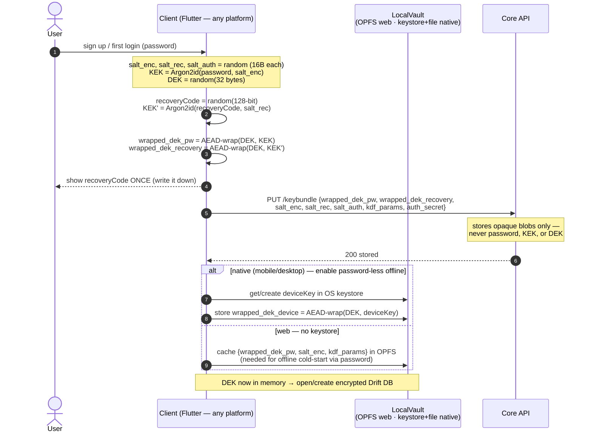
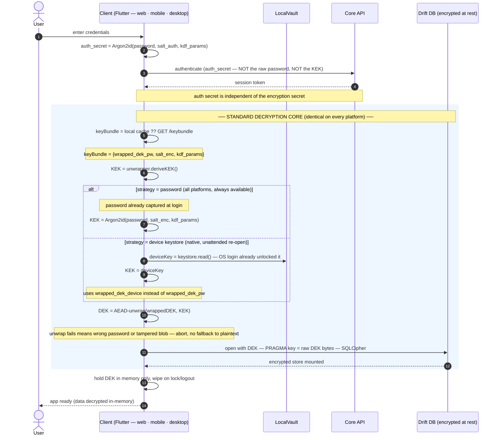
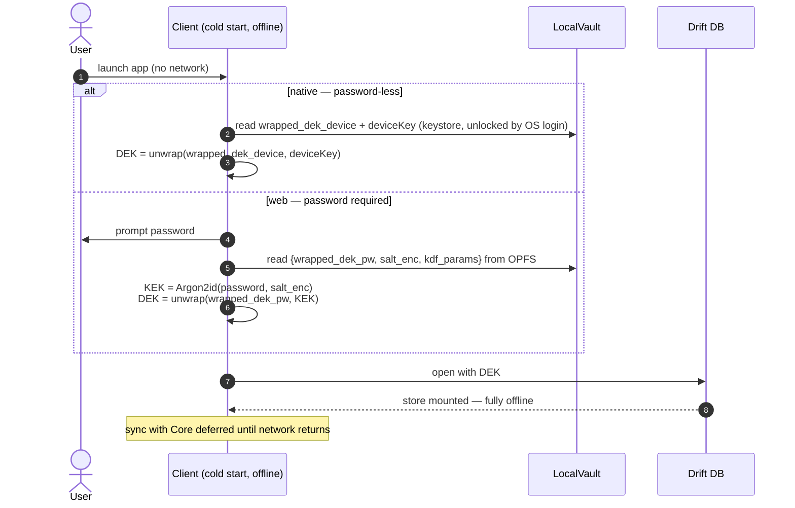
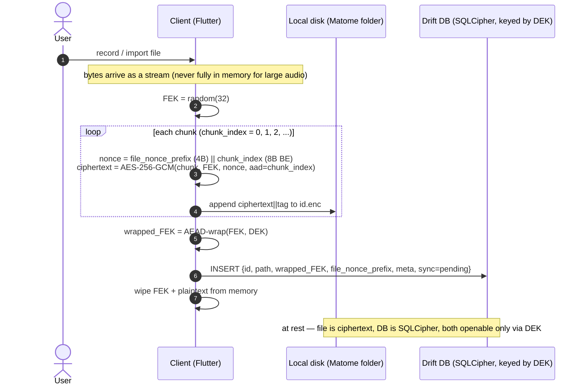
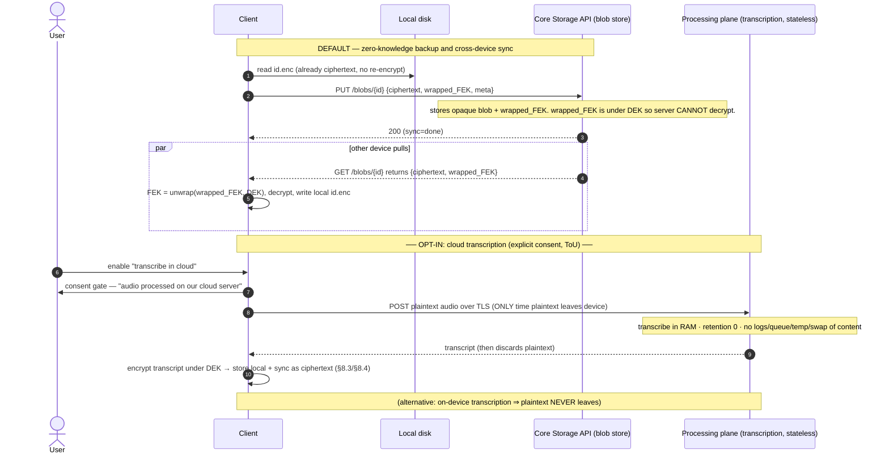
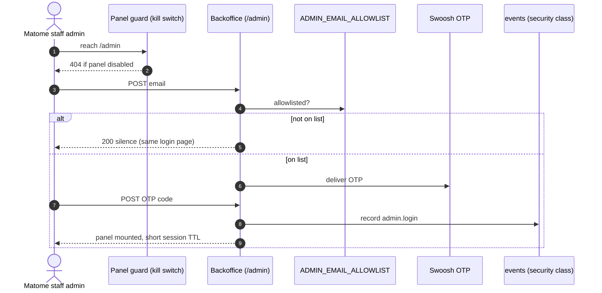
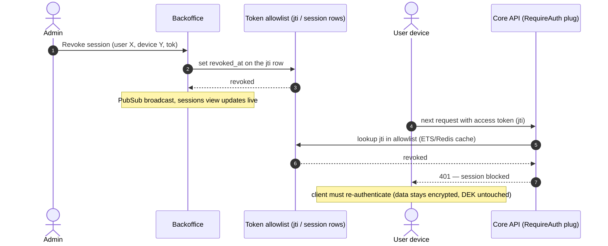

# Matome — Unified E2E + Offline-First Key Flow

> Related: decision record [ADR-0002](../../services/api/docs/adr/0002-envelope-encryption-key-hierarchy.md) ·
> architecture summary [`architecture.md`](architecture.md) §11 D8 (implemented vs
> dark/deferred) and its item-organization model (§5, D6/D7, plan #102) which this
> design's client sits on top of · honest cross-platform verification state
> [`dod-matrix-1857.md`](dod-matrix-1857.md) · forward rollout + recovery posture
> [`runbook-at-rest-migration.md`](runbook-at-rest-migration.md) · native-connection
> spike **#815** (`apps/flutter/tool/spike_815_sqlcipher/DECISION.md`).

**Goal.** One decryption process shared by web, mobile, and desktop, so every
client opens its at-rest store the same way. The design gives:

- **End-to-end at-rest encryption** — the local store (Drift DB + media) is
  ciphertext on disk on every platform; the key that opens it is derived from a
  secret the server never receives.
- **Offline-first** — a client that has unlocked once can cold-start and open
  its store with **no network**.
- **Zero-knowledge storage of the key** — the server only ever holds a *wrapped*
  (encrypted) copy of the data key. It is mathematically unable to unwrap it.

> ⚠️ **Scope of the "we can't read your data" claim.** This document covers the
> **local at-rest store** only. The Core API today persists recordings and
> transcripts in **plaintext** (it is the source of truth and the ai-stub needs
> plaintext to transcribe). So E2E here means *the on-device mirror is encrypted
> under a key we cannot unwrap* — **not** that the Core never sees plaintext.
> A full "server never sees plaintext" posture requires moving transcription/AI
> client-side, which is a separate product decision. See §6.

---

## 1. Key hierarchy (envelope encryption)

Never a single "user key". Two layers, so a password change never re-encrypts
the data:

```
  user password ──Argon2id(salt_enc, params)──►  KEK   (Key Encryption Key)
  recovery key  ──Argon2id(salt_rec, params)──►  KEK'         │ wraps
  device key    (OS keystore, native only) ─────► KEK''       ▼
                                              DEK (random 256-bit) ──► encrypts Drift DB + media
```

- **DEK** — random 256-bit. The *only* thing that actually decrypts data. Never
  leaves the device in clear, never persisted in clear, wiped from memory on
  lock/logout.
- **KEK(s)** — wrap the *same* DEK several independent ways. Unwrapping through
  any one yields the identical DEK:
  - **password KEK** — portable, works on every platform, is what the server
    stores. The zero-knowledge anchor.
  - **recovery KEK** — from a high-entropy recovery code shown once at
    enrollment; survives a forgotten password.
  - **device KEK** — native only; a key held in the OS keystore
    (Keychain / Keystore / DPAPI / libsecret), unlocked by OS login. Enables
    **password-less offline** cold-start.

**Auth secret ≠ encryption secret.** Login authentication uses a salted
Argon2id verifier — `auth_secret = Argon2id(password, salt_auth, params)` sent
to the server as the login credential (never the raw password). The KEK uses
`Argon2id(password, salt_enc, params)` and **never leaves the client**. If both
came from one hash the server would see a password-derived value at login and
the zero-knowledge claim would weaken. (An earlier draft of this doc floated
SRP; the plan pins settled on the salted-verifier approach instead — simpler,
still keeps the server from ever seeing the raw password or the KEK.)

**What the server stores (per user):**

| Field | Meaning | Can server decrypt DEK with it? |
|---|---|---|
| `wrapped_dek_pw` | authenticated wrap of DEK under password-KEK | ❌ needs password |
| `wrapped_dek_recovery` | authenticated wrap of DEK under recovery-KEK | ❌ needs recovery code |
| `salt_enc`, `salt_rec`, `salt_auth`, `kdf_params` | Argon2id inputs | ❌ inputs only |

The `device-KEK`-wrapped copy lives **only on the device**, never uploaded.

See **Appendix A** for the frozen, byte-level wire format of every wrapped
blob and the exact KDF parameters — this is the contract downstream
implementation (crypto core, `/keybundle`) builds against with no further
design decisions.

---

## 2. Enrollment (first ever unlock on the account)

Runs once, on the first client the user sets up. Produces the DEK and every
wrapped copy.



---

## 3. Unified login → disk decryption (the standard process)

**This is the one process every platform shares.** The core —
*obtain wrapped DEK → derive/obtain a KEK → unwrap DEK → open DB* — is
byte-identical everywhere. The **only** branch is *where the KEK comes from*,
expressed as a `KeyUnwrapper` strategy. Online path shown; §4 is the offline
cold-start of the same core.



**Platform mapping of the same core:**

| Platform | Wrapped DEK source | KEK source (unwrapper) | Password prompt on re-open? | Offline cold-start |
|---|---|---|---|---|
| Mobile (iOS/Android) | keystore-wrapped local copy | **device KEK** (Keychain/Keystore) | No — OS login unlocks keystore | ✅ password-less |
| Desktop (macOS/Win/Linux) | keystore-wrapped local copy | **device KEK** (Keychain/DPAPI/libsecret) | No — OS login unlocks keystore | ✅ password-less |
| Web | OPFS-cached `wrapped_dek_pw` | **password KEK** (Argon2id) | Yes — no keystore to hold DEK | ✅ with password (or online-only) |

Same DEK, same DB open, same at-rest format. Only the `deriveKEK()`
implementation differs — a single strategy interface, not three code paths.

---

## 4. Offline cold-start (same core, no network)

Cold start = app opened fresh (heap empty), possibly offline. The decryption
core is identical to §3; it just reads the wrapped DEK from `LocalVault` instead
of the API, so **no network is required**.



**Why the split is unavoidable, not laziness:** to be safe at rest the unwrap
key must be a secret **not sitting in clear on disk**. Native has one — the OS
keystore, unlocked by OS login. The browser has none, so the only at-rest-safe
secret is the user's password (in their head). Hence: native = password-less
offline; web = password-at-cold-start (or stay online-only and skip local
persistence entirely).

---

## 5. Password change & recovery

- **Password change** — re-derive a new password-KEK, re-wrap the **same DEK**,
  `PUT` the new `wrapped_dek_pw`. Data is **not** re-encrypted (DEK unchanged).
  Cheap, O(1).
- **Forgot password** — unwrap via `wrapped_dek_recovery` using the recovery
  code, then set a new password-KEK. Without password **and** recovery code the
  DEK is unrecoverable — that is the zero-knowledge tax. Optional escrow trades
  it for "we could recover it" and must be disclosed.
- **Key rotation** — generate DEK′, re-encrypt store, re-wrap DEK′ under all
  KEKs. Rare, backgroundable.

---

## 6. Honest limits (state these; do not overclaim)

1. **Core still holds plaintext.** This design encrypts the **on-device mirror**.
   The Core API stores recordings/transcripts in clear for server-side
   transcription/AI. Truthful claim: *"your local store is encrypted with a key
   we cannot unwrap."* **Not** *"we never see your data."* Full E2E (server never
   sees plaintext) needs client-side transcription/AI or a processing enclave —
   a separate, costly product decision.
2. **Web zero-knowledge is weaker than native.** The web client's JS is served
   by us on every load, so a malicious (or compromised) deploy could exfiltrate
   the password/DEK in-session. The ZK claim is **credible on installed,
   code-signed native apps; shaky on web**. Consider Subresource Integrity,
   pinned service-worker builds, and being explicit that the strong guarantee is
   native.
3. **Active/in-session attacker still wins.** Once the DEK is in memory and data
   decrypted, local malware or same-origin XSS reads plaintext. Envelope
   encryption defends **at-rest**, nothing more. Complement with short token
   TTL, refresh rotation, and device/session binding server-side.
4. **`flutter_secure_storage` reset-on-error footgun.** On native the
   device-KEK/DEK sits in the keystore; `AndroidOptions.resetOnError` defaults to
   `true` in 10.x and **wipes** the value on a transient decrypt error. For the
   DEK a silent wipe = unrecoverable local store. Construct with
   `resetOnError: false`. (Already noted in `db_encryption.dart`.)
5. **OPFS persistence (task #1860) turned a transient XSS into a durable
   breach — task #1861 narrows, does not close, that window.** Before #1860,
   the web store was in-memory only: a page reload wiped everything an XSS
   payload might have touched. After #1860, the encrypted DB image (and,
   once media is wired to OPFS, encrypted media) survives across reloads —
   so does the vulnerability surface: a persisted-XSS payload (or a
   malicious/compromised deploy of this app's own JS) that runs once can
   keep reading OPFS on every future visit, not just the one session it
   landed in. #1861's mitigations and their honest limits:
   - **Hardened CSP** (`web/index.html` meta + the authoritative
     `nginx.conf` response header) restricts script origins to `'self'` —
     this is the actual delivery-vector defense (mitigates a malicious
     3rd-party/injected script from running at all) but does **not**
     defend against a compromise of the app's OWN first-party JS (a
     supply-chain compromise of this repo's build, or a dependency).
     CanvasKit is forced same-origin via `--no-web-resources-cdn` (dev
     `mise run flutter-web` + `Dockerfile.web`); without that flag Flutter
     loads `gstatic.com/flutter-canvaskit` and the CSP blanks the page.
     Source meta allows script `'unsafe-inline'` only so DWDS hot-reload
     works; Docker strips it so production meta matches nginx (no
     unsafe-inline scripts).
   - **Subresource Integrity is PARTIAL, not full**, for a structural
     reason, not an oversight: Flutter's web build loads `main.dart.js` /
     the CanvasKit or skwasm engine binary / `flutter_service_worker.js`
     via its own JS loader (`_flutter.loader` inside `flutter_bootstrap.js`),
     not via further static `<script src>`/`<link>` tags — and SRI only
     applies to a resource named directly in a tag's `integrity` attribute.
     `Dockerfile.web` computes and injects a real SHA-384 hash for the ONE
     tag that IS static (`flutter_bootstrap.js` itself, hashed against the
     actual built file post-`flutter build web`), so tampering with that
     top-level entry point is caught — but a compromise reached through
     `main.dart.js` or the engine binary it loads next is **not** covered by
     any `integrity` attribute in this build.
   - **DEK heap-lifetime minimization** (`lib/core/crypto/dek_session_guard.dart`)
     wipes the live DEK (`Dek.wipe()` — zeroes the bytes in place) on
     explicit lock, explicit logout, and an idle timeout, and requires a
     fresh unlock (re-derive KEK, re-unwrap) before the store opens again.
     This bounds *how long* a compromised live tab has a working key, it
     does not prevent a compromise that happens WHILE the session is
     unlocked and active from reading the DEK and everything it decrypts —
     see item 3 above. There is no code-level defense against that; it is
     the fundamental limit of running decryption in a browser tab that also
     runs untrusted-adjacent JS in the same origin.
   - **Bottom line, stated plainly:** the envelope + OPFS + CSP + SRI + DEK-
     wipe stack together defend the data **at rest** (a stolen/inspected
     OPFS file, or a browser profile copied off the disk, is ciphertext) and
     narrow the **at-risk window** of a live compromise. Neither this task
     nor any of its predecessors makes a currently-running, actively
     compromised tab safe — a live XSS or malicious extension executing
     WHILE the user is unlocked and using the app can still read plaintext
     and the live DEK. Web's zero-knowledge posture is, and will remain,
     weaker than native's (item 2) for exactly this reason.

---

## 7. Delta from today's code

| Component | Today | Add for this design |
|---|---|---|
| `DbEncryptionKeyManager` | generates random DEK in keystore (native), dormant (`kSqlCipherEnabled=false`) | keep as the **device-KEK** wrap path; add password-KEK derivation (Argon2id) + envelope wrap/unwrap |
| Core API | stores JWT session only | add `/keybundle` (PUT/GET) for opaque `wrapped_dek_*` + salts + params |
| Web connection | in-memory sqlite, no persistence | opt-in OPFS store opened with DEK via password-KEK; keep in-memory as the online-only default |
| Native connection | plaintext Drift + FDE (SQLCipher blocked #815) | flip to SQLCipher keyed by DEK once the `sqlcipher_flutter_libs` build conflict is resolved |
| Recovery | none | recovery-code enrollment + `wrapped_dek_recovery` |

**Blocking dependency:** at-rest DB encryption on native still needs the
`sqlcipher_flutter_libs` + `drift_flutter` co-build conflict (#815) resolved, or
a hand-rolled native connection — **resolved**: spike #815 (task #1847) went
GO on a hand-rolled connection; see
`apps/flutter/tool/spike_815_sqlcipher/DECISION.md`. The key machinery above is
independent and can land first (Wave 1, task #1849).

---

## 8. File lifecycle — local save → at-rest → cloud

> **Superseded:** [`file-lifecycle.md`](file-lifecycle.md) is the canonical
> description of the implemented Matome Vault lifecycle and the required
> cloud-only eviction contract. The remainder of this section is retained as
> historical key-design context; its proposed ciphertext-cloud flow is not the
> current architecture. Core/object storage currently receive the original
> bytes through an authenticated HTTPS stream so server-side processing can
> operate on them.

### 8.1 Where files live today (the gap)

| | Today | Target |
|---|---|---|
| Media (`import_*`, `segment_*`) | **plaintext files** in `<documents>/Matome/`, absolute paths in DB | per-file ciphertext (`<id>.enc`), encrypted before hitting disk |
| Drift DB | plaintext (SQLCipher blocked #815) | SQLCipher, keyed by DEK |
| Cloud copy | (web reads plaintext from Core) | ciphertext blob only, server can't read |

> ⚠️ **SQLCipher alone does NOT protect media.** Audio/imports live *outside* the
> DB as files. Encrypting the DB leaves the blobs plaintext on disk. Media needs
> its own per-file encryption. The folder *location* (`<documents>/Matome/`) is
> irrelevant to security — the absence of encryption is the exposure.

### 8.2 Key hierarchy extended to files

```
DEK ──wraps──► FEK (random per file) ──AES-256-GCM (streamed)──► ciphertext blob (disk + cloud)
```

Per-file **FEK** (File Encryption Key), not the DEK directly, so large audio
streams without loading into RAM, uploads as an opaque blob, and a DEK rotation
only re-wraps FEKs instead of re-encrypting every file. The wrapped FEK lives in
the (SQLCipher) DB row next to the file metadata. Byte layout: **Appendix A**.

### 8.3 Save local — file is encrypted before it touches disk



### 8.4 Cloud lifecycle — ciphertext sync (default) + opt-in processing



### 8.5 What each party can read

| Location | Content at rest | Who can decrypt |
|---|---|---|
| Local disk `<id>.enc` | ciphertext (FEK) | client with DEK only |
| Local DB | SQLCipher (DEK) — holds wrapped_FEKs | client with DEK only |
| Core `/blobs` | ciphertext + wrapped_FEK | **nobody server-side** — DEK never uploaded |
| Processing plane | plaintext **in RAM, transiently** | server, during processing only, consented, not persisted |

**Migration note.** Existing plaintext files in `<documents>/Matome/` need a
one-time re-encrypt pass on first unlock after enabling encryption: read each
`import_*`/`segment_*`, encrypt under a new FEK, write `<id>.enc`, wrap FEK under
DEK into the row, securely delete the plaintext original. Mirrors the existing
`moveLegacyMediaInto` one-time relocation in `app_storage.dart` — same shape,
plus encryption.

---

## 9. Backoffice / admin panel (Phoenix LiveView on Core)

**Built AFTER this doc's auth layer ships.** It does **not** conflict with the
zero-knowledge design: the backoffice reads **auth metadata** (sessions, devices,
login methods, IPs, timestamps, space quotas) — all server-side and fully
visible. It **cannot** read the DEK, FEKs, or user content (§8.5), and that is a
feature, not a limitation.

Current Core already has: Guardian JWT, a **persisted** `refresh_tokens` table,
Argon2, and a `user_socket` channel. Missing: `phoenix_live_view`, session
metadata, and the admin surface below.

### 9.1 Access control — the panel is secret, admin-only (layered)

The backoffice is a confidential internal panel for **Matome staff admins only**.
Defense in depth — every layer must pass:

| Layer | Control | Notes |
|---|---|---|
| Kill switch | `ADMIN_PANEL_ENABLED` | unset/`false` in prod ⇒ every `/admin*` is 404 |
| Soft IP tier | `ADMIN_IP_ALLOWLIST` (optional) | rate-limit tier only — **no hard 404** for unknown IPs |
| Identity | **hard allowlist** — `ADMIN_EMAIL_ALLOWLIST` env CSV; no `users` row required | NOT self-service; non-members get total silence |
| Auth strength | **email OTP mandatory** — CSPRNG one-shot code, HMAC-peppered verification, 30-min TTL | password + authenticator TOTP retired for /admin |
| Session | short admin session TTL, re-auth on sensitive actions | absolute TTL; recent OTP required for every session, Space, operational, and configuration mutation |
| Audit | every admin login, sensitive read, and action written to security-class `events` | mutations and mandatory before/after events share one `Ecto.Multi`; `actor_email` and proxy-aware IP snapshotted |



### 9.2 Session hierarchy — user → device → active tokens

The sessions view resolves the full tree: which user is **active now**
(Phoenix.Presence over `user_socket`), and every token they hold **per device**.

```
User  alice@matome.io            ● active now  (Presence)
├─ Device  MacBook (macos)       last_seen 2m   ● online     device_key ✔
│   ├─ session tok_a1  passkey   ip 10.x  exp 14:20   [revoke]
│   └─ session tok_a2  passkey   ip 10.x  exp 15:05   [revoke]
├─ Device  iPhone (ios)          last_seen 3h   ○ idle       device_key ✔
│   └─ session tok_b1  totp+pw   ip 200.x exp tomorrow [revoke]
└─ Device  Chrome (web)          last_seen 5d   ○ offline    device_key none
    └─ session tok_c1  password  ip 187.x expired         —
```

- **active now** = live Presence entry (client holds the `user_socket` channel + heartbeat).
- **has valid session** = non-revoked, non-expired row in the token allowlist.
  These differ: a phone with a valid token but no live socket is *idle*, not *online*.

### 9.3 Revocation — hard allowlist, blocks on the next request

Chosen model: **hard allowlist checked per request** (guardian_db-style). Revoke
sets `revoked_at`; the very next request with that token is rejected. Cost is one
lookup per authenticated request — back it with an ETS/Redis cache to stay fast.



Revoking a **session** blocks server access. It does **not** wipe the on-device
encrypted store — that is governed by the DEK (§3). To also lock local data,
issue a remote "lock" signal the client honors by dropping the DEK from memory.

### 9.4 Spaces — full lifecycle admin

Manage each space end-to-end. Spaces relate to the two-axis model
(`is_local` ⟂ `space_type`) already planned in #102.

| Capability | Backoffice action | Enforcement point |
|---|---|---|
| **Quota (GB)** | set `quota_bytes` | `PUT /blobs` (§8.4) checks `used_bytes + incoming ≤ quota_bytes`, else 413. Counts **ciphertext** bytes (size is metadata, not content) |
| **Expiration** | set / extend `expires_at` | scheduled job (Oban) suspends → archives → purges past expiry |
| **Lifecycle** | `active → suspended (read-only) → archived → deleted (grace)` | status gates the storage + sync APIs |
| **Access** | grant/revoke membership, set role (owner/admin/member/viewer) | authz on every space API call |

**Critical E2E caveat on space access.** The admin manages the **permission
list** (who *may* access), but in a zero-knowledge system the admin **cannot
grant crypto access** — it holds no space key. A newly added member still needs
the **space key wrapped to them by an existing member/owner** to actually decrypt
content. So: admin adds permission, an existing member's client completes the key
share. This is deliberate — admins can't silently become readers of encrypted
spaces. (Quota and expiration are pure metadata, so admin controls those freely.)

> Shared encrypted spaces need a **per-space key** wrapped to each member's public
> key — an extension of the per-user DEK model in §1. Single-user spaces just use
> the owner's DEK. Multi-user E2E spaces are designed in
> `services/api/docs/adr/0003-space-kek-multi-user.md` (wrapper slot `space-KEK`,
> Appendix A `0x05`).

### 9.5 Schema deltas (Core, Ecto)

| Table | Change |
|---|---|
| `users` | `+ role` (user / admin / superadmin) |
| `devices` *(new)* | `user_id, platform, display_name, user_agent, first_seen_at, last_seen_at, device_key_enrolled, revoked_at` |
| `refresh_tokens` | `+ device_id, ip, user_agent, login_method, last_seen_at, revoked_at, rotated_from, family_id, jti` |
| `token_allowlist` *(new, or reuse sessions)* | `jti, user_id, device_id, expires_at, revoked_at` — checked per request |
| `webauthn_credentials` *(new)* | passkey: `credential_id, public_key, sign_count, aaguid, created_at, last_used_at` |
| `totp_secrets` / `recovery_codes` *(new)* | MFA factors |
| `spaces` | `+ quota_bytes, used_bytes, expires_at, status, owner_id` |
| `space_members` *(new)* | `space_id, user_id, role, granted_at, revoked_at` |
| `events` *(canonical)* | indexed actor/owner/subject/device/run/correlation dimensions plus bounded details |

### 9.6 Effort (after the doc's auth layer exists)

| # | Item | Size |
|---|---|---|
| 1 | LiveView + `/admin` scope + asset pipeline | S/M ~2-3d |
| 2 | Admin allowlist + MFA gate + network guard (§9.1) | M ~3d |
| 3 | Enrich `refresh_tokens` + `devices` table + metadata capture (§9.2) | M ~3-4d |
| 4 | Hard-allowlist revocation + per-request check + cache (§9.3) | M ~2-3d |
| 5 | Sessions LiveView (hierarchy + Presence + revoke, real-time) | M ~3-4d |
| 6 | Users LiveView (methods, MFA status, last login) | M ~2-3d |
| 7 | Audit log viewer (security-class `events`) | S/M ~2d |
| 8 | Spaces admin (quota, expiration, lifecycle, Oban jobs) | L ~1wk |
| 9 | Space access mgmt (membership + roles + key-share UX) | M ~3-4d |

**v1 total: ~4-5 weeks, 1 dev.** Hard parts are not the LiveView CRUD — they are
the per-request revocation cache (§9.3), live Presence needing a Flutter
heartbeat (§9.2), and the multi-user space-key sharing (§9.4).

---

## Appendix A — Wire-format spec v1 (FROZEN, task #1848)

This appendix is the byte-level contract. Task #1849 (crypto core) and #1851
(`/keybundle`) implement against it with no further design decisions. Any
change to this appendix after Wave 1 starts is a breaking change requiring a
new `format_version` and a migration plan — do not edit in place.

### A.1 Versioning axes (two, independent)

There are two separate version knobs so an algorithm change on one axis never
forces a change on the other:

1. **`format_version`** (byte 0 of every wrapped blob) — the *wrap layout*
   (header shape, algorithm id, field ordering). Currently `0x01`.
2. **`kdf_params.profile`** (string, travels inside the keybundle JSON, not in
   the wrapped blob) — the *KDF cost parameters*. Currently `"argon2id-v1-portable"`.
   Bumping this only requires re-deriving KEKs at next login (password
   change-shaped operation); it does not touch the wrap layout.

### A.2 The three salts

| Salt | Purpose | Length | Generated | Stored |
|---|---|---|---|---|
| `salt_enc` | derives the **password-KEK** (`Argon2id(password, salt_enc)`) | 16 bytes (128-bit), CSPRNG | once, at enrollment | server (`/keybundle`), not secret |
| `salt_rec` | derives the **recovery-KEK** (`Argon2id(recovery_code, salt_rec)`) | 16 bytes (128-bit), CSPRNG | once, at enrollment | server (`/keybundle`), not secret |
| `salt_auth` | derives the **auth-secret** (`Argon2id(password, salt_auth)`) sent to the server for login | 16 bytes (128-bit), CSPRNG | once, at signup | server (`/keybundle`), not secret |

Salts are independently random — not derived from each other, not reused
across purposes. Domain separation comes from the distinct salt, so no
additional context label is needed on the KDF call itself (the wrapped-blob
AAD in A.4 provides separation for the *wrap* step, which is a different
operation from the KDF).

**Why one salt buys nothing extra:** if `salt_enc == salt_auth`, the
password-KEK and the auth-secret would be the *same* value under the same
params, and the server (which legitimately receives the auth-secret) would
then also possess the KEK. Distinct salts are what makes "auth-secret ⟂ KEK"
true instead of aspirational.

### A.3 Argon2id parameters — one portable profile, not native/web-split

**Decision (resolves an open question in this doc's §1/§3): the KDF profile
used for `salt_enc`, `salt_rec`, and `salt_auth` is a single, platform-portable
parameter set — not a heavier "native" profile and a lighter "web" profile.**

Rationale: `wrapped_dek_pw` is wrapped **once** and must be unwrappable by
**any** device the user logs into. If native used heavier Argon2id params than
web, the same password + `salt_enc` would derive *two different* KEKs on the
two platforms, and a user who enrolled on mobile could never unwrap
`wrapped_dek_pw` from a web login (or vice versa) — silently breaking the
plan's own interop DoD ("same account, same DEK across devices"). So the
profile must be sized to the **weakest** platform in the fleet: browser
Argon2id-WASM, which has no SIMD/thread acceleration and must not jank the UI
thread for multiple seconds.

`argon2id-v1-portable` (frozen default, applies identically to `salt_enc`,
`salt_rec`, `salt_auth`):

| Param | Value | Rationale |
|---|---|---|
| Algorithm | Argon2id | side-channel + GPU/ASIC resistant hybrid, OWASP-recommended default |
| Argon2 spec version | `0x13` (19) | RFC 9106 |
| Memory | `19456` KiB (19 MiB) | RFC 9106 §4 / OWASP's second (constrained-environment) recommended option — the floor cited specifically for browser/mobile WASM contexts |
| Iterations (time cost) | `2` | pairs with 19 MiB per RFC 9106's constrained profile |
| Parallelism | `1` | WASM Argon2id builds do not reliably parallelize a single hash across Web Workers; `p=1` avoids coordination overhead for one hash op and keeps native/web bit-for-bit reproducible |
| Output length | `32` bytes | matches DEK/AES-256 key size, and the auth-secret length sent to the server |
| Salt length | `16` bytes | per salt, see A.2 |

This profile is deliberately conservative rather than maximal — it is the
baseline task #1859 (Argon2id WASM latency spike) benchmarks against on a
mid-tier device. If that spike shows the profile is still too slow for web, the
fix is a **new named profile** (`argon2id-v2-portable`) referenced by
`kdf_params.profile` in a fresh keybundle — a KDF-axis bump only (A.1), not a
wire-format break. Native devices complete this profile in well under 100 ms
on modern hardware; the entire cost is carried for the sake of the web floor.

**Login cost implication (explicit, not hidden):** a normal login on any
platform performs **two** Argon2id hashes under this profile — one for
`auth_secret` (salt_auth) and one for the password-KEK (salt_enc). Both are
independent CPU/WASM-bound hashes; #1849 should compute them in parallel
where the runtime allows (e.g. separate Web Workers) rather than serially.

**Native-only exception — `device-KEK` skips Argon2id entirely.** The
device-KEK is a random AES-256 key held in the OS keystore (Keychain /
Keystore / DPAPI / libsecret), gated by OS login, not derived from a password.
There is no "native Argon2id profile" because this path never runs Argon2id —
this is *why* native gets password-less offline unlock (§4) while web cannot.

### A.4 Wrapped-blob layout (`wrapped_dek_pw`, `wrapped_dek_recovery`, `wrapped_dek_device`, `wrapped_FEK`)

All four wrapped values share **one binary layout**, authenticated,
never raw AES output:

```
offset  size   field
0       1      format_version   (0x01)
1       1      payload_type     (0x01 = DEK, 0x02 = FEK)
2       1      wrapper_type     (0x00 = DEK-as-wrapping-key, 0x01 = password-KEK,
                                  0x02 = recovery-KEK, 0x03 = device-KEK,
                                  0x04 = passkey-KEK [reserved],
                                  0x05 = space-KEK [reserved])
3       1      alg_id           (0x01 = AES-256-GCM)
4       12     nonce            (96-bit, CSPRNG, unique per wrap)
16      32     ciphertext       (AES-256-GCM output; 32 bytes in because
                                  both DEK and FEK plaintexts are 32-byte keys —
                                  GCM is a stream cipher, ciphertext length == plaintext length)
48      16     gcm_tag          (128-bit authentication tag)
                total: 64 bytes
```

- **AEAD, not raw AES-CBC/ECB.** AES-256-GCM in all v1 wraps (`alg_id = 0x01`).
  RFC-3394 key-wrap was considered and rejected for v1: GCM is already the
  primitive used for the FEK media stream (A.5), so reusing it here means one
  audited AEAD implementation covers every wrap in the system instead of two.
  `alg_id` is reserved specifically so a future format could add `0x02 =
  AES-KEYWRAP` without a `format_version` bump.
- **AAD binds the header.** The 4-byte header (`format_version || payload_type
  || wrapper_type || alg_id`) is passed as AES-GCM additional authenticated
  data. This is the resolution to a gap the source design left implicit: without
  it, a ciphertext+tag valid as `wrapped_dek_recovery` could be silently
  relabeled and accepted as `wrapped_dek_pw` if an attacker who compromises the
  keybundle store swaps field values (same alg, same key length). Binding the
  header in the AAD makes any cross-slot substitution fail tag verification.
- **Transport encoding:** base64 (standard, padded) inside the `/keybundle`
  JSON payload. 64 raw bytes → 88 base64 chars.
- **`wrapped_FEK`** uses `payload_type = 0x02`, `wrapper_type = 0x00` (wrapped
  directly by the DEK, not by any KEK) and is stored in the SQLCipher row next
  to the file's metadata, not in `/keybundle`.
- **Reserved wrapper slots — out of scope to implement in P1, but the format
  has a numbered slot so they slot in without a version bump:**
  - `0x04 passkey-KEK` — future WebAuthn-PRF-derived KEK.
  - `0x05 space-KEK` — future per-space shared key for multi-user encrypted
    spaces (§9.4). A space-KEK wrap would use `payload_type = 0x01` (it wraps a
    space DEK-equivalent) with `wrapper_type = 0x05`.

### A.5 Per-file media stream (`FEK`-encrypted, §8.3)

Not a single wrap — a **chunked AEAD stream**, because media is too large to
hold in memory:

- Nonce per chunk = `file_nonce_prefix` (4 random bytes, generated once per
  file at encrypt time) `||` `chunk_index` (8-byte big-endian counter starting
  at 0). This guarantees a **unique nonce per chunk** (the plan's mandatory pin)
  without a CSPRNG call per chunk — uniqueness comes from the monotonically
  increasing counter, unpredictability from the random prefix.
- AAD per chunk = the 8-byte big-endian `chunk_index` — binds each ciphertext
  chunk to its position, so chunk reordering or truncation fails
  authentication instead of silently decrypting to garbage or a truncated
  file.
- On-disk layout per chunk: `ciphertext (chunk_size bytes) || tag (16 bytes)`,
  chunks written sequentially to `<id>.enc`. The final chunk may be shorter
  (partial); its tag is still 16 bytes.
- `file_nonce_prefix` is stored in the DB row alongside `wrapped_FEK` (it is
  not secret, only the FEK and DEK are).

### A.6 `/keybundle` payload shape (reference for #1851)

```json
{
  "salt_enc": "<base64, 16 bytes>",
  "salt_rec": "<base64, 16 bytes>",
  "salt_auth": "<base64, 16 bytes>",
  "kdf_params": {
    "profile": "argon2id-v1-portable",
    "algorithm": "argon2id",
    "version": 19,
    "memory_kib": 19456,
    "iterations": 2,
    "parallelism": 1,
    "output_len": 32
  },
  "wrapped_dek_pw": "<base64, 88 chars (64 raw bytes)>",
  "wrapped_dek_recovery": "<base64, 88 chars (64 raw bytes)>",
  "auth_secret": "<base64, 32 bytes — the Argon2id(password, salt_auth) output, login credential>"
}
```

`wrapped_dek_device` and `wrapped_FEK` never appear here — the former is
device-local only (§1), the latter travels with its owning file row.

### A.7 Recovery code

- **Entropy: 128-bit exactly** (16 bytes, CSPRNG) — meets the plan's `≥128-bit`
  floor with no padding; brute-forcing 128 bits offline is already infeasible,
  and Argon2id-stretching (`salt_rec`, A.3 profile) adds further defense-in-depth
  cost per guess against a compromised keybundle.
- **Human encoding:** Crockford Base32 (no ambiguous `I/L/O/U`), grouped in
  4-character blocks separated by hyphens: 128 bits / 5 bits-per-char = 26
  chars → 7 groups, e.g. `XXXX-XXXX-XXXX-XXXX-XXXX-XXXX-XX`. Shown once at
  enrollment (§2); never stored in plaintext anywhere, never logged.
