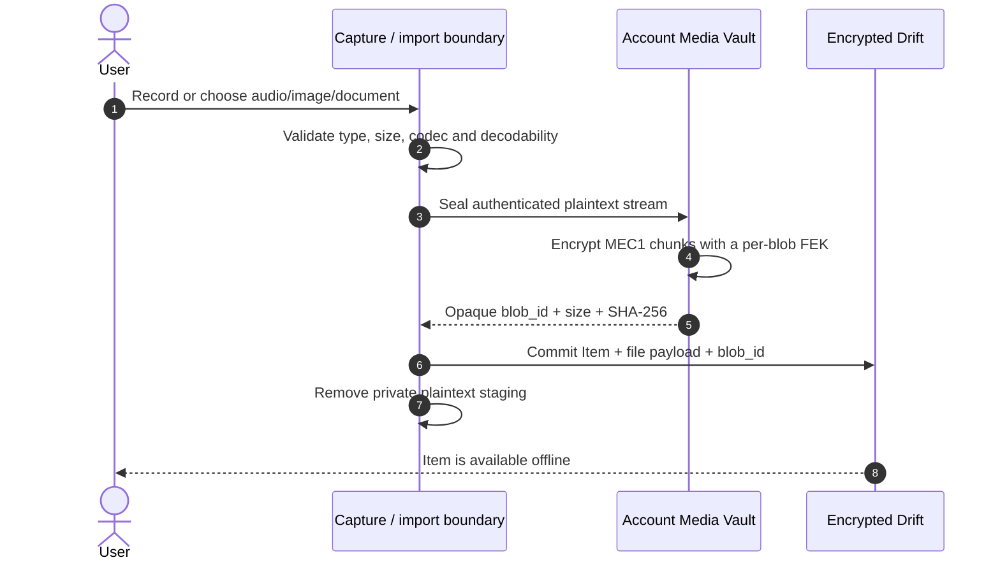

# File lifecycle: device, Space sync, and cloud retention

This document is the canonical lifecycle for audio, image, and document files
owned by Matome. It explains what happens from capture/import through offline
use, optional Space synchronization, local-space reclamation, and deletion.

Text-only Items do not have a file payload and are outside this lifecycle.

## 1. Three independent decisions

Matome must not collapse these user decisions into one operation:

| Decision | Question | Controlled by |
|---|---|---|
| Organization | Where does this Item belong? | Inbox, Matome, or Space membership |
| Synchronization | May this Item leave the device? | The Item's effective Space and its local/cloud mode |
| Local retention | Must this device keep a local copy? | Account retention policy or an explicit local-eviction action |

Filing organizes content; it does not automatically grant cloud consent. An
Item synchronizes only when its effective Space is a cloud Space. Likewise,
successful synchronization does not imply that the local copy should be
removed. The default retention policy is `keep_forever`.

The effective Space is resolved by the rule in `architecture.md` section 5:

```text
effectiveSpace(item) =
    item.matome.space  when the item belongs to a Matome
    item.space         otherwise, when directly filed into a Space
    none               otherwise

syncEligible(item) = effectiveSpace(item) is a cloud Space
```

## 2. Storage authorities

| Data | Local authority | Cloud authority |
|---|---|---|
| Local-only Item and its file | Account-scoped Drift + encrypted Media Vault | None |
| Pending cloud Item | Drift + Media Vault until reconciliation succeeds | Core may contain partial/idempotent upload state |
| Reconciled cloud Item | Drift is the offline mirror; Vault may retain a local copy | Core Postgres + object storage |
| Cloud-only-on-this-device Item | Drift keeps metadata and remote identity | Core Postgres + object storage hold the recoverable file |

The local database stores an opaque `blob_id`, logical plaintext size and
SHA-256, media metadata, and reconciliation state. It never stores a durable
physical path, a file encryption key, or nonce material. Native files are
encrypted in the private account Vault; Web files are encrypted in durable
OPFS. The Drift database is encrypted as well.

Core and object storage receive the original file bytes. The client decrypts
authenticated Vault ranges into an HTTPS upload stream; it does not upload the
local MEC1 ciphertext container. Core-side AI processing therefore has access
to the uploaded plaintext. The Vault guarantees encryption at rest on the
client, not end-to-end encryption from the server.

## 3. State model

The names below describe the lifecycle. They are not all single persisted enum
values; some are derived from placement, `blob_state`, `upload_state`, Core
identity, and durable work state.

| Lifecycle state | Local ciphertext | Cloud copy | Meaning |
|---|---:|---:|---|
| `staging` | No | No | A capture/import is being validated in private temporary storage |
| `local_ready` | Yes | No | The Vault commit and local Item transaction succeeded |
| `local_only` | Yes | No | The Item has no cloud-effective Space and must not upload |
| `pending_sync` | Yes | Not guaranteed | Durable work exists for an eligible cloud Space |
| `synced_local` | Yes | Yes | Core accepted and verified the upload; the device retains its copy |
| `cloud_only` | No | Yes | Metadata remains locally, but this device reclaimed the Vault blob |
| `pending_delete` | Maybe | Maybe | A tombstone exists while local/remote deletion converges |
| `deleted` | No | No | Remote deletion is confirmed or idempotently absent, then local data is removed |

`local_only` and `cloud_only` mean different things:

- **Local-only** describes synchronization authority: no recoverable cloud copy
  is promised.
- **Cloud-only** describes retention on one device: synchronization already
  succeeded, but that device no longer retains the ciphertext blob.

## 4. Capture or import

In product copy, users may call both selecting a file and sending it to the
cloud an "upload." Internally these are separate operations. Selecting,
recording, or dropping a file first **imports it into the local Vault**. A cloud
upload happens only later if the effective Space permits it.



The visibility boundary is atomic from the domain's perspective: an Item must
not become visible until a ready Vault blob can back it. A crash before commit
is handled by Vault reconciliation. Recorder staging may temporarily contain
plaintext under private application storage, but it is never a durable domain
path and is removed after seal/commit or recovery cleanup. Importing does not
delete or take ownership of the user's original source file.

## 5. Offline lifetime

After local commit, users can organize, inspect, play, or preview the Item
without a network connection:

- Playback, image preview, and document open acquire purpose- and TTL-bound
  Vault leases.
- Native leases create bounded plaintext scratch files only inside private
  account storage and sweep them on close, expiry, restart, logout, or account
  switch.
- Web leases expose revocable Blob URLs and revoke them on dispose/close.
- External export creates a user-selected copy outside Vault ownership. Matome
  cannot revoke, encrypt, retain, or delete that exported copy.

Loose Items, draft Matomes, and Items in local Spaces remain `local_only`.
Network availability does not change that decision and must not trigger an
upload. Losing or wiping the only device can permanently lose such content.

If an Item is already eligible for cloud sync but the device is offline, its
intent remains in the durable work queue as `pending_sync` or a retryable
failure. The local file remains usable. Reconnect resumes idempotently; the UI
must not claim `synced` before Core acceptance and upload verification.

## 6. Promoting or choosing a cloud Space

A new Space is local. Promotion to cloud is an explicit, one-way v1 choice
because eligible Items in that Space may leave the device. The service computes
the affected Matome/Item counts; the current confirmation screen shows the Space
name plus an aggregate count rather than a complete itemized egress list.

Moving an Item into an existing cloud Space has the same egress consequence.
Matome membership wins when resolving the effective Space, so moving a child
Item alone does not override the Space of its containing Matome.

```mermaid
sequenceDiagram
    autonumber
    actor U as User
    participant C as Flutter client
    participant D as Encrypted Drift / work queue
    participant V as Media Vault
    participant S as Core + object storage
    participant A as AI processing

    U->>C: Promote local Space or file Item into cloud Space
    C->>U: Show itemized egress consent
    U->>C: Confirm
    C->>D: Persist placement/promotion and idempotent sync work
    alt Offline
        D-->>C: Keep pending_sync; local use continues
    else Online
        C->>V: Acquire authenticated upload read lease
        V-->>C: Plaintext byte stream + verified size/hash
        C->>S: Stream bytes over presigned HTTPS upload
        S-->>C: Accept and verify object
        C->>D: Store Core identity, uploaded_at, uploaded state
        S->>A: Dispatch supported processing
        A-->>S: Persist processing result/status
        C->>S: Poll bounded current-run projection
    end
```

The local Vault copy stays present after upload because `keep_forever` is the
default. Sync is not a move operation.

## 7. Reclaiming local space while keeping the cloud copy

This operation is **local eviction**, not Item deletion. Its intended result is
`synced_local -> cloud_only` on the current device:

1. Confirm that the Item has a stable Core identity and upload state
   `uploaded` with `uploaded_at`.
2. Confirm the remote object is durable and matches the expected logical size
   and SHA-256 recorded at ingest.
3. Confirm there is no pending upload/delete work, no dirty local replacement,
   and no active playback/preview/export lease.
4. Block new local readers and wait for existing leases to close.
5. Delete only the encrypted local Vault blob.
6. Set local `blob_state` to `missing`, retaining the Item, `blob_id` identity,
   metadata, Core identity, and remote object.
7. Resolve future opens from Core. A future rehydrate action may stream the
   remote object through the normal Vault seal path, verify size/hash, and
   return `blob_state` to `ready`.

The operation must fail closed if remote durability cannot be proved. In
particular, local-only Items, unknown/orphan blobs, active work, active leases,
and mismatched size/hash facts are never eligible.

### Current implementation status

The current retention service implements `keep_forever` plus opt-in expiry for
**unreferenced**, remote-verified blobs. It deliberately preserves every blob
still referenced by an Item. Audio can fall back to a Core download URL when a
local blob is missing, but there is not yet a complete user-facing "clear local
copy" transition and rehydrate flow for all audio/image/document consumers.

Therefore `cloud_only` above is the required product and safety contract, not a
claim that the action is currently exposed. Implementing it requires an
explicit referenced-blob eviction service, UI state/action, all-media remote
open or rehydrate behavior, and tests proving offline/error recovery. The
generic orphan GC must not be relaxed to approximate this feature.

## 8. Automatic retention and garbage collection

The account policy defaults to `keep_forever`, which never automatically
removes ready local Vault files. An opt-in `expire_after_upload` policy may
collect only blobs that satisfy every current GC guard:

- no Item references the blob;
- no active work references it;
- no active lease exists;
- Core identity, `uploaded` state, and `uploaded_at` exist;
- Vault plaintext size and SHA-256 match Drift metadata;
- the configured expiry time has elapsed.

Unknown, local-only, referenced, mismatched, or otherwise ambiguous blobs are
preserved. Reconciliation records a decision and reason so cleanup is auditable
and restart-safe.

Automatic orphan collection and explicit cloud-only eviction are separate
operations. The former cleans unreachable data; the latter changes the storage
availability of a live Item and requires explicit user intent.

## 9. Delete is not eviction

Deleting an Item means converging its domain record and file removal across the
device and cloud. It must never use the cloud-only path.

The safe order is:

1. Commit an Item tombstone locally.
2. Cancel or revoke pending upload work.
3. Preflight the Vault, block new readers, and wait for active leases.
4. Persist and retry remote deletion until Core confirms success or idempotent
   `404 Not Found`.
5. Delete local ciphertext.
6. Remove final local payload/domain metadata.

If the device is offline, the tombstone and durable delete work remain pending;
the app must not resurrect the Item from a later pull. Archive is a separate,
reversible user-facing state and does not by itself free the local file.

## 10. User action matrix

| User action | Local result | Cloud result | Works offline? |
|---|---|---|---:|
| Record/import | Encrypted Vault blob + local Item | None | Yes |
| Organize in Inbox/local Space | Placement changes; blob retained | None | Yes |
| Move into/promote to cloud Space | Durable sync intent; blob retained | Upload when online | Yes, queues work |
| Successful sync | Blob retained by default | Core/object/processing state reconciled | Completion needs network |
| Clear local copy | Target: metadata retained, blob becomes missing | Remote object retained | Only after prior online verification |
| Rehydrate | Target: remote bytes resealed into Vault | Unchanged | No |
| Export | Copy outside Vault lifecycle | Unchanged | Yes when local blob exists |
| Archive | Item hidden but recoverable; blob retained | Archive intent converges | Yes |
| Delete | Tombstone, then ciphertext and metadata removed | Remote object/record removed | Yes, convergence waits for network |

## 11. Invariants

- No durable `local_path`, `Uri.file(localPath)`, or UI-owned physical media
  path may represent an Item.
- No plaintext media may be stored in Documents or another user-visible app
  directory as Matome-owned state.
- A local-only file is never evicted under the assumption that a remote copy
  probably exists.
- Upload and delete hold/revoke Vault leases so retention cannot race a reader.
- Remote upload is verified before any policy may authorize local reclamation.
- Account switch/logout closes leases and isolates each account's Vault.
- Browsers without durable OPFS block local Vault operation rather than falling
  back to plaintext or transient storage.
- Exported copies are explicitly outside these guarantees.

## 12. Primary implementation references

- Effective Space and cloud gate:
  `apps/flutter/lib/features/spaces/effective_space.dart`
- Space promotion:
  `apps/flutter/lib/features/spaces/space_promotion.dart`
- Durable upload work:
  `apps/flutter/lib/features/recordings/upload_queue.dart`
- Upload transport:
  `apps/flutter/lib/features/recordings/recordings_repository.dart`
- Retention/GC:
  `apps/flutter/lib/core/vault/vault_retention_service.dart`
- Central deletion boundary:
  `apps/flutter/lib/features/items/item_deletion_service.dart`
- Vault contracts and stores: `packages/matome_vault/`
- Data model and broader architecture: `architecture.md`
