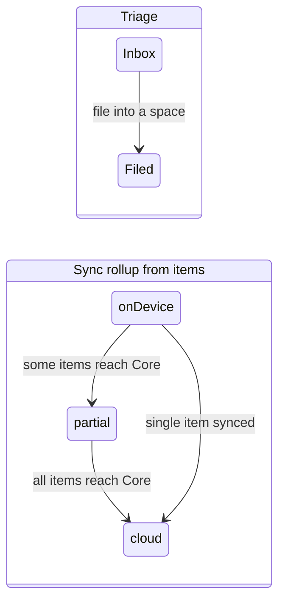
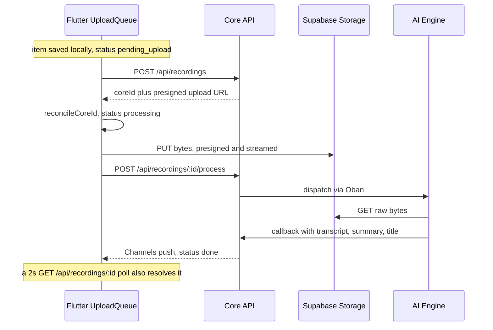

# Matome — Lifecycle

> Status: agreed · Last updated: 2026-06-20
> The cradle-to-grave life of a **Matome** and its items, anchored to the code
> that implements each stage. Every claim cites the file (and symbol) behind it;
> where code and this doc disagree, the code wins.
>
> Background: a **Matome** is a per-happening collection of **items**
> (recordings: `audio | meeting | image`). See
> [ADR-0003](decisions/ADR-0003-matome-central-entity.md) for the entity model,
> [ADR-0004](decisions/ADR-0004-identity-permissions-triage.md) for
> identity/permissions/triage,
> [ADR-0005](decisions/ADR-0005-matome-detail-letter-and-panel.md) for the
> letter-format detail screen and its forthcoming responsive side panel, and
> [architecture.md](architecture.md) for the system around it.

---

## The two axes a Matome moves along

A Matome's life is two independent state machines, not one:

- **Triage** — *is it filed?* `Inbox` (`spaceId == null`) → `Filed` (`spaceId` set). A user action.
- **Sync** — *is it on the cloud?* `onDevice` → `partial` → `cloud`, rolled up from its items. A background consequence of uploads.

They are decoupled by design: an item can reach the cloud before its parent Matome is filed, and a Matome can be filed before its items finish syncing. The UI pill (`_OnDeviceHint`) reflects the **sync rollup**, not triage, so it never contradicts the per-item badges.



- Triage: `MatomeItem.isInbox` (`spaceId == null`) — `lib/core/db/matome_card.dart`.
- Sync rollup: `MatomeItem.syncRollup` — `lib/core/db/matome_card.dart`:
  ```dart
  enum MatomeSyncRollup { onDevice, partial, cloud }

  MatomeSyncRollup get syncRollup {
    if (recordings.isEmpty) {
      return coreId != null ? MatomeSyncRollup.cloud : MatomeSyncRollup.onDevice;
    }
    final synced = recordings.where((r) => r.isOnCloud).length;
    if (synced == 0) return MatomeSyncRollup.onDevice;
    if (synced == recordings.length) return MatomeSyncRollup.cloud;
    return MatomeSyncRollup.partial;
  }
  ```
- An item is "on cloud" per `RecordingItem.isOnCloud` — `lib/core/db/recording_card.dart`:
  ```dart
  bool get isOnCloud =>
      coreId != null &&
      processingStatus != 'pending_upload' &&
      processingStatus != 'failed';
  ```

---

## 1. Birth

A Matome is **never created empty** — it is minted implicitly when the first item enters. Two entry points:

- **Capture / import from the Inbox** — `InboxUploader.upload()` (`lib/features/home/inbox_upload.dart`) persists the item, and `RecordingsDao.upsertRecordingWithMatome()` (`lib/core/db/daos/recordings_dao.dart`) mints a fresh local Matome **in the same transaction** when the recording carries no `matome_id`, preserving the 1-item→1-Matome invariant at birth.
- The local id is `mat_local_<uuid>` — `mintLocalMatomeId()` / `kLocalMatomeIdPrefix` (`lib/features/matome/matome_ids.dart`). Items mint `rec_local_<uuid>` (`lib/features/recordings/recording_ids.dart`).

Fields set at birth (`lib/core/db/tables.dart`, `class Matomes`):

| Column | Value at birth |
|--------|----------------|
| `id` | `mat_local_<uuid>` (or the stringified Core id once reconciled) |
| `spaceId` | from the item's workspace; **null ⟺ Inbox** |
| `title` | the item's title |
| `happenedAt` | epoch ms of the happening |
| `createdAt` | epoch ms of row creation |
| `aggregatedSummary` | null |
| `summaryStale` | false |
| `coreId` | **null** — no Core id until filed + synced |

> Not implemented: there is no UI flow to create a blank Matome and add items later. Birth is always item-driven.

## 2. Local-first persistence

The Matome and its items live in Drift (SQLite) first; the UI watches the DB, and sync runs in the background. The local PK is kept stable across reconciliation — the `rec_local_`/`mat_local_` id is **never remapped** to the Core id; instead `coreId` is filled in alongside it.

- Tables: `Matomes`, `Recordings`, `MatomeContacts` — `lib/core/db/tables.dart`.
- The item's parent edge: `Recordings.matomeId` (FK → `matomes(id)`), set in the birth transaction — `lib/core/db/tables.dart`.
- An item carries `processingStatus` (`'pending_upload' | 'processing' | 'done' | 'failed'`, default `'done'`) and a nullable `coreId` — `lib/core/db/tables.dart`. (`isProcessing` is a legacy 0/1 flag superseded by `processingStatus`.)

## 3. Adding items

- **Add photo** — `MatomeDetailController.addPhoto()` (`lib/features/matome/matome_detail_controller.dart`) durably copies the picked file, then `RecordingsDao.upsertRecordingWithMatome()` upserts the item against the **existing** Matome id (no new Matome minted), and the Matome's summary is marked stale (`markSummaryStale(matomeId, true)`).

## 4. Upload + processing (per item)

Each item runs the one ingestion path. Status moves `pending_upload → processing → done | failed`.



Code anchors:

| Step | Symbol — file |
|------|---------------|
| Queue drain (gates on `pending_upload`) | `UploadQueue.drainRow()` — `lib/features/recordings/upload_queue.dart` |
| Core create + presign | `RecordingsRepository.createRecording()` (`POST /api/recordings`) — `lib/features/recordings/recordings_repository.dart` |
| Reconcile Core id (PK unchanged) | `InboxController.reconcileCoreId()` → status `'processing'` — `lib/features/home/inbox_controller.dart` |
| S3 presigned upload (streamed, bare Dio, SigV4) | `RecordingsRepository.uploadFile()` / `_uploadStream()` — `lib/features/recordings/recordings_repository.dart` |
| Enqueue processing | `RecordingsRepository.enqueueProcessing()` (`POST /api/recordings/{id}/process`) — same file |
| Await terminal (socket vs poll race, 10 min timeout) | `RecordingResultWaiter.wait()` — `lib/features/recordings/recording_result_waiter.dart`; channel via `RecordingStatusSocket` — `lib/features/recordings/recording_status_socket.dart` |
| Apply result (`done`/`failed`, retains local file) | `InboxController.applyUploadResult()` — `lib/features/home/inbox_controller.dart` |

- Remote status enum: `enum RecordingStatus { pending, processing, done, failed, unknown }` — `lib/features/recordings/recording.dart`.
- Reaching `done` updates the item's `summary`/`notes`; the on-device media file is **retained**, not deleted.

## 5. Sync rollup

As items reconcile to Core ids, `MatomeItem.syncRollup` (§ "two axes" above) recomputes the Matome's pill: `onDevice` → `partial` → `cloud`. This is pure derivation — no stored Matome sync column.

## 6. Summary

The Matome-level summary is a **local, deterministic composition** of its items' AI summaries — not a separate AI call.

- Regenerate: `MatomeDetailController.regenerateSummary()` → `MatomesDao.regenerateSummary()` (`lib/core/db/daos/matomes_dao.dart`), which calls `composeAggregatedSummary()` (`lib/features/matome/matome_summary.dart`) — collects items with a non-empty `summary`, renders a markdown header + bullets, stores the result in `aggregatedSummary`, and clears `summaryStale`.
- Staleness: `MatomesDao.markSummaryStale()` flips `summaryStale` whenever an item is added, removed, or its summary changes (e.g. `addPhoto`, `removeItem`). The UI then offers "Regenerate summary".

## 7. Triage — Inbox → Space

Filing is the user's primary triage action and the gate into the sync domain.

- `MatomeDetailController.fileIntoSpace()` → `MatomesDao.fileIntoSpace()` (`lib/core/db/daos/matomes_dao.dart`) sets `spaceId` (Inbox → a Space; `null` → FK → `workspaces(id)`). UI: `_FilingSection` in `lib/features/matome/matome_detail_screen.dart`.
- First sync after filing: `MatomeSyncService.pushFiled()` (`lib/features/matome/matome_sync_service.dart`) lists filed Matomes (`spaceId != null`), and for a Core-backed Space with `coreId == null`, calls `MatomesRepository.createMatome()` (`POST /api/matomes`) and reconciles the returned Core id into the local row. Only **filed** Matomes are pushed to Core.

> Not a primary UI affordance today: re-filing a Matome to a different Space (the data operation `fileIntoSpace`/`moveMatomeToSpace` exists, but re-file isn't surfaced as a main flow).

## 8. Contacts

A Matome carries tagged contacts via the `matome_contacts` edge.

- Attach/detach: `MatomeDetailController.attachContact()` / `detachContact()` → `ContactsDao.addContactToMatome()` / `removeContactFromMatome()` (`lib/core/db/daos/contacts_dao.dart`). Add is idempotent (`UNIQUE(matome_id, contact_id)`).
- Edge schema: `class MatomeContacts` — `lib/core/db/tables.dart` (`id`, `matomeId`, `contactId`, `role` ∈ `organizer | attendee | speaker`, default `attendee`).
- Sync: `MatomeSyncService._pushContacts()` / `_reconcileContactEdges()` (`lib/features/matome/matome_sync_service.dart`) ensure each contact has a Core id, then attach the edge on Core / reconcile on pull.

## 9. Death

- **Remove an item** — `MatomeDetailController.removeItem()` (`lib/features/matome/matome_detail_controller.dart`) deletes the recording row, best-effort deletes the on-device file, marks the Matome's summary stale, and reloads.
- **Archive a Matome (soft-delete, recoverable)** — the decided death path is a soft-delete, surfaced from the detail header **"…" overflow menu** (`MatomeActionsMenu` → `MatomeAction.archive`, `lib/features/matome/matome_actions_menu.dart`). The flow (`_MatomeHeader._archive` in `lib/features/matome/matome_detail_screen.dart`) is: confirm dialog → **optimistic removal** (the local-first `MatomeDetailController.archive()` → `MatomeSyncService.archiveMatome()` stamps `archived_at` in Drift first, so the row leaves every list immediately — all list queries exclude archived) → an **Undo** SnackBar that calls `MatomeDetailController.restore()` → `MatomeSyncService.restoreMatome()`. If the archive **sync fails**, the optimistic removal is **rolled back** (restore the row) and the error is surfaced. The row and its child recordings are retained; reconcile is by `core_id`.
- **Hard delete** — the data layer exists (`MatomesDao.deleteMatome()` cascades contact/share edges then deletes the row; `MatomesRepository.deleteMatome()` → `DELETE /api/matomes/:id`) but is **not surfaced as a direct UI flow** — archive (soft-delete) is the user-facing path.

---

## State reference

| Axis | Values | Source |
|------|--------|--------|
| Item processing | `pending_upload → processing → done \| failed` | `Recordings.processingStatus` — `lib/core/db/tables.dart` |
| Item remote status | `pending, processing, done, failed, unknown` | `enum RecordingStatus` — `lib/features/recordings/recording.dart` |
| Item on-cloud | `coreId != null && status ∉ {pending_upload, failed}` | `RecordingItem.isOnCloud` — `lib/core/db/recording_card.dart` |
| Matome sync rollup | `onDevice, partial, cloud` | `MatomeItem.syncRollup` — `lib/core/db/matome_card.dart` |
| Matome triage | `Inbox (spaceId == null)` / `Filed` | `MatomeItem.isInbox` — `lib/core/db/matome_card.dart` |
| Matome reconciled | `coreId == null` until filed + synced | `Matomes.coreId` — `lib/core/db/tables.dart` |

## Not (yet) implemented

- No blank-Matome creation — birth is always item-driven (§1).
- No direct **hard-delete** UI — only the data layer exists; the user-facing death path is **archive** (soft-delete + Undo restore), which now ships in the detail header overflow menu (§9).
- No primary re-file-across-Spaces affordance (§7).
