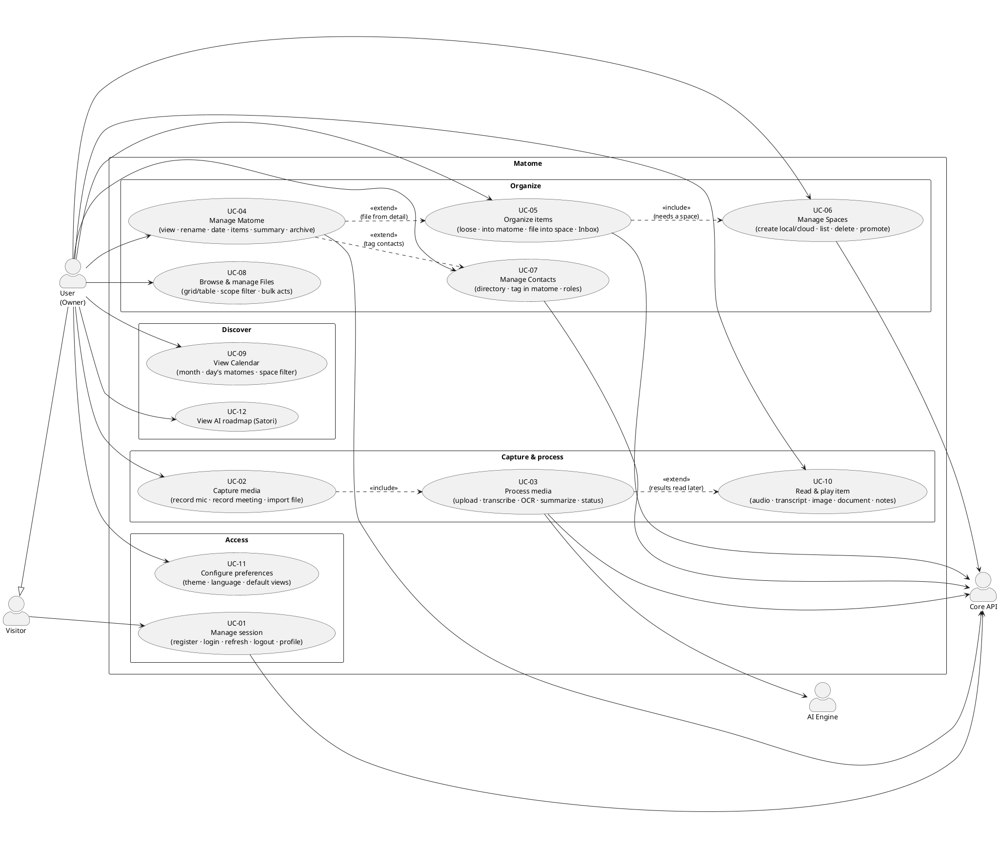

# Matome — Use Cases

> Status: agreed · Last updated: 2026-06-23
> The complete catalog of what Matome does **today**, as actor-goal use cases.
> CRUD is grouped as a single **"manage X"** case (create/edit/delete are not split
> into separate cases) to keep the diagram readable. Each use case has its own
> detail doc — with a Mermaid sequence diagram and the requirements it satisfies —
> in [`use-cases/`](use-cases/).
>
> Foundations: [`internal/prd.md`](internal/prd.md),
> [`internal/architecture.md`](internal/architecture.md),
> [`internal/requirements.md`](internal/requirements.md).

---

## Actors

- **Visitor** — unauthenticated; can only register / sign in.
- **User (Owner)** — authenticated; owns all their data. Primary actor for everything.
- **AI Engine** — external service that transcribes / OCRs / summarizes; secondary actor.
- **Core API** — backend system boundary (system of record + orchestrator).

---

## Use-case diagram (PlantUML)

> The diagram is PlantUML (renders in any PlantUML-aware viewer). The per-use-case
> docs use **Mermaid** sequence diagrams for the runtime flow.

---

## Catalog

| # | Use case | Primary actor | Detail doc |
|---|---|---|---|
| UC-01 | **Manage session** — register, login, refresh, logout, view profile | Visitor / User | [uc-01-manage-session.md](use-cases/uc-01-manage-session.md) |
| UC-02 | **Capture media** — record mic, record meeting (loopback), import file | User | [uc-02-capture-media.md](use-cases/uc-02-capture-media.md) |
| UC-03 | **Process media** — upload → transcribe/OCR → summarize → status/retry | User · AI Engine · Core | [uc-03-process-media.md](use-cases/uc-03-process-media.md) |
| UC-04 | **Manage Matome** — view, rename, date, items, summary, archive/restore | User | [uc-04-manage-matome.md](use-cases/uc-04-manage-matome.md) |
| UC-05 | **Organize items** — loose / into matome / file into space; Inbox view | User | [uc-05-organize-items.md](use-cases/uc-05-organize-items.md) |
| UC-06 | **Manage Spaces** — create local/cloud, list, delete, promote | User | [uc-06-manage-spaces.md](use-cases/uc-06-manage-spaces.md) |
| UC-07 | **Manage Contacts** — directory CRUD, tag in matome, roles | User | [uc-07-manage-contacts.md](use-cases/uc-07-manage-contacts.md) |
| UC-08 | **Browse & manage Files** — grid/table, scope filter, bulk actions | User | [uc-08-browse-files.md](use-cases/uc-08-browse-files.md) |
| UC-09 | **View Calendar** — month grid, day's matomes, space filter | User | [uc-09-view-calendar.md](use-cases/uc-09-view-calendar.md) |
| UC-10 | **Read & play item** — audio playback, transcript, image/document, notes, retry | User | [uc-10-read-item.md](use-cases/uc-10-read-item.md) |
| UC-11 | **Configure preferences** — theme, language, default views, sign out | User | [uc-11-configure-preferences.md](use-cases/uc-11-configure-preferences.md) |
| UC-12 | **View AI roadmap (Satori)** — informational roadmap | User | [uc-12-view-satori.md](use-cases/uc-12-view-satori.md) |

> CRUD note: "Manage" use cases (UC-04 Matome, UC-06 Spaces, UC-07 Contacts, UC-11
> preferences, parts of UC-08 Files) deliberately fold create / edit / delete into one
> case each. Splitting them would triple the diagram without adding meaning.
