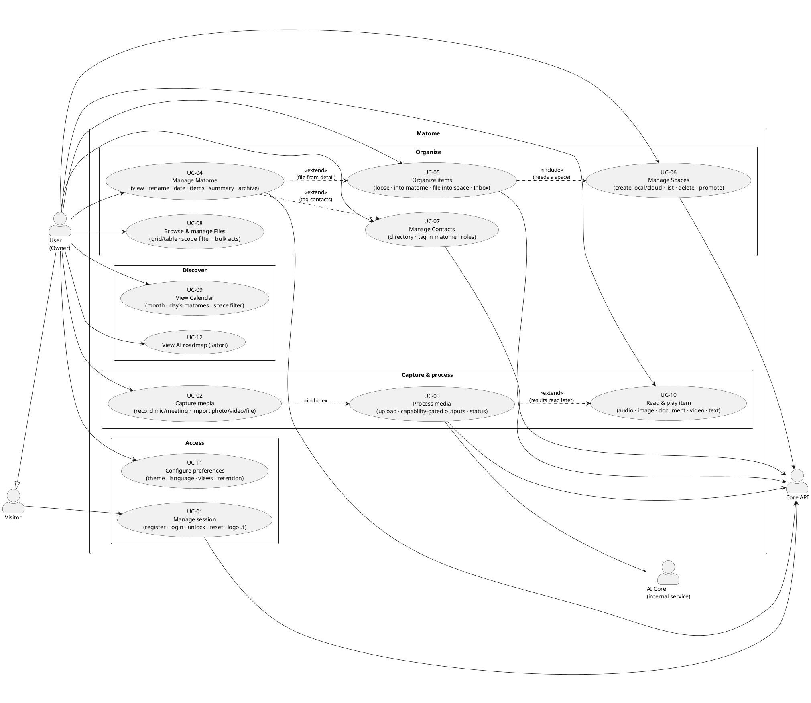

# Matome — Use Cases

> Status: agreed · Last updated: 2026-07-20
> The complete catalog of what Matome does **today**, as actor-goal use cases.
> CRUD is grouped as a single **"manage X"** case (create/edit/delete are not split
> into separate cases) to keep the diagram readable. Each use case has its own
> detail doc — with a Mermaid sequence diagram and the requirements it satisfies —
> in [`use-cases/`](use-cases/).
>
> Foundations: [`internal/prd.md`](internal/prd.md),
> [`internal/architecture.md`](internal/architecture.md),
> [`internal/requirements.md`](internal/requirements.md).

---

## Actors

- **Visitor** — unauthenticated; can welcome/register/sign in or recover the Core
  account password.
- **User (Owner)** — authenticated; owns all their data. Primary actor for everything.
- **AI Core** — internal, Core-managed processing service. Production currently
  transcribes supported audio; other typed processors are capability-gated.
- **Core API** — backend system boundary (system of record + orchestrator).

---

## Use-case diagram (PlantUML)

> The diagram is PlantUML (renders in any PlantUML-aware viewer). The per-use-case
> docs use **Mermaid** sequence diagrams for the runtime flow.

---

## Catalog

| # | Use case | Primary actor | Detail doc |
|---|---|---|---|
| UC-01 | **Manage session** — welcome, register, login, unlock, refresh, password reset, logout, profile | Visitor / User | [uc-01-manage-session.md](use-cases/uc-01-manage-session.md) |
| UC-02 | **Capture media** — record mic/meeting; import photo, video, audio, or document where available | User | [uc-02-capture-media.md](use-cases/uc-02-capture-media.md) |
| UC-03 | **Process media** — verified upload → capability-gated processing → status/retry | User · AI Core · Core | [uc-03-process-media.md](use-cases/uc-03-process-media.md) |
| UC-04 | **Manage Matome** — browse/search/sort, view, rename, date, items, summary actions, archive/delete | User | [uc-04-manage-matome.md](use-cases/uc-04-manage-matome.md) |
| UC-05 | **Organize items** — Inbox triage, loose/Matome/Space placement, conditional reading panes | User | [uc-05-organize-items.md](use-cases/uc-05-organize-items.md) |
| UC-06 | **Manage Spaces** — create local, list/open/delete, promote to cloud, preview | User | [uc-06-manage-spaces.md](use-cases/uc-06-manage-spaces.md) |
| UC-07 | **Manage Contacts** — local directory CRUD, detail, Matome roles, related content | User | [uc-07-manage-contacts.md](use-cases/uc-07-manage-contacts.md) |
| UC-08 | **Browse & manage Files** — grid/table, scope filter, bulk actions, Vault export | User | [uc-08-browse-files.md](use-cases/uc-08-browse-files.md) |
| UC-09 | **View Calendar** — month grid, day's matomes, space filter | User | [uc-09-view-calendar.md](use-cases/uc-09-view-calendar.md) |
| UC-10 | **Read & play item** — Vault-backed audio/image/document, static video detail, text edit, legacy detail fallback | User | [uc-10-read-item.md](use-cases/uc-10-read-item.md) |
| UC-11 | **Configure preferences** — theme, language, views, per-surface reading panes, Vault retention, sign out; dev host when enabled | User | [uc-11-configure-preferences.md](use-cases/uc-11-configure-preferences.md) |
| UC-12 | **View AI roadmap (Satori)** — conditional legacy-shell informational roadmap | User | [uc-12-view-satori.md](use-cases/uc-12-view-satori.md) |

> CRUD note: "Manage" use cases (UC-04 Matome, UC-06 Spaces, UC-07 Contacts, UC-11
> preferences, parts of UC-08 Files) deliberately fold create / edit / delete into one
> case each. Splitting them would triple the diagram without adding meaning.

## Route and surface coverage

This matrix is the completeness check against the app-owned route inventory.
`Active` means reachable in the configured primary app; `Conditional` means a
build-time flag or platform capability controls availability; `Compatibility`
means an old deep link redirects when possible and may render its legacy fallback;
`Dev-only` means intentionally excluded from the end-user product catalog.

| Route or surface | Page / behavior | Use case | Availability |
|---|---|---|---|
| `/` | Welcome | UC-01 | Active when signed out |
| `/login` | Login | UC-01 | Active when signed out |
| `/signup` | Registration | UC-01 | Active when signed out |
| `/unlock` | Account Vault unlock | UC-01 | Active for authenticated locked sessions |
| `/forgot-password` | Request reset code | UC-01 | Active when signed out |
| `/reset-password?token=…` | Reset Core account password | UC-01 | Active when signed out |
| `/recording` | Microphone capture | UC-02 | Platform-capability dependent |
| `/meeting` | Meeting/loopback capture | UC-02 | Conditional; Linux implementation |
| Shell/Matome add actions | Photo, video, file/document, text-note creation | UC-02 / UC-04 | Conditional by action and feature flag |
| `/inbox` | Matome/loose-item triage, search, sorting, actions | UC-04 / UC-05 | Active; loose lane conditional on `localFirstSpaces` |
| `/matome/:id` | Matome hub and management | UC-04 | Active |
| `/files` | Cross-Matome file library | UC-08 | Active in either shell placement |
| `/items/audio/:id` | Audio playback/transcript/notes | UC-10 | Active |
| `/items/image/:id` | Image preview/fullscreen | UC-10 | Active |
| `/items/document/:id` | Document metadata/external open | UC-10 | Active for imported rows |
| `/items/video/:id` | Static video file detail; no playback/AI today | UC-10 | Active for imported rows |
| `/items/text/:id` | Local-first text body/edit/delete/processing state | UC-10 | Active |
| `/calendar` | Calendar discovery | UC-09 | Conditional on `FeatureFlags.calendar` |
| `/spaces` | Space directory, create/delete/promote/preview | UC-06 | Conditional on `FeatureFlags.spaces` |
| `/spaces/:spaceId` | Space detail | UC-06 | Conditional on `FeatureFlags.spaces` |
| `/contacts` | Contact directory and optional reading pane | UC-07 | Conditional on `FeatureFlags.contacts` |
| `/contacts/:id` | Contact detail and related content | UC-07 | Conditional on `FeatureFlags.contacts` |
| `/satori` | Static AI roadmap or safety redirect to Inbox | UC-12 | Conditional; compiled out under `newNavShell` |
| `/inbox/:id`, `/calendar/:id`, `/spaces/recording/:id` | Parent-Matome redirect or legacy recording-detail fallback | UC-04 / UC-10 | Compatibility |
| `/inbox/settings` | Preferences, retention, sign out | UC-11 | Active |
| Settings custom host | Runtime Core endpoint override | UC-11 | Dev-only behind `FeatureFlags.godMode` |

Widgetbook Pages and Journeys are design-review/test surfaces rather than end-user
goals. Their route coverage is governed separately by
[`internal/design-system-route-contract.md`](internal/design-system-route-contract.md).
