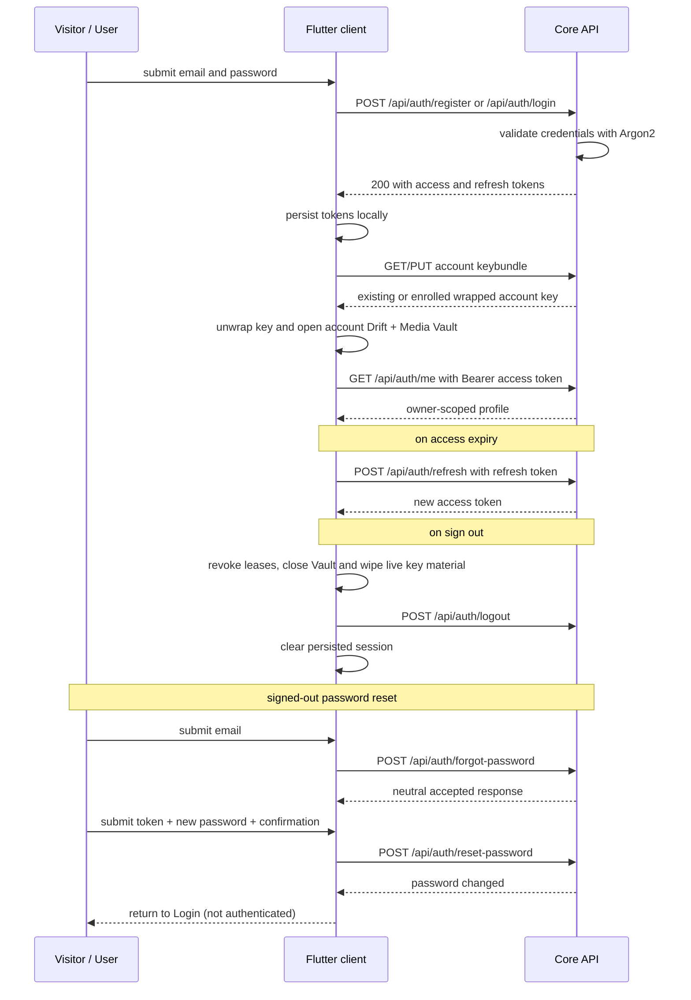

# UC-01 — Manage session (authenticate)

> Part of the [Matome use-case catalog](../use-cases.md). Foundations:
> [PRD](../internal/prd.md) · [Architecture](../internal/architecture.md) ·
> [Requirements](../internal/requirements.md).

## Summary
A Visitor reaches the welcome screen, registers or signs in with email +
password, or requests a password reset while signed out. Core validates normal
credentials (Argon2) and issues a Guardian JWT access token plus a refresh
token. Authentication alone does not expose account data: the client must also
enroll or unlock that account's encrypted Vault before entering authenticated
routes. Accounts without a keybundle enroll after password authentication;
existing accounts unwrap their keybundle. The client persists tokens so the
authenticated session can be restored, but restored sessions remain at the
unlock gate until the Vault is ready. Every non-auth call and every local Vault
namespace is owner-scoped.

## Actors
- **Primary:** Visitor (welcome, register, login, forgot/reset password) and User
  (unlock, refresh, logout, profile).
- **Secondary:** Core API — validates credentials, mints and verifies JWTs.

## Preconditions
- The app is installed and can reach the Core API.
- For refresh / logout / profile, a valid session already exists (the User is
  authenticated, or a persisted token is available to restore).
- Authenticated content routes require an account-scoped Vault in the `ready`
  phase; a JWT by itself is insufficient.

## Main flow
1. A Visitor submits email + password to register or to log in.
2. Core validates the credentials (Argon2 password hashing) and issues an
   access JWT + a refresh JWT.
3. The client persists both tokens locally.
4. The client fetches the account keybundle. If none exists, it creates and
   uploads one; otherwise it unwraps the existing account key using the login
   password.
5. The client opens the account-scoped encrypted Drift database and Media Vault.
   Authenticated routes become available only after this succeeds.
6. Every authenticated request carries the access token as a `Bearer` header
   and is scoped to the caller's `owner_id`.
7. When the access token expires, the client refreshes it using the refresh
   token (no re-login).
8. Logout revokes local Vault access, closes leases and account stores, then
   clears the session client-side.
9. The User reads their own profile via `GET /api/auth/me`.

### Password-reset flow

1. From Login, a signed-out Visitor opens `/forgot-password`, submits a non-empty
   email, and the client requests `POST /api/auth/forgot-password`.
2. Core returns a neutral response that does not reveal whether the account
   exists; the client shows the same confirmation.
3. The Visitor opens `/reset-password`, optionally with `?token=…`, enters the
   reset token, a new password, and matching confirmation, then the client calls
   `POST /api/auth/reset-password`.
4. Success returns the Visitor to Login; it does not automatically authenticate.
5. The current shipping reset flow changes the Core credential only. It does not
   invoke the implemented-but-unwired recovery-code coordinator and does not
   rewrap the Vault keybundle under the new password. A subsequent login can
   therefore authenticate yet remain fail-closed at `/unlock` if the old Vault
   wrap is no longer usable.

## Alternate & exception flows
- **Invalid credentials** — register / login returns `401`; the User stays
  unauthenticated and is shown an error.
- **Expired access token** — the client transparently refreshes via the refresh
  token and retries.
- **Invalid / expired refresh token** — refresh fails; the session is cleared
  and Vault access is revoked before the User is forced to re-login.
- **App reload / restart** — the JWT session may be restored from persisted
  tokens. Native may reopen with an enrolled device wrap on cold start; Web
  requires the account password again for that browser session.
- **Vault timeout / explicit lock** — authenticated routes return to `/unlock`.
  The current timeout flow requires the password; future passkey, biometric, or
  PIN unlock methods can implement the same Vault-session boundary.
- **Missing keybundle** — successful password authentication enrolls the
  account once. Enrollment failure fails closed and does not mint replacement
  key material silently.
- **Vault open failure or unavailable durable Web storage** — the client remains
  locked/failed-closed instead of falling back to plaintext or transient data.
- **Forgot-password privacy** — the same neutral success copy is shown regardless
  of account existence.
- **Invalid/expired reset token or rejected reset** — the reset form remains
  signed out and shows an error; no session is created.
- **Password mismatch** — the client rejects the reset before calling Core.
- **Vault recovery limitation** — recovery-code DEK rewrap machinery exists in
  code and tests but is not wired to the shipping reset screen; it is not a
  user-accessible recovery promise today.

## Sequence

## Requirements satisfied
| Requirement | What it covers |
|---|---|
| **FR-AUTH-1** | A Visitor can register with email + password. |
| **FR-AUTH-2** | A Visitor can sign in and receive a Guardian JWT access + refresh token. |
| **FR-AUTH-3** | A User can refresh the access token using the refresh token. |
| **FR-AUTH-4** | A User can sign out; the token is invalidated client-side and the session cleared. |
| **FR-AUTH-5** | A User can read their own profile via `GET /api/auth/me`. |
| **FR-AUTH-6** | An authenticated session survives an app reload/restart (token persisted locally). |
| **FR-AUTH-7** | Every non-auth API call is scoped to the caller's `owner_id`; no cross-owner reads/writes. |
| **FR-AUTH-8** | Account content remains gated until its encrypted Vault is enrolled/unlocked and ready. |
| **FR-AUTH-9** | Logout or forced sign-out revokes leases, closes account stores, and wipes live key material before clearing the session. |
| **FR-AUTH-10** | A signed-out Visitor can request a password-reset code without account enumeration. |
| **FR-AUTH-11** | A signed-out Visitor can reset the Core account password with a valid token and return to Login; the current UI does not claim Vault keybundle recovery. |
| **NFR-SEC-1** | Passwords hashed with Argon2; auth is Guardian JWT; authorization is app-level by `owner_id` (no Supabase Auth/RLS). |
| **NFR-SEC-5** | Account Vault namespaces and encryption material are isolated by owner and fail closed. |

## Code anchors
- `services/api/lib/matome_api_web/router.ex` — `/api/auth/*`: public `register`, `login`, `refresh`, `logout` plus authenticated `me`.
- `apps/flutter/lib/features/auth/auth_controller.dart` — `AuthController`: restores the persisted session on creation; holds `isAuthenticated` / `isLoading`.
- `apps/flutter/lib/features/auth/auth_repository.dart` — `AuthRepository`: register / login / refresh / logout / profile calls.
- `apps/flutter/lib/features/auth/forgot_password_screen.dart` — neutral reset-code request flow.
- `apps/flutter/lib/features/auth/reset_password_screen.dart` — token/new-password form and return-to-login success state.
- `apps/flutter/lib/core/vault/vault_session_controller.dart` — account enrollment, unlock, timeout, lock, and logout teardown.
- `apps/flutter/lib/core/vault/vault_boot_coordinator.dart` — atomically opens/closes the account database and Media Vault.
- `apps/flutter/lib/app/router.dart` — routes `/`, `/login`, `/unlock`, `/signup`,
  `/forgot-password`, and `/reset-password`, plus the auth/Vault guard.
