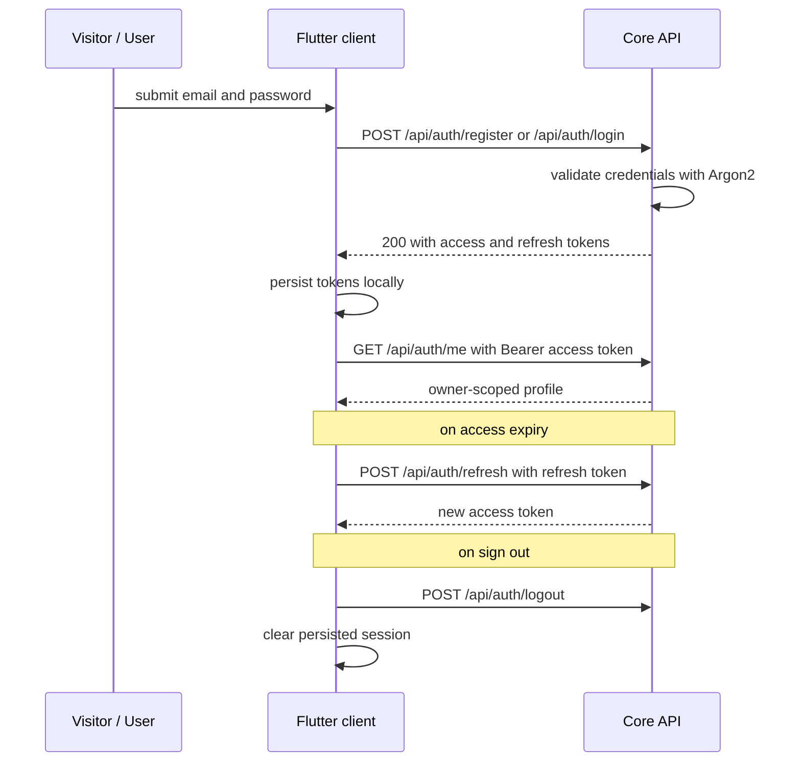

# UC-01 — Manage session (authenticate)

> Part of the [Matome use-case catalog](../use-cases.md). Foundations:
> [PRD](../internal/prd.md) · [Architecture](../internal/architecture.md) ·
> [Requirements](../internal/requirements.md).

## Summary
A Visitor registers or signs in with email + password; Core validates the
credentials (Argon2) and issues a Guardian JWT access token plus a refresh
token. The client persists the tokens locally so the session survives an app
reload, and sends the access token as a Bearer credential on every subsequent
request. Tokens are refreshed on expiry, logout clears the session, and the
profile is read via `GET /api/auth/me`. Every non-auth call is owner-scoped, so
a User only ever touches their own data.

## Actors
- **Primary:** Visitor (register / login) and User (refresh / logout / profile).
- **Secondary:** Core API — validates credentials, mints and verifies JWTs.

## Preconditions
- The app is installed and can reach the Core API.
- For refresh / logout / profile, a valid session already exists (the User is
  authenticated, or a persisted token is available to restore).

## Main flow
1. A Visitor submits email + password to register or to log in.
2. Core validates the credentials (Argon2 password hashing) and issues an
   access JWT + a refresh JWT.
3. The client persists both tokens locally.
4. Every authenticated request carries the access token as a `Bearer` header
   and is scoped to the caller's `owner_id`.
5. When the access token expires, the client refreshes it using the refresh
   token (no re-login).
6. Logout clears the session client-side.
7. The User reads their own profile via `GET /api/auth/me`.

## Alternate & exception flows
- **Invalid credentials** — register / login returns `401`; the User stays
  unauthenticated and is shown an error.
- **Expired access token** — the client transparently refreshes via the refresh
  token and retries.
- **Invalid / expired refresh token** — refresh fails; the session is cleared
  and the User is forced to re-login.
- **App reload / restart** — the session is restored from the persisted token,
  with no credential re-entry.

## Sequence

## Requirements satisfied
| Requirement | What it covers |
|---|---|
| **FR-AUTH-1** | A Visitor can register with email + password. |
| **FR-AUTH-2** | A Visitor can sign in and receive a Guardian JWT access + refresh token. |
| **FR-AUTH-3** | A User can refresh the access token using the refresh token. |
| **FR-AUTH-4** | A User can sign out; the token is invalidated client-side and the session cleared. |
| **FR-AUTH-5** | A User can read their own profile via `GET /api/auth/me`. |
| **FR-AUTH-6** | An authenticated session survives an app reload/restart (token persisted locally). |
| **FR-AUTH-7** | Every non-auth API call is scoped to the caller's `owner_id`; no cross-owner reads/writes. |
| **NFR-SEC-1** | Passwords hashed with Argon2; auth is Guardian JWT; authorization is app-level by `owner_id` (no Supabase Auth/RLS). |

## Code anchors
- `services/api/lib/matome_api_web/router.ex` — `/api/auth/*`: public `register`, `login`, `refresh`, `logout` plus authenticated `me`.
- `apps/flutter/lib/features/auth/auth_controller.dart` — `AuthController`: restores the persisted session on creation; holds `isAuthenticated` / `isLoading`.
- `apps/flutter/lib/features/auth/auth_repository.dart` — `AuthRepository`: register / login / refresh / logout / profile calls.
- `apps/flutter/lib/app/router.dart` — routes `/`, `/login`, `/signup` and the auth guard gating the rest of the tree.
