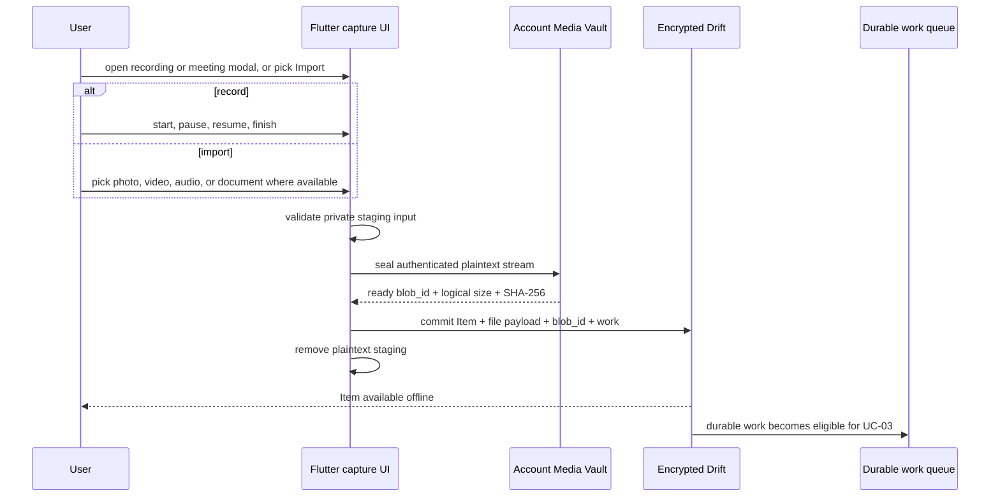

# UC-02 — Capture media

> Part of the [Matome use-case catalog](../use-cases.md). Foundations:
> [PRD](../internal/prd.md) · [Architecture](../internal/architecture.md) ·
> [Requirements](../internal/requirements.md).

## Summary
A signed-in User captures raw material for a happening in one of three ways:
record microphone audio (start / pause / resume / finish, with a live duration
timer and a waveform amplitude meter); record a meeting by mixing system-audio
loopback with the microphone (Linux desktop only, via ffmpeg); or import an
existing photo, video, audio, or document where the active picker exposes that
type. The graduated shell has dedicated photo/video actions and a feature-gated
generic file action; Matome detail has photo/video/file actions. Whatever the
source, plaintext first
exists only in private staging, is validated, and is sealed into the
account-scoped encrypted Media Vault. Drift receives the Item, file metadata,
opaque `blob_id`, and durable work only after the Vault reports a ready blob.
The Item then becomes available offline and processing/sync can proceed through
UC-03 when policy permits. A capture interrupted by a crash is recoverable as a
draft on next entry.

## Actors
- **Primary:** User.

## Preconditions
- The User is signed in.
- The User's account Vault is unlocked and ready.
- Microphone permission is granted for mic / meeting recording.
- Linux desktop is required for meeting loopback capture.

## Main flow
1. The User opens the recording modal (`/recording`), the meeting modal
   (`/meeting`), or chooses Add photo, Add video, or Add file from the active
   shell/Matome surface.
2. For recording, the User drives start / pause / resume / finish; for import,
   the User picks a file.
3. The capture/import boundary validates type, size, codec, and decodability in
   private staging.
4. The client streams the input into the account Media Vault, which encrypts it
   and returns an opaque `blob_id`, logical size, and SHA-256 only after the blob
   is ready.
5. In one local publication boundary, the client commits the Item, file payload,
   `blob_id`, and durable work to encrypted Drift. The current default
   organization lane may mint the Item's initial Matome; the Vault boundary does
   not depend on that placement.
6. The client removes plaintext staging. The Item is now visible and usable
   offline; durable work hands off to UC-03, whose sync gate decides whether any
   bytes may leave the device.

## Alternate & exception flows
- **Microphone unsupported** (some web targets) — the app degrades gracefully
  with a clear notice instead of failing.
- **Crash mid-capture** — the partial capture is recoverable as a draft on the
  next entry into the capture flow.
- **Crash during seal/commit** — Vault reconciliation removes or recovers
  uncommitted artifacts; an Item never becomes visible with a missing ready blob.
- **Vault locked or unavailable** — capture/import cannot publish an Item and
  fails closed rather than storing durable plaintext.
- **Meeting capture off Linux** — loopback meeting recording is unavailable on
  non-Linux platforms; an exposed action reports the capability limitation.
- **Import availability** — dedicated shell video/photo actions depend on the
  graduated shell; generic document/file import depends on
  `FeatureFlags.documents`; legacy-shell picker options differ.
- **Video classification** — `mp4`, `mov`, `mkv`, and `avi` enter as video file
  Items. The current shared classifier checks audio first, so `.webm` is treated
  as audio; common video extensions currently fall back to
  `application/octet-stream` when no MIME mapping is available.
- **Matome import limit** — Matome-detail file/video import enforces the current
  25 MiB client limit before Vault publication.

## Sequence

## Requirements satisfied
| Requirement | What it covers |
|---|---|
| **FR-CAP-1** | Record mic audio with start / pause / resume / finish, live duration timer, waveform meter. |
| **FR-CAP-2** | Record a meeting by mixing system-audio loopback + mic — Linux desktop only (ffmpeg). |
| **FR-CAP-3** | Import photo, video, audio, or document media where the active picker/flags expose it. |
| **FR-CAP-4** | A capture interrupted by a crash/kill is recoverable as a draft on next entry. |
| **FR-CAP-5** | Where mic capture is unsupported, the app degrades gracefully with a clear notice. |
| **FR-CAP-6** | A captured/imported item is sealed into the Vault and persisted locally before any network activity. |
| **FR-CAP-9** | An Item becomes visible only after a ready encrypted blob and its opaque `blob_id` are committed to Drift. |
| **FR-CAP-10** | Import supported video files through the same Vault-backed file ingest path; video is upload-only and has no AI processing today. |
| **NFR-SYNC-1** | Local-first: the UI watches the local DB; capture succeeds offline and syncs later. |
| **NFR-ARCH-6** | The local row keeps its stable `rec_local_*` / `mat_local_*` PK; it is never remapped. |
| **NFR-SEC-6** | Durable client media is encrypted at rest; no physical path or key material is stored as Item state. |

## Code anchors
- `apps/flutter/lib/features/recording/` — mic record + meeting (loopback) capture modules.
- `apps/flutter/lib/app/screens/recording_screen.dart` — capture screen scaffold.
- `apps/flutter/lib/core/vault/media_ingest_service.dart` — sole seal-then-commit publication boundary.
- `apps/flutter/lib/features/home/inbox_upload.dart` — `InboxUploader`: validates, seals, commits local state, then starts durable work.
- `apps/flutter/lib/app/shell_scaffold.dart` — shell record/photo/video/file/meeting add actions and platform/flag capability handling.
- `apps/flutter/lib/features/matome/matome_detail_screen.dart` — Matome-scoped photo/video/file pickers.
- `packages/matome_vault/` — encrypted blob contracts and native/Web stores.
- `apps/flutter/lib/app/router.dart` — routes `/recording` and `/meeting`.
