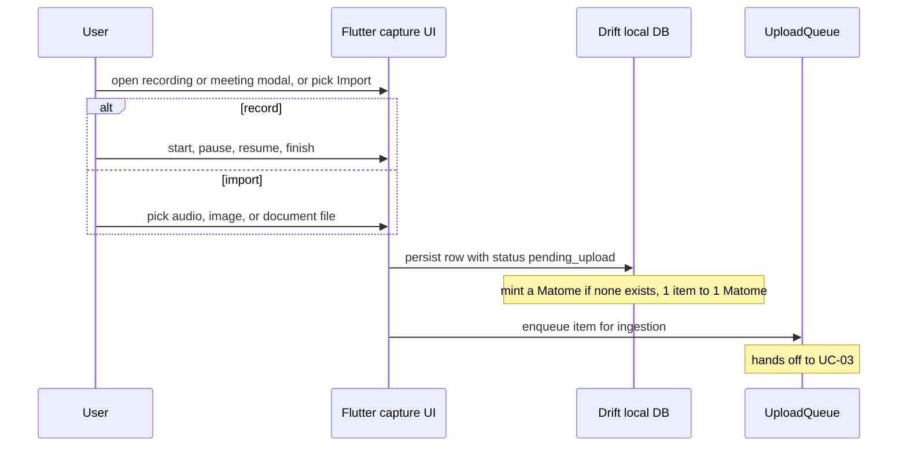

# UC-02 — Capture media

> Part of the [Matome use-case catalog](../use-cases.md). Foundations:
> [PRD](../internal/prd.md) · [Architecture](../internal/architecture.md) ·
> [Requirements](../internal/requirements.md).

## Summary
A signed-in User captures raw material for a happening in one of three ways:
record microphone audio (start / pause / resume / finish, with a live duration
timer and a waveform amplitude meter); record a meeting by mixing system-audio
loopback with the microphone (Linux desktop only, via ffmpeg); or import an
existing audio, image, or document file. Whatever the source, the item is
persisted to the local Drift store **first** as `pending_upload`, minting a
Matome if the item has none (1 item → 1 Matome at birth). Capture then hands the
item off to ingestion (UC-03). A capture interrupted by a crash is recoverable
as a draft on next entry.

## Actors
- **Primary:** User.

## Preconditions
- The User is signed in.
- Microphone permission is granted for mic / meeting recording.
- Linux desktop is required for meeting loopback capture.

## Main flow
1. The User opens the recording modal (`/recording`), the meeting modal
   (`/meeting`), or chooses Import.
2. For recording, the User drives start / pause / resume / finish; for import,
   the User picks a file.
3. The captured / imported item is persisted to Drift **locally first** with
   status `pending_upload`, minting a Matome if none exists (1 item → 1 Matome).
4. Capture enqueues the item to the upload queue, handing off to ingestion
   (UC-03).

## Alternate & exception flows
- **Microphone unsupported** (some web targets) — the app degrades gracefully
  with a clear notice instead of failing.
- **Crash mid-capture** — the partial capture is recoverable as a draft on the
  next entry into the capture flow.
- **Meeting capture off Linux** — loopback meeting recording is unavailable on
  non-Linux platforms.

## Sequence

## Requirements satisfied
| Requirement | What it covers |
|---|---|
| **FR-CAP-1** | Record mic audio with start / pause / resume / finish, live duration timer, waveform meter. |
| **FR-CAP-2** | Record a meeting by mixing system-audio loopback + mic — Linux desktop only (ffmpeg). |
| **FR-CAP-3** | Import an existing audio, image, or document file from device storage. |
| **FR-CAP-4** | A capture interrupted by a crash/kill is recoverable as a draft on next entry. |
| **FR-CAP-5** | Where mic capture is unsupported, the app degrades gracefully with a clear notice. |
| **FR-CAP-6** | A captured/imported item is persisted locally first (Drift) before any network activity. |
| **FR-MAT-1** | A Matome is minted implicitly at first item (1 item → 1 Matome); no blank-Matome flow. |
| **NFR-SYNC-1** | Local-first: the UI watches the local DB; capture succeeds offline and syncs later. |
| **NFR-ARCH-6** | The local row keeps its stable `rec_local_*` / `mat_local_*` PK; it is never remapped. |

## Code anchors
- `apps/flutter/lib/features/recording/` — mic record + meeting (loopback) capture modules.
- `apps/flutter/lib/app/screens/recording_screen.dart` — capture screen scaffold.
- `apps/flutter/lib/features/home/inbox_upload.dart` — `InboxUploader`: drives local-first persist + enqueue.
- `apps/flutter/lib/core/db/daos/recordings_dao.dart` — `RecordingsDao.upsertRecordingWithMatome`: persists the item and mints the Matome.
- `apps/flutter/lib/app/router.dart` — routes `/recording` and `/meeting`.
