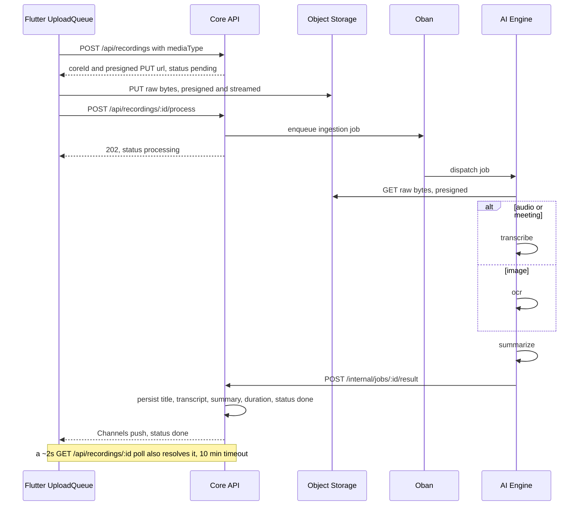

# UC-03 — Process media (AI ingestion)

> Part of the [Matome use-case catalog](../use-cases.md). Foundations:
> [PRD](../internal/prd.md) · [Architecture](../internal/architecture.md) ·
> [Requirements](../internal/requirements.md).

## Summary
Every media type flows through **one** ingestion path. The client drains a
locally-captured `pending_upload` item: it creates a `pending` record on Core
and receives a presigned upload URL, streams the raw bytes straight to object
storage (never through Core), then requests processing. Core enqueues an Oban
job; the AI Engine downloads the media via a presigned GET, transcribes or OCRs
it, summarizes, and POSTs a single terminal result to Core's internal callback.
Core persists the result, flips status to `done`, and broadcasts over Phoenix
Channels. The client resolves the terminal status by **racing** the Channel push
against a ~2 s poll (10-minute timeout). On failure the User can retry, which
re-enqueues server-side — the client never processes media locally.

## Actors
- **Primary:** User (triggers ingestion; retries on failure).
- **Secondary:** AI Engine (transcribe / OCR / summarize) and Core API
  (orchestrator + system of record).

## Preconditions
- A captured item exists locally as `pending_upload` (UC-02).
- The network is available so the upload queue can drain.

## Main flow
1. The UploadQueue drains a `pending_upload` item.
2. The client POSTs `/api/recordings` (with `mediaType`); Core returns a
   `coreId` and a presigned PUT URL. The client reconciles the `coreId` against
   its stable local PK and moves status to `processing`.
3. The client PUTs the raw bytes to object storage via the presigned URL
   (streamed).
4. The client POSTs `/api/recordings/:id/process`; Core enqueues an Oban
   ingestion job.
5. The AI Engine downloads the media via a presigned GET, transcribes or OCRs
   it, and summarizes.
6. The AI Engine POSTs the single terminal result to
   `/internal/jobs/:id/result`.
7. Core persists `title`, `transcript`, `summary`, `duration`, sets status
   `done`, and broadcasts on Phoenix Channels.
8. The client resolves the terminal status by racing the Channel push against a
   ~2 s `GET /api/recordings/:id` poll (10-minute timeout).

## Alternate & exception flows
- **Processor error** — Core sets status `failed` with an `error_reason`; the
  client surfaces the failure.
- **Retry** — the User retries; retry re-enqueues server-side (Oban). The client
  never processes media locally.
- **Idempotent callback** — callback handling is idempotent per `job_id` /
  recording status, so a duplicate result is a no-op.
- **Media types** — `audio | meeting | image` today (future `video | pdf`); set
  by the client at upload and routed by the AI Engine.

## Sequence

## Requirements satisfied
| Requirement | What it covers |
|---|---|
| **FR-ING-1** | Every media type flows through one ingestion path: `pending → processing → done \| failed`. |
| **FR-ING-2** | Client creates a `pending` record on Core (`POST /api/recordings`) and gets a presigned upload URL. |
| **FR-ING-3** | Client uploads raw bytes directly to object storage (streamed); never through Core. |
| **FR-ING-4** | Client requests processing (`POST /api/recordings/:id/process`); Core enqueues an Oban job. |
| **FR-ING-5** | AI Engine downloads via presigned GET, runs transcribe/OCR + summarize, POSTs one terminal result. |
| **FR-ING-6** | On `done`, Core persists `title`, `transcript`, `summary`, `duration` and broadcasts over Channels. |
| **FR-ING-7** | Client resolves terminal status by racing a Channel push against a ~2 s poll (10-minute timeout). |
| **FR-ING-8** | On `failed`, the User can retry; retry re-enqueues server-side — never processed locally. |
| **FR-ING-9** | Callback handling is idempotent per `job_id` / recording status. |
| **NFR-ARCH-1** | Thin client: it only captures, uploads bytes, and reads results — never runs processing. |
| **NFR-ARCH-2** | Backend owns processing; adding a media type/model is a backend change. |
| **NFR-ARCH-4** | One ingestion contract for every media type. |
| **NFR-ARCH-5** | Boundary: client talks only to Core + storage; only Core talks to the AI Engine. |
| **NFR-SEC-2** | Object storage is reached only via short-lived Core-issued presigned URLs. |
| **NFR-SEC-3** | The AI Engine is internal-only behind a shared service token, never client-facing. |

## Code anchors
- `apps/flutter/lib/features/recordings/upload_queue.dart` — `UploadQueue.drainRow`: drains a pending item through the ingestion steps.
- `apps/flutter/lib/features/recordings/recordings_repository.dart` — `RecordingsRepository.createRecording` / `uploadFile` / `enqueueProcessing`.
- `apps/flutter/lib/features/recordings/recording_result_waiter.dart` — `RecordingResultWaiter`: races channel vs poll (`kProcessingTimeout` 10 min, `kPollInterval` 2 s).
- `apps/flutter/lib/features/recordings/recording_status_socket.dart` — `RecordingStatusSocket`: the Phoenix Channel push side of the race.
- `services/api/lib/matome_api_web/router.ex` — `POST /internal/jobs/:id/result` (`InternalJobController.result`, service-token); Core ↔ AI contract `POST /v1/jobs` + callback.
