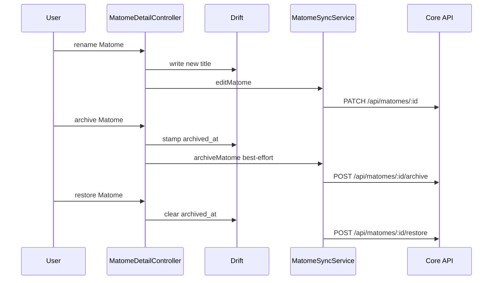

# UC-04 — Manage Matome

> Part of the [Matome use-case catalog](../use-cases.md). Foundations:
> [PRD](../internal/prd.md) · [Architecture](../internal/architecture.md) ·
> [Requirements](../internal/requirements.md).

## Summary
A Matome is the central per-happening aggregate that ties together Items,
contacts, an aggregated summary, and notes. In the current default organization
lane, the first capture mints its Matome; the feature-gated loose-item lane can
defer that grouping. From Inbox the User searches, sorts, selects, and invokes
row/bulk actions. From `/matome/:id` the User views and renames the Matome, edits
date/time and notes, adds existing/new media or a standalone text Item, manages
contacts/Space, copies or regenerates the summary, and archives/restores it.
Regeneration is a local deterministic composition of existing Item summaries,
not an AI call.

## Actors
- **Primary:** User editing a Matome from the detail screen.
- **Secondary:** Core API (receives PATCH and archive/restore only for sync-eligible matomes).

## Preconditions
- User is signed in.
- At least one item exists to birth the Matome; there is no blank-create path.

## Main flow
1. User browses Inbox Matomes, searches by visible content, or sorts the table by
   title, date, Item count, or people.
2. User opens `/matome/:id` and sees Items, contacts, summary, notes, and filing
   state.
3. User edits rename, date/time, or notes. Each edit writes to Drift first, then
   reconciles to Core when the Matome is cloud-eligible.
4. User adds a photo, video, or feature-gated file; attaches an existing
   owner-scoped file; or creates a standalone text Item and enters its routed
   editor. New files seal into Vault before publication, and Item changes mark
   the aggregated summary stale.
5. User tags or inline-creates a contact and can create/select a Space while
   filing the Matome.
6. User copies a non-empty summary to the clipboard or regenerates it by locally
   composing Item summaries.
7. Removing an Item enters the shared tombstone-first remote/Vault delete
   pipeline and marks the summary stale.
8. User archives the Matome; `archived_at` is stamped in Drift so it leaves lists
   immediately, and Undo/Restore reverses it. Inbox rows also expose regenerate,
   move, copy-summary, and archive actions.
9. In table view, confirmed row/bulk Delete invokes the current hard-delete DAO
   path. This is distinct from recoverable archive.

## Alternate & exception flows
- Offline edits and archives are not rolled back if the Core leg fails; they converge on the next sync via the adopt-guard on pull plus a re-push pass.
- An archived Matome stays openable, showing an archived banner with a Restore action.
- Share remains a disabled “soon” menu entry and performs no action.
- Copy summary reports when there is no summary instead of placing empty content
  on the clipboard.
- Confirmed hard delete is surfaced from the Inbox table. Unlike archive, it has
  no restore/Undo contract; its current direct Matome DAO path is separate from
  `ItemDeletionService`, so this UC does not claim remote/Vault convergence for
  that hard-delete operation.
- Only matomes whose effective space is a cloud space are pushed to Core; see UC-05 and UC-06 for the effective-space and promotion rules.
- Legacy `/inbox/:id`, `/calendar/:id`, and `/spaces/recording/:id` links resolve
  the Item's parent Matome and redirect here when the local relationship exists.

## Sequence

## Requirements satisfied
| Requirement | What it covers |
|---|---|
| **FR-MAT-1** | Matome is born implicitly from the first item; no blank create. |
| **FR-MAT-2** | View Matome detail at `/matome/:id` with items, contacts, summary, notes. |
| **FR-MAT-3** | Rename a Matome. |
| **FR-MAT-4** | Edit Matome date and time. |
| **FR-MAT-5** | Add a photo or file, upserting against the existing Matome. |
| **FR-MAT-6** | Remove an Item through durable remote/Vault deletion and mark the summary stale. |
| **FR-MAT-7** | Edit Matome notes. |
| **FR-MAT-8** | Regenerate the aggregated summary as a local deterministic compose. |
| **FR-MAT-9** | Archive a Matome as an offline-first soft-delete with Undo. |
| **FR-MAT-10** | Restore an archived Matome. |
| **FR-MAT-11** | Only sync-eligible matomes (effective space is a cloud space) push to Core. |
| **FR-MAT-12** | Search/sort Inbox Matomes; use row regenerate/move/copy/archive and bulk move/archive/delete actions. |
| **FR-MAT-13** | Copy a non-empty aggregated summary and receive truthful empty/success feedback. |
| **FR-MAT-14** | Confirmed Inbox-table hard delete uses direct Matome DAO behavior and is distinct from archive and Item deletion. |
| **NFR-SYNC-1** | Edits land in Drift first, then reconcile to Core. |
| **NFR-SYNC-2** | Failed Core legs converge on next sync rather than rolling back local state. |
| **NFR-ARCH-6** | The local row keeps its stable `mat_local_*` PK across reconciliation; `core_id` is filled alongside, never remapped. |
| **NFR-UX-2** | The detail is one route with breakpoint-driven layout (stacked letter on narrow; letter + side panel ≥ 900 px). |
| **NFR-UX-5** | The always-visible sync chip shows exactly three states (On device / Syncing / Synced). |

## Code anchors
- `apps/flutter/lib/features/matome/matome_detail_controller.dart` — `MatomeDetailController`: `rename`, `editDateTime`, `addPhoto`, `removeItem`, `regenerateSummary`, `archive`, `restore`.
- `apps/flutter/lib/features/matome/matome_sync_service.dart` — `MatomeSyncService`: `editMatome`, `archiveMatome`, `pushArchives`.
- `apps/flutter/lib/features/matome/matome_summary.dart` — `composeAggregatedSummary`: local deterministic compose of item summaries.
- `apps/flutter/lib/features/home/home_screen.dart` — Inbox search, grouped/card/table presentation, and Matome bulk handlers.
- `apps/flutter/lib/features/matome/widgets/matome_table.dart` — sorting, selection, row/bulk archive/move/delete actions.
- `apps/flutter/lib/features/matome/matome_actions_menu.dart` — rename/date/regenerate/move/copy/archive and disabled Share affordance.
- `services/api/lib/.../router.ex` — Core `PATCH /api/matomes/:id`, `POST /api/matomes/:id/archive`, `POST /api/matomes/:id/restore`.
