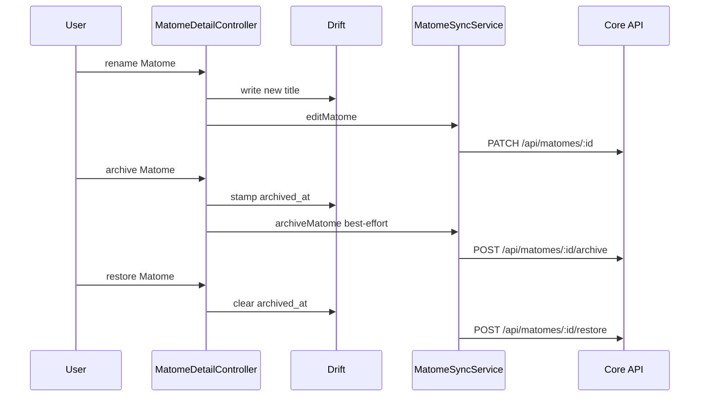

# UC-04 — Manage Matome

> Part of the [Matome use-case catalog](../use-cases.md). Foundations:
> [PRD](../internal/prd.md) · [Architecture](../internal/architecture.md) ·
> [Requirements](../internal/requirements.md).

## Summary
A Matome is the central per-happening aggregate that ties together items, contacts, a summary, and notes. It is never created blank; it is born implicitly from the first captured item (1 item produces 1 Matome). From the detail screen (`/matome/:id`) the user views and renames it, edits its date and time, adds and removes items, edits notes, regenerates the aggregated summary, and archives or restores it. Regenerating the summary is a local deterministic compose over the existing item summaries, not an AI call. All edits land in Drift first and only sync-eligible matomes (those whose effective space is a cloud space) push to Core.

## Actors
- **Primary:** User editing a Matome from the detail screen.
- **Secondary:** Core API (receives PATCH and archive/restore only for sync-eligible matomes).

## Preconditions
- User is signed in.
- At least one item exists to birth the Matome; there is no blank-create path.

## Main flow
1. The first captured item mints a local Matome with id `mat_local_<uuid>`.
2. User opens `/matome/:id` and sees its items, contacts, summary, and notes.
3. User edits the Matome — rename, date and time, or notes. Each edit writes to Drift first, then the reconciler issues `PATCH /api/matomes/:id`.
4. User adds a photo or file, which upserts against the existing Matome and marks the summary stale; removing an item deletes its row plus file and also marks the summary stale.
5. User regenerates the summary; item summaries are composed locally into `aggregated_summary`.
6. User archives the Matome; `archived_at` is stamped in Drift so it leaves all lists immediately, and a best-effort archive POST is sent to Core. Undo restores it.

## Alternate & exception flows
- Offline edits and archives are not rolled back if the Core leg fails; they converge on the next sync via the adopt-guard on pull plus a re-push pass.
- An archived Matome stays openable, showing an archived banner with a Restore action.
- A hard-delete path exists in the data layer but is not surfaced as a UI flow.
- Only matomes whose effective space is a cloud space are pushed to Core; see UC-05 and UC-06 for the effective-space and promotion rules.

## Sequence

## Requirements satisfied
| Requirement | What it covers |
|---|---|
| **FR-MAT-1** | Matome is born implicitly from the first item; no blank create. |
| **FR-MAT-2** | View Matome detail at `/matome/:id` with items, contacts, summary, notes. |
| **FR-MAT-3** | Rename a Matome. |
| **FR-MAT-4** | Edit Matome date and time. |
| **FR-MAT-5** | Add a photo or file, upserting against the existing Matome. |
| **FR-MAT-6** | Remove an item, deleting its row and file. |
| **FR-MAT-7** | Edit Matome notes. |
| **FR-MAT-8** | Regenerate the aggregated summary as a local deterministic compose. |
| **FR-MAT-9** | Archive a Matome as an offline-first soft-delete with Undo. |
| **FR-MAT-10** | Restore an archived Matome. |
| **FR-MAT-11** | Only sync-eligible matomes (effective space is a cloud space) push to Core. |
| **NFR-SYNC-1** | Edits land in Drift first, then reconcile to Core. |
| **NFR-SYNC-2** | Failed Core legs converge on next sync rather than rolling back local state. |
| **NFR-ARCH-6** | The local row keeps its stable `mat_local_*` PK across reconciliation; `core_id` is filled alongside, never remapped. |
| **NFR-UX-2** | The detail is one route with breakpoint-driven layout (stacked letter on narrow; letter + side panel ≥ 900 px). |
| **NFR-UX-5** | The always-visible sync chip shows exactly three states (On device / Syncing / Synced). |

## Code anchors
- `apps/flutter/lib/features/matome/matome_detail_controller.dart` — `MatomeDetailController`: `rename`, `editDateTime`, `addPhoto`, `removeItem`, `regenerateSummary`, `archive`, `restore`.
- `apps/flutter/lib/features/matome/matome_sync_service.dart` — `MatomeSyncService`: `editMatome`, `archiveMatome`, `pushArchives`.
- `apps/flutter/lib/features/matome/matome_summary.dart` — `composeAggregatedSummary`: local deterministic compose of item summaries.
- `services/api/lib/.../router.ex` — Core `PATCH /api/matomes/:id`, `POST /api/matomes/:id/archive`, `POST /api/matomes/:id/restore`.
