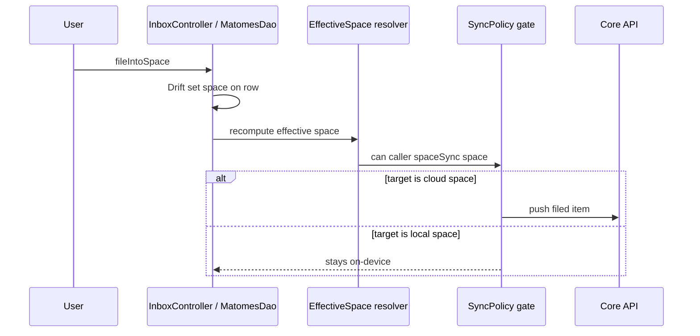

# UC-05 — Organize items (triage)

> Part of the [Matome use-case catalog](../use-cases.md). Foundations:
> [PRD](../internal/prd.md) · [Architecture](../internal/architecture.md) ·
> [Requirements](../internal/requirements.md).

## Summary
Behind `FeatureFlags.localFirstSpaces`, Items compose freely: loose, inside a
Matome, or filed directly into a Space. The effective-space resolver is the
single sync authority: `matome.spaceId` wins, else `item.workspaceId`, else NULL.
Inbox derives everything whose effective Space is NULL. Filing organizes but
does not itself sync; only a cloud effective Space permits egress. The configured
primary build currently leaves `localFirstSpaces` OFF, so the loose-item lane and
its direct filing controls are not presented; Inbox remains Matome-centric.

## Actors
- **Primary:** User triaging items from the Inbox.
- **Secondary:** Core API (engaged only when the target is a cloud space).

## Preconditions
- User is signed in.
- An item or Matome exists to organize.
- A Space exists to file into (see UC-06).

## Main flow
1. User views the Matome-centric Inbox, with search and date grouping. When
   `localFirstSpaces` is enabled, loose Items whose effective Space is NULL also
   appear.
2. User files a Matome into a Space. In the enabled loose lane, the User may also
   file/move a loose Item directly into a Space or Matome.
3. The resolver recomputes the effective space from the new placement.
4. If the target is a cloud space the item becomes sync-eligible and the drain pushes it through the single operation-keyed gate; if the target is a local space it stays on-device.

## Alternate & exception flows
- Filing into a local space organizes the content without any sync.
- Leaving a Matome makes the shadowed `workspaceId` authoritative again, with no data loss.
- The loose/effective-Space behavior and direct Item filing controls sit behind
  `FeatureFlags.localFirstSpaces`; when OFF, controllers deliberately suppress
  loose rows and retain the Matome-first lane.
- **Reading panes.** Behind `FeatureFlags.masterDetailLayout`, Inbox, Files,
  Spaces, and Contacts each use an independently persisted mode: `always`,
  `onClick` (default), or `off`. At expanded width, `always` reserves a pane,
  `onClick` selects and opens it on first tap with a close action, and `off`
  navigates to full-screen detail. Compact/medium widths navigate. Selection is
  reconciled after list changes so it cannot retain a deleted/out-of-scope row.
- With `masterDetailLayout` OFF, each collection preserves its legacy responsive
  behavior; the setting remains persisted but does not drive the new scaffold.

## Sequence

## Requirements satisfied
| Requirement | What it covers |
|---|---|
| **FR-ORG-1** | Items compose freely as loose, in a Matome, or filed into a Space. |
| **FR-ORG-2** | Effective-space resolver: matome space wins, else recording workspace, else NULL. |
| **FR-ORG-3** | Inbox is the derived view of everything whose effective space is NULL. |
| **FR-ORG-4** | File a Matome into a Space. |
| **FR-ORG-5** | File or move a loose item directly into a Space or a Matome. |
| **FR-ORG-6** | `workspaceId` is shadowed, not cleared, when an item joins a Matome. |
| **FR-ORG-7** | Sync happens only when the effective space is a cloud space. |
| **FR-MAT-11** | Only sync-eligible matomes (effective space is a cloud space) push to Core. |
| **NFR-SYNC-3** | One resolver computes eligibility, one operation-keyed gate decides sync — no second predicate, no inline `if isCloud`. |
| **NFR-SYNC-4** | Two axes never collapsed (`is_local` ⟂ `space_type`; `local ⟹ personal`, `org ⟹ cloud`). |
| **NFR-SYNC-6** | The behaviour is behind `FeatureFlags.localFirstSpaces` (single-flip rollback). |
| **FR-PRF-6** | Configure `always`, `onClick`, or `off` independently for Inbox, Files, Spaces, and Contacts reading panes. |

## Code anchors
- `apps/flutter/lib/features/spaces/effective_space.dart` — `effectiveSpaceId`, `isCloudSynced`: the resolver and eligibility check.
- `apps/flutter/lib/features/spaces/sync_policy.dart` — `SyncPolicy.can`, `Operation`: the single gate.
- `apps/flutter/lib/core/db/daos/matomes_dao.dart` — `MatomesDao.fileIntoSpace`: sets the space on the row.
- `apps/flutter/lib/features/home/inbox_controller.dart` — `InboxController.moveToSpace`, `InboxController.fileIntoSpace`: triage from the Inbox.
- `apps/flutter/lib/features/matome/matome_sync_service.dart` — `MatomeSyncService.pushFiled`: pushes filed items when eligible.
- `apps/flutter/lib/ui/master_detail_scaffold.dart` — shared master-detail shell
  and `selectsOnTap` behavior behind `FeatureFlags.masterDetailLayout`.
- `apps/flutter/lib/core/settings/reading_pane.dart` — independent persisted
  `ReadingPaneMode` per collection surface.
- `apps/flutter/lib/features/contacts/contacts_screen.dart` — `contactsSelectionProvider`, `ContactsScreen._open`, `_ContactsPaneDetail`: the Contacts master–detail wiring (tap = select-in-pane vs navigate, real `ContactDetail` pane, post-frame selection reconcile).
