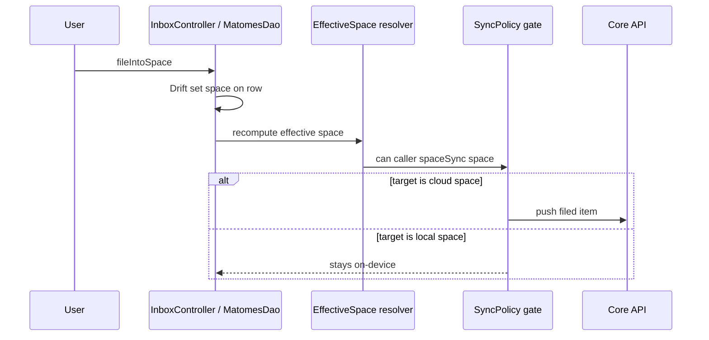

# UC-05 — Organize items (triage)

> Part of the [Matome use-case catalog](../use-cases.md). Foundations:
> [PRD](../internal/prd.md) · [Architecture](../internal/architecture.md) ·
> [Requirements](../internal/requirements.md).

## Summary
Items compose freely: they can be loose, inside a Matome, or filed directly into a Space. The effective-space resolver is the single authority on sync eligibility: `matome.spaceId` wins, else `recording.workspaceId`, else NULL. The Inbox is the derived view of everything whose effective space is NULL — loose items plus draft matomes. Filing organizes content but does not by itself sync; sync happens only when the effective space is a cloud space. When an item joins a Matome its `workspaceId` is shadowed rather than cleared, so leaving the Matome restores it without data loss.

## Actors
- **Primary:** User triaging items from the Inbox.
- **Secondary:** Core API (engaged only when the target is a cloud space).

## Preconditions
- User is signed in.
- An item or Matome exists to organize.
- A Space exists to file into (see UC-06).

## Main flow
1. User views the Inbox, the view of everything whose effective space is NULL.
2. User files a Matome into a Space (Inbox to Space), or files or moves a loose item directly into a Space or a Matome.
3. The resolver recomputes the effective space from the new placement.
4. If the target is a cloud space the item becomes sync-eligible and the drain pushes it through the single operation-keyed gate; if the target is a local space it stays on-device.

## Alternate & exception flows
- Filing into a local space organizes the content without any sync.
- Leaving a Matome makes the shadowed `workspaceId` authoritative again, with no data loss.
- The whole behaviour sits behind `FeatureFlags.localFirstSpaces`.
- **Reading pane (master–detail).** On expanded widths, the collection surfaces used to triage — Inbox, Files, Spaces, and now **Contacts** — render through the shared `MasterDetailScaffold` behind `FeatureFlags.masterDetailLayout`: the directory stays as a full-width master beside a reading pane that previews the selected row in place (for Contacts, the real `ContactDetail`), so the user can scan and inspect without leaving the list. Tapping selects in-pane only when the pane is visible (`MasterDetailScaffold.showsPane`); on narrow widths, with the pane off, or with the flag OFF it degrades to navigating to the full-screen detail (`/contacts/:id`), exactly as shipped. The pane selection is reconciled after every list re-read so it never points at a row that has left the list (deleted / out of scope).

## Sequence

## Requirements satisfied
| Requirement | What it covers |
|---|---|
| **FR-ORG-1** | Items compose freely as loose, in a Matome, or filed into a Space. |
| **FR-ORG-2** | Effective-space resolver: matome space wins, else recording workspace, else NULL. |
| **FR-ORG-3** | Inbox is the derived view of everything whose effective space is NULL. |
| **FR-ORG-4** | File a Matome into a Space. |
| **FR-ORG-5** | File or move a loose item directly into a Space or a Matome. |
| **FR-ORG-6** | `workspaceId` is shadowed, not cleared, when an item joins a Matome. |
| **FR-ORG-7** | Sync happens only when the effective space is a cloud space. |
| **FR-MAT-11** | Only sync-eligible matomes (effective space is a cloud space) push to Core. |
| **NFR-SYNC-3** | One resolver computes eligibility, one operation-keyed gate decides sync — no second predicate, no inline `if isCloud`. |
| **NFR-SYNC-4** | Two axes never collapsed (`is_local` ⟂ `space_type`; `local ⟹ personal`, `org ⟹ cloud`). |
| **NFR-SYNC-6** | The behaviour is behind `FeatureFlags.localFirstSpaces` (single-flip rollback). |

## Code anchors
- `apps/flutter/lib/features/spaces/effective_space.dart` — `effectiveSpaceId`, `isCloudSynced`: the resolver and eligibility check.
- `apps/flutter/lib/features/spaces/sync_policy.dart` — `SyncPolicy.can`, `Operation`: the single gate.
- `apps/flutter/lib/core/db/daos/matomes_dao.dart` — `MatomesDao.fileIntoSpace`: sets the space on the row.
- `apps/flutter/lib/features/home/inbox_controller.dart` — `InboxController.moveToSpace`, `InboxController.fileIntoSpace`: triage from the Inbox.
- `apps/flutter/lib/features/matome/matome_sync_service.dart` — `MatomeSyncService.pushFiled`: pushes filed items when eligible.
- `apps/flutter/lib/ui/master_detail_scaffold.dart` — `MasterDetailScaffold`, `MasterDetailScaffold.showsPane`: the shared master–detail shell + the single pane-visibility predicate (behind `FeatureFlags.masterDetailLayout`).
- `apps/flutter/lib/features/contacts/contacts_screen.dart` — `contactsSelectionProvider`, `ContactsScreen._open`, `_ContactsPaneDetail`: the Contacts master–detail wiring (tap = select-in-pane vs navigate, real `ContactDetail` pane, post-frame selection reconcile).
