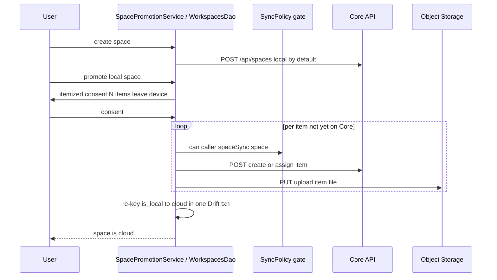

# UC-06 — Manage Spaces

> Part of the [Matome use-case catalog](../use-cases.md). Foundations:
> [PRD](../internal/prd.md) · [Architecture](../internal/architecture.md) ·
> [Requirements](../internal/requirements.md).

## Summary
A Space groups matomes. The user creates a Space (local by default, cloud only by explicit choice), lists and opens and deletes spaces, and promotes a local space to cloud. Promotion is one-way in v1 and requires explicit itemized consent ("N items will leave this device"). It runs per-item with idempotency keyed on a stable Core id, is resumable on partial failure, and is driven by a sealed `local → promoting → cloud | failed` state machine. A local space never syncs and a cloud space always syncs; all sync flows through one operation-keyed gate. The two axes never collapse: `is_local` is independent of `space_type`, with local implying personal and org implying cloud.

## Actors
- **Primary:** User managing and promoting Spaces.
- **Secondary:** Core API and Object Storage (engaged during cloud create, assign, and upload).

## Preconditions
- User is signed in.
- For promotion, a local space with items exists.

## Main flow
1. User creates a Space via `POST /api/spaces`; it is local by default.
2. User lists spaces (name plus matome count) and opens a space detail.
3. User deletes a space; its matomes return to the Inbox.
4. User promotes a local space: the app shows itemized consent with the count of items that will leave the device. On consent the app runs a per-item Core create/assign plus upload (idempotent, skipping items already on Core), then re-keys the space `local → cloud` in one Drift transaction. The space reaches cloud only once every item has a Core row.

## Alternate & exception flows
- Dismissing the consent dialog makes no change.
- A partial failure leaves the state `failed`; resuming re-runs idempotently and skips items already on Core.
- Promotion is one-way; there is no cloud-to-local demotion in v1.
- The state is re-derived from `is_local` plus each item's `coreId`; there is no separate promotion-state column.

## Sequence

## Requirements satisfied
| Requirement | What it covers |
|---|---|
| **FR-SPC-1** | Create a Space; local by default, cloud only by explicit choice. |
| **FR-SPC-2** | A local Space's items never sync while they remain in it. |
| **FR-SPC-3** | A cloud Space's items sync to Core. |
| **FR-SPC-4** | List Spaces (name + matome count) and open a Space detail. |
| **FR-SPC-5** | Delete a Space; its matomes return to the Inbox. |
| **FR-SPC-6** | Promote local → cloud: one-way, itemized consent, per-item idempotent, resumable, sealed `local → promoting → cloud \| failed` state machine. |
| **FR-SPC-7** | Sync eligibility flows through one operation-keyed gate — no inline `if isCloud`, no role enum. |
| **FR-ORG-7** | Filing organizes; sync happens only when the effective space is a cloud space. |
| **NFR-SYNC-3** | One resolver, one gate — no second predicate. |
| **NFR-SYNC-4** | Two axes never collapse (`is_local` ⟂ `space_type`; local ⟹ personal, org ⟹ cloud). |
| **NFR-SYNC-5** | Accepted data-loss risk surfaced as itemized consent before data leaves the device. |
| **NFR-SEC-2** | Object storage reached only via short-lived Core-issued presigned URLs (per-item upload). |

## Code anchors
- `apps/flutter/lib/features/spaces/space_promotion.dart` — `SpacePromotionService`, `PromotionState`: consent, per-item idempotent create/upload, resume.
- `apps/flutter/lib/core/db/daos/workspaces_dao.dart` — `WorkspacesDao.promoteToCloud`: the atomic local-to-cloud re-key.
- `apps/flutter/lib/features/spaces/spaces_repository.dart` — `POST /api/spaces`: create a Space.
- `apps/flutter/lib/features/spaces/sync_policy.dart` — `SyncPolicy`: the operation-keyed gate.
- `services/api/lib/.../router.ex` — Core `/api/spaces` endpoints.

The promotion runbook (consent count, per-item idempotent create/assign plus upload skipping items already on Core, atomic re-key, resumable on partial failure) is described inline above rather than linked to an external spec.
