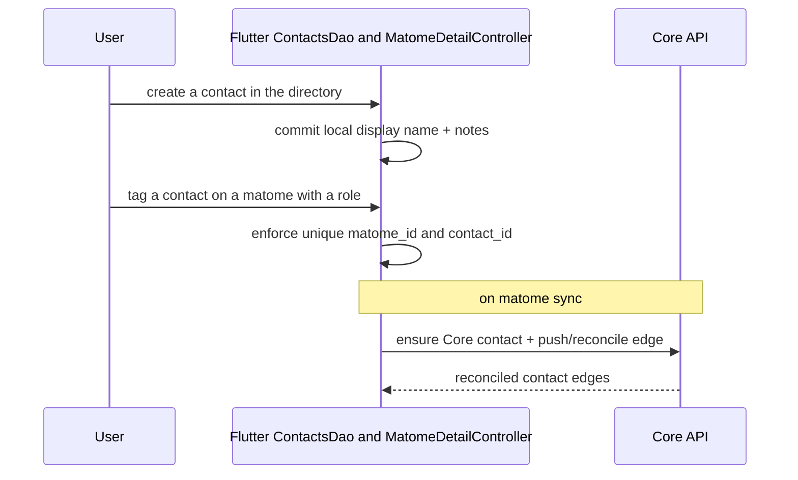

# UC-07 — Manage Contacts

> Part of the [Matome use-case catalog](../use-cases.md). Foundations:
> [PRD](../internal/prd.md) · [Architecture](../internal/architecture.md) ·
> [Requirements](../internal/requirements.md).

## Summary
A User maintains an owner-owned local contact directory. The current create/edit
form writes display name and notes; contact detail can also display company,
title, email, phone, and linked-user fields when legacy/synced data contains
them, but those fields are not editable in the current form. From a Matome the
User can tag a contact with a role
(organizer | attendee | speaker); the tag is idempotent per matome + contact.
The User can change a contact's role or untag it, and open a contact detail that
surfaces the contact's linked Matomes (with their roles), Space memberships, and
related files. Contact edges sync to Core when their owning Matome syncs.

## Actors
- **Primary:** User — creates, edits, and deletes contacts, and tags/untags them on Matomes.
- **Secondary:** Core API — stores contacts and contact edges, reconciles edges on pull.

## Preconditions
- The User is signed in (owner-scoped session).

## Main flow
1. The User opens the contacts directory (`/contacts`) and creates, edits, or deletes a contact.
2. The User opens a contact detail (`/contacts/:id`) and sees the contact's linked Matomes, Spaces, and files.
3. From a Matome (UC-04) the User tags a contact with a role via the picker (inline-create is allowed), changes the role, or untags the contact.
4. When the owning Matome syncs, its contact edges sync to Core — the client ensures a Core id for the contact, attaches the edge, and reconciles edges on pull.

## Alternate & exception flows
- **Duplicate tag** — adding a contact already tagged on the same Matome is idempotent (`UNIQUE matome_id + contact_id`); no duplicate edge is created.
- **Privacy risk** — a linked contact's profile is viewable without that user's consent, a recorded privacy risk (NFR-SEC-4).
- **Reading pane** — at expanded width with `masterDetailLayout`, Contacts obeys
  its independent `always`/`onClick`/`off` mode and can show the real editable
  detail inline; narrower/off modes navigate to `/contacts/:id`.
- **Related video** — video rows route to `/items/video/:id` like other file
  media types.
- **Merge affordance** — a visible Merge menu entry is currently reserved/no-op
  and is not a supported contact operation.

## Sequence

## Requirements satisfied
| Requirement | What it covers |
|---|---|
| **FR-CON-1** | Create/edit/delete local contacts by display name and notes; detail may display additional structured fields when present. |
| **FR-CON-2** | A User can tag a contact in a Matome with a role (organizer / attendee / speaker); tagging is idempotent per matome + contact. |
| **FR-CON-3** | A User can change a tagged contact's role and untag a contact. |
| **FR-CON-4** | A contact detail shows the contact's linked Matomes (with roles), Space memberships, and related files. |
| **FR-CON-5** | Contact edges sync to Core (ensure Core id, attach edge, reconcile on pull) when their Matome syncs. |
| **FR-CON-6** | Related files route by audio/image/document/video media type; Merge remains an inactive reserved affordance. |
| **FR-PRF-6** | Contacts obey their independently persisted reading-pane mode on expanded layouts. |
| **NFR-SEC-4** | A linked contact's profile is viewable without that user's consent — a recorded privacy risk. |
| **NFR-SYNC-1** | Local-first: directory + tagging succeed offline; the UI watches the local DB and syncs in the background. |

## Code anchors
- `apps/flutter/lib/features/contacts/` — `ContactsScreen` / `ContactDetailScreen`: directory CRUD and detail (linked matomes, spaces, files).
- `apps/flutter/lib/features/contacts/contacts_controller.dart` — local
  display-name/notes create, edit, and delete behavior.
- `apps/flutter/lib/core/db/daos/contacts_dao.dart` — `ContactsDao.addContactToMatome` / `removeContactFromMatome`: idempotent tag/untag of the contact edge.
- `apps/flutter/lib/features/...` — `MatomeSyncService._pushContacts` / `_reconcileContactEdges`: ensure Core id, push edges, reconcile on pull.
- `services/api/lib/matome_api_web/router.ex` — `/api/contacts`, `/api/matomes/:matome_id/contacts`, `/api/recordings/:recording_id/contacts`.
- `apps/flutter/lib/app/router.dart` — routes `/contacts` and `/contacts/:id`.
