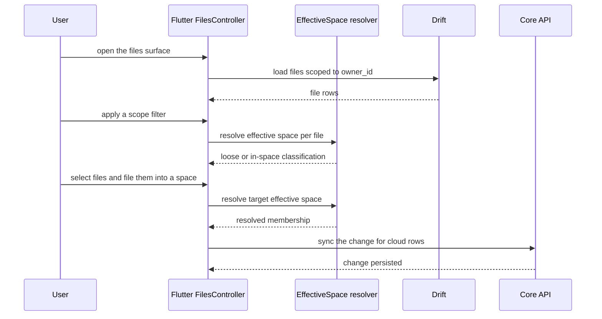

# UC-08 — Browse & manage Files

> Part of the [Matome use-case catalog](../use-cases.md). Foundations:
> [PRD](../internal/prd.md) · [Architecture](../internal/architecture.md) ·
> [Requirements](../internal/requirements.md).

## Summary
A User browses every file across all of their Matomes (owner-scoped) in a grid
or a table, with the chosen view persisted as a preference. The User can filter
by scope — All, Loose, or In a space — where "loose" means the file's effective
space resolves to NULL. Tapping a file routes it by media type to the audio,
image, or document detail (UC-10). The User can also bulk-act on a selection:
open, move to a Matome, file into a Space, or delete (a permanent hard-delete
behind a confirm). Download is presented in the UI but is a stub.

## Actors
- **Primary:** User — browses, filters, opens, and bulk-acts on files.
- **Secondary:** Core API — persists move / file-into-space / delete on synced rows.

## Preconditions
- The User is signed in (owner-scoped session).
- The Files surface is enabled — `FeatureFlags.newNavShell` for the nav tab, and the `/files` route.

## Main flow
1. The User opens `/files`.
2. The User toggles between grid and table; the choice is persisted.
3. The User applies a scope filter — All, Loose, or In-space (loose = effective space NULL).
4. The User taps a file, which opens by media type (audio / image / document).
5. The User selects files and bulk-moves them to a Matome, files them into a Space, or deletes them.

## Alternate & exception flows
- **Scope resolution** — the scope filter uses the effective-space resolver to decide loose vs in-space membership.
- **Delete** — delete is a permanent hard-delete, gated behind a confirmation. When the deleted file was open in the reading pane, the pane selection clears.
- **Download** — selecting download shows a "not available" notice; the action is a stub.
- **Master–detail reading pane (flag-gated, `FeatureFlags.masterDetailLayout`)** — when ON, Files renders through the unified `MasterDetailScaffold`. The shared `MasterDetailScaffold.showsPane` predicate (global `readingPaneProvider` position × current width class) is the single source of truth for tap behaviour:
  - Reading pane = Right AND width class = expanded → the grid/table renders FULL-WIDTH (no 1080-cap centring, killing the wide-window whitespace) beside a read-only `FileView` reading pane; tapping a file selects it in the pane (`filesSelectionProvider`) instead of navigating.
  - Reading pane = Off, or a narrower (medium/compact) width → the master is full-width and tapping a file routes to its media-typed detail (UC-10), exactly as the flag-OFF reality.
  - The pane selection is reconciled after each frame so it never points at a file that has left the loaded list (deleted, moved out of the active scope, or absent after a reload).
  - Flag OFF (shipped default) → the centred 1080 column + route-on-tap, byte-for-byte unchanged.

## Sequence

## Requirements satisfied
| Requirement | What it covers |
|---|---|
| **FR-FIL-1** | Browse every file across all Matomes in a grid or table view, with the view persisted as a preference. |
| **FR-FIL-2** | Filter files by scope — All / Loose / In a space. |
| **FR-FIL-3** | Open a file, routed by media type to the audio / image / document detail. |
| **FR-FIL-4** | Bulk-act on a selection — open, move to a Matome, file into a Space, delete (hard-delete with confirm). |
| **FR-FIL-5** | Download is presented but currently a stub ("not available"). |
| **FR-ORG-2** | The scope filter and file-into-Space use the effective-space resolver (loose = effective space NULL). |
| **FR-ORG-5** | A User can file/move a file directly into a Space or a Matome. |
| **NFR-SYNC-3** | One resolver, one operation-keyed gate decides which moves/files sync to Core (cloud rows). |
| **FR-AUTH-7** | The files surface is owner-scoped; no cross-owner reads/writes. |

## Code anchors
- `apps/flutter/lib/features/files/files_screen.dart` — `FilesScreen`: grid/table, selection, bulk actions; `filesSelectionProvider` + `_FilesPaneDetail` (the flag-gated `FileView` reading pane).
- `apps/flutter/lib/ui/master_detail_scaffold.dart` — `MasterDetailScaffold` + `showsPane` predicate driving the Files reading-pane layout (flag ON).
- `apps/flutter/lib/core/settings/reading_pane.dart` — `readingPaneProvider` (global reading-pane position).
- `apps/flutter/lib/ui/files_scope_filter.dart` — `FilesScopeFilter` with `FilesScope` (`all` | `loose` | `inSpace`).
- `apps/flutter/lib/features/spaces/effective_space.dart` — effective-space resolver: loose vs in-space classification.
- `apps/flutter/lib/app/router.dart` — route `/files`.
