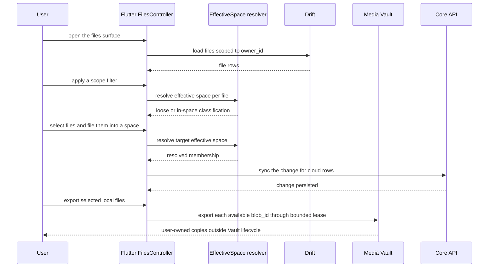

# UC-08 — Browse & manage Files

> Part of the [Matome use-case catalog](../use-cases.md). Foundations:
> [PRD](../internal/prd.md) · [Architecture](../internal/architecture.md) ·
> [Requirements](../internal/requirements.md).

## Summary
A User browses every file across all of their Matomes (owner-scoped) in a grid
or a table, with the chosen view persisted as a preference. The User can filter
by scope — All, Loose, or In a space — where "loose" means the file's effective
space resolves to NULL. Tapping a file routes it by media type to audio, image,
document, or video detail (UC-10). The User can also bulk-act on a selection:
open, move to a Matome, file into a Space, export, or delete behind a confirm.
Export reads each available local blob through the Vault export boundary and
creates a user-owned copy outside Matome's encryption, retention, and deletion
lifecycle.

## Actors
- **Primary:** User — browses, filters, opens, and bulk-acts on files.
- **Secondary:** Core API — persists move / file-into-space / delete on synced rows.

## Preconditions
- The User is signed in (owner-scoped session).
- The Files surface is enabled — `FeatureFlags.newNavShell` for the nav tab, and the `/files` route.

## Main flow
1. The User opens `/files`.
2. The User toggles between grid and table; the choice is persisted.
3. The User applies a scope filter — All, Loose, or In-space (loose = effective space NULL).
4. The User taps a file, which opens by media type (audio / image / document /
   video), or selects it into the configured expanded reading pane.
5. The User selects files and bulk-moves them to a Matome, files them into a
   Space, exports their available local Vault blobs, or deletes them.

## Alternate & exception flows
- **Scope resolution** — the scope filter uses the effective-space resolver to decide loose vs in-space membership.
- **Delete** — delete is permanent and confirmation-gated. The client first
  commits a tombstone/durable delete intent, then converges remote deletion and
  Vault ciphertext removal without racing active leases. When the deleted file
  was open in the reading pane, the pane selection clears.
- **Bulk export** — each selected row with a local `blob_id` is exported through
  `VaultExportService`. Unavailable/missing local blobs are skipped; the current
  bulk action does not rehydrate cloud-only content. Exported copies are outside
  Vault ownership and cannot be revoked or deleted by Matome.
- **Move to Matome** — the target picker includes an explicit Unfiled target and
  offers Undo after a move.
- **Table sorting** — table columns sort Name, When, and Size.
- **Master-detail reading pane** — behind
  `FeatureFlags.masterDetailLayout`, Files uses its own persisted
  `ReadingPaneMode`: `always`, `onClick` (default), or `off`.
  - At expanded width, `always` reserves the read-only `FileView` pane;
    `onClick` opens it on selection and provides close; `off` navigates.
  - Compact/medium widths always route to media detail.
  - Pane notes are read-only, while supported processing retry remains available.
  - Selection reconciles after delete, move, filter, or reload.
- **Local-first controls** — scope filtering and direct file-into-Space controls
  are conditional on `FeatureFlags.localFirstSpaces`; the configured default
  lane leaves them hidden.

## Sequence

## Requirements satisfied
| Requirement | What it covers |
|---|---|
| **FR-FIL-1** | Browse every file across all Matomes in a grid or table view, with the view persisted as a preference. |
| **FR-FIL-2** | Filter files by scope — All / Loose / In a space. |
| **FR-FIL-3** | Open a file, routed by media type to audio/image/document/video detail. |
| **FR-FIL-4** | Bulk-act on a selection — open, move to a Matome, file into a Space, export, or delete with confirmation. |
| **FR-FIL-5** | Export available local blobs through the Vault export service; exported copies leave Matome's lifecycle. |
| **FR-FIL-6** | Sort table rows, move to Matome or Unfiled with Undo, and use a read-only expanded reading pane with retry where supported. |
| **FR-ORG-2** | The scope filter and file-into-Space use the effective-space resolver (loose = effective space NULL). |
| **FR-ORG-5** | A User can file/move a file directly into a Space or a Matome. |
| **NFR-SYNC-3** | One resolver, one operation-keyed gate decides which moves/files sync to Core (cloud rows). |
| **FR-AUTH-7** | The files surface is owner-scoped; no cross-owner reads/writes. |

## Code anchors
- `apps/flutter/lib/features/files/files_screen.dart` — `FilesScreen`: grid/table, selection, bulk actions; `filesSelectionProvider` + `_FilesPaneDetail` (the flag-gated `FileView` reading pane).
- `apps/flutter/lib/core/vault/vault_export_service.dart` — safe filename handling and platform export boundary.
- `apps/flutter/lib/features/items/item_deletion_service.dart` — tombstone-first local/remote/Vault deletion orchestration.
- `apps/flutter/lib/ui/master_detail_scaffold.dart` — `MasterDetailScaffold` and
  `selectsOnTap` driving expanded Files pane selection (flag ON).
- `apps/flutter/lib/core/settings/reading_pane.dart` — independently persisted
  Files `ReadingPaneMode` (`always`, `onClick`, `off`).
- `apps/flutter/lib/ui/files_scope_filter.dart` — `FilesScopeFilter` with `FilesScope` (`all` | `loose` | `inSpace`).
- `apps/flutter/lib/features/spaces/effective_space.dart` — effective-space resolver: loose vs in-space classification.
- `apps/flutter/lib/app/router.dart` — route `/files`.
