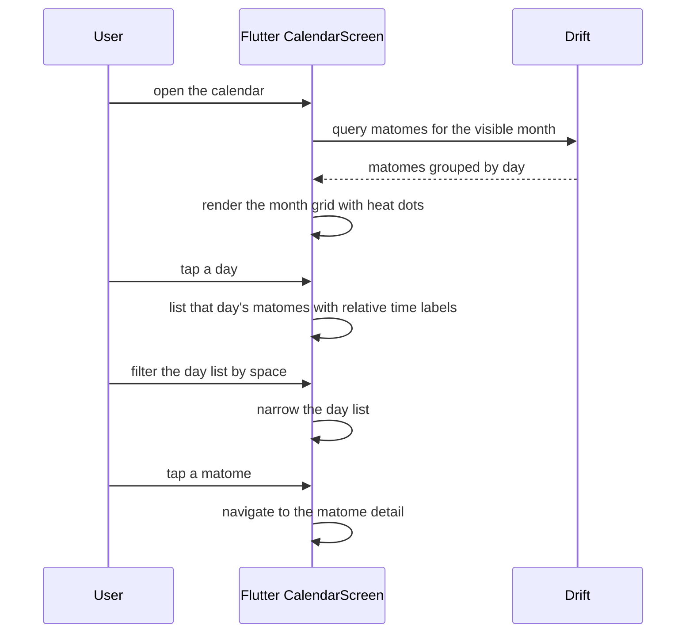

# UC-09 — View Calendar

> Part of the [Matome use-case catalog](../use-cases.md). Foundations:
> [PRD](../internal/prd.md) · [Architecture](../internal/architecture.md) ·
> [Requirements](../internal/requirements.md).

## Summary
A User opens a month grid where days that have Matomes show a heat dot. The User
navigates to the previous or next month, taps a day to list that day's Matomes
(with relative time labels), and can narrow the day list by Space. Tapping a
Matome opens it (UC-04). The calendar is a read-only discovery surface over the
local Drift mirror — it issues no writes.

## Actors
- **Primary:** User — browses the month grid, opens days, filters, and navigates to a Matome.
- **Secondary:** None — the calendar reads only the local mirror.

## Preconditions
- The User is signed in (owner-scoped session).
- The Calendar tab is enabled (`FeatureFlags.calendar`).

## Main flow
1. The User opens `/calendar`.
2. The User sees a month grid with heat dots on days that have Matomes, and navigates between months.
3. The User taps a day and sees the list of that day's Matomes with relative time labels.
4. The User optionally filters the day list by Space.
5. The User taps a Matome and is navigated to `/matome/:id` (UC-04).

## Alternate & exception flows
- **Empty day** — a day with no Matomes shows no heat dot.
- **Space filter** — applying a Space filter narrows the day list to that Space's Matomes.

## Sequence

## Requirements satisfied
| Requirement | What it covers |
|---|---|
| **FR-CAL-1** | A month grid shows heat dots on days that have Matomes, with prev/next month navigation. |
| **FR-CAL-2** | Tapping a day lists that day's Matomes with relative time labels. |
| **FR-CAL-3** | The day list can be filtered by Space, and tapping a Matome opens it. |
| **NFR-SYNC-1** | The calendar reads the local mirror kept in sync with Core. |
| **FR-AUTH-7** | The calendar is owner-scoped; no cross-owner reads. |

## Code anchors
- `apps/flutter/lib/features/calendar/calendar_screen.dart` — `CalendarScreen`: month grid, heat dots, day list, Space filter.
- `apps/flutter/lib/app/router.dart` — route `/calendar`.
