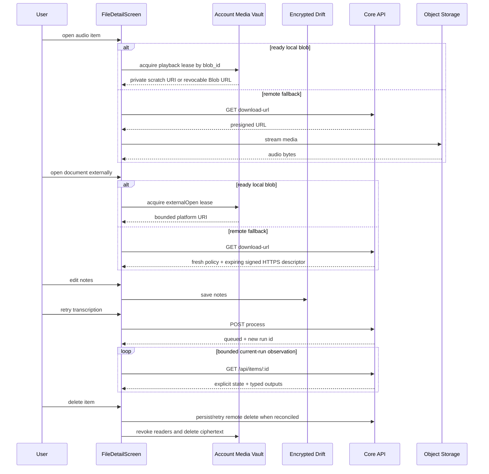

# UC-10 — Read & play item

> Part of the [Matome use-case catalog](../use-cases.md). Foundations:
> [PRD](../internal/prd.md) · [Architecture](../internal/architecture.md) ·
> [Requirements](../internal/requirements.md).

## Summary
A User opens an item's detail screen, which routes by media type. Local media is
addressed only by opaque `blob_id`: audio playback, image preview/fullscreen,
document external-open, and export acquire purpose- and TTL-bound Vault leases.
Native leases expose private temporary scratch files; Web leases expose
revocable Blob URLs. If an audio blob is missing but a reconciled Core row
exists, playback may use a fresh presigned Core download URL. The User reads
machine outputs and edits user-owned notes independently. A standalone
plain-text Item can be edited or deleted offline while durable sync reconciles
later. Failed processing can be retried as a new Core run while prior successful
output remains visible. Video has a canonical routed detail, but currently shows
only a static availability header: there is no video lease/player or AI dispatch.

## Actors
- **Primary:** User reading or playing back a captured item.
- **Secondary:** Account Media Vault (local lease authority), Core API (issues
  remote descriptors, re-enqueues processing, converges deletion), and Object
  Storage (serves remote media through a presigned URL).

## Preconditions
- User is signed in.
- The account Vault is unlocked for local media access.
- An item exists (reached from Matome UC-04 or Files UC-08).
- For cloud playback the item has a Core row.

## Main flow
1. User taps an Item and the app routes by media type:
   `/items/audio/:id`, `/items/image/:id`, `/items/document/:id`,
   `/items/video/:id`, or `/items/text/:id`.
2. For audio with a ready local blob, the player acquires a playback lease by
   `blob_id`; otherwise, when a Core row exists, it fetches a fresh presigned URL
   and streams remotely. The screen shows duration, bitrate, and size.
3. Image inline/fullscreen views acquire preview leases. Native uses bounded
   private scratch files; Web uses Blob URLs that are revoked on dispose.
4. For documents with a ready local blob, approved types acquire an
   `externalOpen` lease before handoff to the platform. When no local blob is
   available, supported paths request a fresh owner-scoped HTTPS descriptor.
5. Video detail renders a static file header/title/availability state. It does
   not instantiate `AudioPlayerBar`, acquire a video playback lease, or request AI.
6. User reads available machine-generated outputs and edits user-owned notes.
7. User retries failed processing; Core creates a new run and the client observes
   that run through bounded owner-scoped polling.
8. For text, an edit commits the body to Drift and durable queue work before any
   network request. Core reconciliation uses `PATCH /api/items/:id/text` with
   `expected_source_revision`; processing outputs/status remain separate from
   body and sync status.
9. User may export a local file from the Files surface, creating an explicitly
   user-owned copy outside
   Vault lifecycle.
10. User deletes the item or moves it to a Space. Deletion commits a tombstone,
   revokes/awaits leases, converges remote deletion when needed, then removes
   Vault ciphertext and final local metadata.

## Alternate & exception flows
- Editing notes and leaving with unsaved changes triggers a leave guard before navigating away.
- A failed transcription surfaces the failure and offers the retry path; the client never processes media locally.
- Image items open in a fullscreen viewer. Documents show metadata plus external action state, never an internal preview.
- HTML/SVG/XML is attachment-only with an active-content warning; unknown types are download-only.
- Executables and scripts are rejected on import and are never handed to a launcher.
- A missing local audio blob can fall back to Core when a verified remote copy
  exists. Complete user-facing clear-local-copy and all-media rehydrate flows
  are not yet exposed; image/document consumers must not imply otherwise.
- Closing the view, lease expiry, logout, account switch, or Vault lock revokes
  local plaintext access and removes native scratch files/revokes Web Blob URLs.
- Video import/upload/export is supported as file lifecycle behavior, but the
  current video detail is not a player and exposes no generated output.
- Legacy `/inbox/:id`, `/calendar/:id`, and `/spaces/recording/:id` links first
  look up the owner-scoped local parent Matome and redirect to `/matome/:id`.
  If owner/row/parent resolution fails, the legacy recording-detail fallback may
  render; it does not query Core to discover a missing relationship.
- A stale text edit/delete receives `409 version_conflict`; the app preserves the
  local body or deletion intent and shows an explicit sync conflict. It does not
  relabel the conflict as processing failure or silently overwrite newer Core data.

## Sequence

## Requirements satisfied
| Requirement | What it covers |
|---|---|
| **FR-ITM-1** | Open an audio item and play/pause/seek through a local Vault playback lease or presigned remote URL, with duration/bitrate/size. |
| **FR-ITM-2** | Read the machine-generated transcript (read-only). |
| **FR-ITM-3** | Edit the item's user-owned notes behind a leave guard. |
| **FR-ITM-4** | Retry failed processing as a new run and observe it through bounded current-run polling. |
| **FR-ITM-5** | View an image item inline and fullscreen through a revocable Vault preview lease. |
| **FR-ITM-6** | View document metadata and safely open/export it externally through a local Vault lease or fresh remote descriptor, without an internal renderer. |
| **FR-ITM-7** | Delete through tombstone-first remote/Vault convergence and move an item to a Space. |
| **FR-ITM-8** | Edit/delete standalone text locally first, then reconcile durable revision-guarded work with explicit conflicts. |
| **FR-ITM-9** | Open a routed static video file detail; video supports upload/export but no in-app playback or AI dispatch today. |
| **FR-ING-7** | Terminal status is observed through bounded owner-scoped polling; client timeout is non-authoritative. |
| **FR-ING-8** | Retry re-enqueues server-side; the client never processes media locally. |
| **NFR-SEC-2** | Object storage is reached only via short-lived presigned URLs. |
| **NFR-SEC-6** | Local plaintext access is purpose-bound, time-bounded, revocable, and never represented by durable Item paths. |
| **NFR-SYNC-1** | The UI watches the local DB; edits succeed offline and sync in the background. |

## Code anchors
- `apps/flutter/lib/features/details/file_detail_screen.dart` — `FileDetailScreen`: the media-typed detail host (playback, transcript, notes, leave guard, retry/delete/move).
- `apps/flutter/lib/features/details/details_controller.dart` — `delete`: removes the Drift row and, when present, the Core row.
- `apps/flutter/lib/core/vault/vault_lease_image.dart` — revocable local image preview/fullscreen leases.
- `apps/flutter/lib/core/vault/vault_export_service.dart` — explicit export outside Vault ownership.
- `apps/flutter/lib/features/items/item_deletion_service.dart` — tombstone-first deletion and lease-safe ciphertext cleanup.
- `apps/flutter/lib/app/router.dart` — audio/image/document/video/text Item routes
  plus parent-Matome compatibility redirects and legacy fallbacks.
- `apps/flutter/lib/features/items/text_item_host.dart` — standalone body editing/deletion, durable sync state, separate AI retry/status/summary rendering.
- `apps/flutter/lib/features/documents/document_open_service.dart` — Vault/remote fallback, HTTPS/expiry checks, and popup-safe external launch orchestration.
- `services/api/lib/matome_api/content/document_open_policy.ex` — filename/MIME classification and signed response override policy.
- `services/api/lib/matome_api_web/router.ex` — owner-scoped Item download, process, show, and delete routes.
