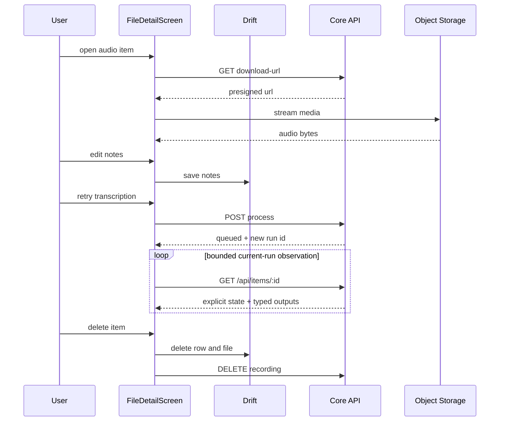

# UC-10 — Read & play item

> Part of the [Matome use-case catalog](../use-cases.md). Foundations:
> [PRD](../internal/prd.md) · [Architecture](../internal/architecture.md) ·
> [Requirements](../internal/requirements.md).

## Summary
A User opens an item's detail screen, which routes by media type. For audio, the screen plays/pauses/seeks either a local file or a presigned Core download URL, exposing duration, bitrate and size; the User reads the machine-generated transcript (read-only) and edits user-owned notes behind an unsaved-changes leave guard. Failed processing can be retried as a new Core run while prior successful output remains visible; the client observes only that run through bounded polling. The item can be deleted (removing the on-disk file, the Drift row and the Core row) or moved to a Space. Image and document Items render their typed outputs when available.

## Actors
- **Primary:** User reading or playing back a captured item.
- **Secondary:** Core API (issues the presigned download URL, re-enqueues processing, deletes the Core row); Object Storage (serves the media via the presigned URL).

## Preconditions
- User is signed in.
- An item exists (reached from Matome UC-04 or Files UC-08).
- For cloud playback the item has a Core row.

## Main flow
1. User taps an item and the app routes by media type: `/recording/detail/:id` for audio, `/recording/image/:id` for image, `/recording/document/:id` for document.
2. For audio, the screen plays a local file when present, otherwise fetches a presigned download URL from Core and streams it; it shows duration, bitrate and size.
3. User reads the read-only machine-generated transcript and edits the user-owned notes.
4. User retries failed processing; Core creates a new run and the client observes that run through bounded owner-scoped polling.
5. User deletes the item (on-disk file plus Drift row plus Core row) or moves it to a Space.

## Alternate & exception flows
- Editing notes and leaving with unsaved changes triggers a leave guard before navigating away.
- A failed transcription surfaces the failure and offers the retry path; the client never processes media locally.
- Image items open in a fullscreen viewer; document items are metadata-only (name, size, type).

## Sequence

## Requirements satisfied
| Requirement | What it covers |
|---|---|
| **FR-ITM-1** | Open an audio item and play/pause/seek a local file or presigned URL, with duration/bitrate/size. |
| **FR-ITM-2** | Read the machine-generated transcript (read-only). |
| **FR-ITM-3** | Edit the item's user-owned notes behind a leave guard. |
| **FR-ITM-4** | Retry failed processing as a new run and observe it through bounded current-run polling. |
| **FR-ITM-5** | View an image item inline and fullscreen. |
| **FR-ITM-6** | View a document item's metadata (name, size, type). |
| **FR-ITM-7** | Delete an item (on-disk file + Drift row + Core row) and move an item to a Space. |
| **FR-ING-7** | Terminal status is observed through bounded owner-scoped polling; client timeout is non-authoritative. |
| **FR-ING-8** | Retry re-enqueues server-side; the client never processes media locally. |
| **NFR-SEC-2** | Object storage is reached only via short-lived presigned URLs. |
| **NFR-SYNC-1** | The UI watches the local DB; edits succeed offline and sync in the background. |

## Code anchors
- `apps/flutter/lib/features/details/file_detail_screen.dart` — `FileDetailScreen`: the media-typed detail host (playback, transcript, notes, leave guard, retry/delete/move).
- `apps/flutter/lib/features/details/details_controller.dart` — `delete`: removes the Drift row and, when present, the Core row.
- `apps/flutter/lib/app/router.dart` — routes `/recording/detail/:id`, `/recording/image/:id`, `/recording/document/:id`.
- `services/api/lib/matome_api_web/router.ex` — owner-scoped Item download, process, show, and delete routes.
