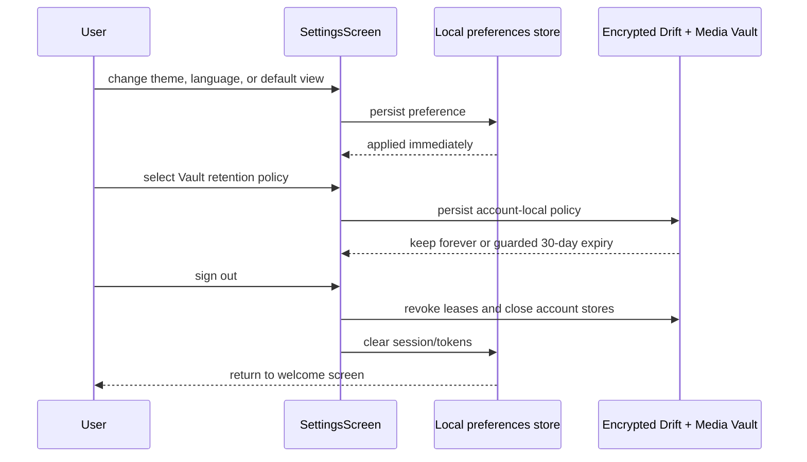

# UC-11 — Configure preferences

> Part of the [Matome use-case catalog](../use-cases.md). Foundations:
> [PRD](../internal/prd.md) · [Architecture](../internal/architecture.md) ·
> [Requirements](../internal/requirements.md).

## Summary
A User opens the settings screen and adjusts grouped preferences: theme mode
(Light / Dark / System), language (English / 日本語), default views, reading-pane
behavior, and the account-local Vault retention policy. Retention defaults to
`keep_forever`. The opt-in 30-day policy can collect only unreferenced,
remote-verified blobs after expiry; it does not evict files still referenced by
live Items and is not a user-facing cloud-only transition. The screen also shows
the signed-in email and offers sign-out, which closes the account Vault before
returning to the welcome screen (UC-01).

Reading-pane settings are independent for Inbox, Files, Spaces, and Contacts.
Each defaults to `onClick` and can be `always`, `onClick`, or `off`; they affect
the shared expanded master-detail layout only when
`FeatureFlags.masterDetailLayout` is enabled. Development builds may also expose
a God Mode custom-Core-host control behind `FeatureFlags.godMode`; it is dark in
the end-user configuration.

## Actors
- **Primary:** User configuring their app preferences.
- **Secondary:** Account Media Vault and encrypted Drift for retention policy
  enforcement; sign-out closes the Vault and clears the session (UC-01).

## Preconditions
- User is signed in.
- The account Vault is unlocked and ready.

## Main flow
1. User opens settings at `/inbox/settings`.
2. User changes theme, language, default Inbox/Files view, or reading-pane
   behavior; each change is persisted locally and applied immediately.
3. For each of Inbox, Files, Spaces, and Contacts, the User chooses `always`,
   `onClick`, or `off`. The mode controls expanded-width pane behavior when the
   master-detail feature is compiled in; compact/medium layouts still navigate.
4. User keeps the default `keep_forever` policy or explicitly chooses removal
   of eligible local files 30 days after verified upload.
5. User views the signed-in email.
6. User signs out, which routes to the Vault-aware logout flow (UC-01).

## Alternate & exception flows
- Persisted preferences survive an app restart and are reapplied on launch.
- The expiry policy preserves referenced, local-only, unknown, mismatched,
  actively leased, or active-work blobs. Collection decisions are recorded.
- Changing retention does not delete exported copies and does not expose the
  not-yet-complete clear-local-copy/rehydrate product flow.
- With `masterDetailLayout` disabled, pane choices remain persisted but do not
  alter the legacy collection layouts.
- In a `godMode` build, the User can choose a preset/custom Core base URL. This
  is an operational development surface, not an end-user cloud/account setting.
- Signing out revokes Vault access, closes account stores, clears the session,
  and returns the User to the welcome screen.

## Sequence

## Requirements satisfied
| Requirement | What it covers |
|---|---|
| **FR-PRF-1** | Set theme mode (Light / Dark / System), persisted. |
| **FR-PRF-2** | Set language (English / 日本語), persisted. |
| **FR-PRF-3** | Set default Inbox view (Cards / Table) and Files view (Grid / Table), persisted. |
| **FR-PRF-4** | Sign out from settings (shows the signed-in email). |
| **FR-PRF-5** | Configure account-local Vault retention: `keep_forever` by default or guarded 30-day expiry for eligible unreferenced remote-verified blobs. |
| **FR-PRF-6** | Configure `always`, `onClick`, or `off` independently for Inbox, Files, Spaces, and Contacts reading panes. |
| **FR-DEV-1** | In `godMode` builds only, configure the runtime Core host through the guarded developer surface. |
| **FR-AUTH-4** | Sign out invalidates the token client-side and clears the session. |
| **NFR-UX-3** | Theme tokens originate in Figma and are bound as Flutter `ThemeExtension`s. |
| **NFR-UX-4** | The app is fully localized (en / ja) via slang. |

## Code anchors
- `apps/flutter/lib/app/screens/settings_screen.dart` — `SettingsScreen`: theme,
  language, default-view, reading-pane, retention, account, and sign-out controls.
- `apps/flutter/lib/core/i18n/locale_controller.dart` — `localeControllerProvider`: the persisted language preference.
- `apps/flutter/lib/core/vault/vault_retention_service.dart` — account policy persistence, reconciliation, guarded collection, and decision recording.
- `apps/flutter/lib/core/settings/reading_pane.dart` — per-surface persisted
  reading-pane modes and `onClick` default.
- `apps/flutter/lib/features/dev/god_mode_host.dart` — build-time guarded runtime
  host controls for development configurations.
- `apps/flutter/lib/app/router.dart` — route `/inbox/settings`.
