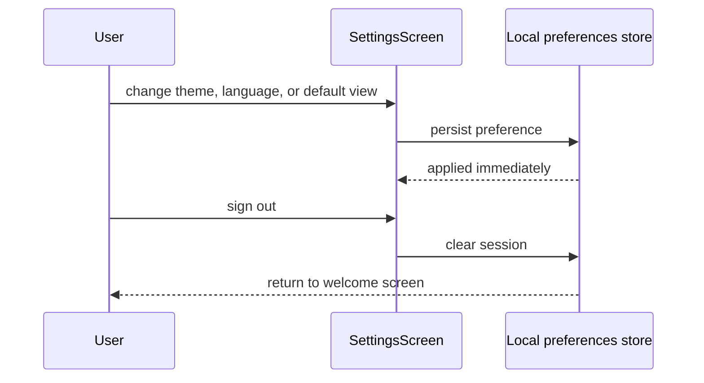

# UC-11 — Configure preferences

> Part of the [Matome use-case catalog](../use-cases.md). Foundations:
> [PRD](../internal/prd.md) · [Architecture](../internal/architecture.md) ·
> [Requirements](../internal/requirements.md).

## Summary
A User opens the settings screen and adjusts grouped preferences: theme mode (Light / Dark / System), language (English / 日本語), the default Inbox view (Cards / Table) and the default Files view (Grid / Table). Each change is persisted locally and applied immediately. The screen also shows the signed-in email and offers a sign-out action, which clears the session and returns to the welcome screen (see UC-01).

## Actors
- **Primary:** User configuring their app preferences.
- **Secondary:** None — preferences are stored locally; sign-out clears the session (see UC-01).

## Preconditions
- User is signed in.

## Main flow
1. User opens settings at `/inbox/settings`.
2. User changes the theme, language, default Inbox view, or default Files view; each change is persisted locally and applied immediately.
3. User views the signed-in email.
4. User signs out, which routes to the logout flow (UC-01).

## Alternate & exception flows
- Persisted preferences survive an app restart and are reapplied on launch.
- Signing out clears the session and returns the User to the welcome screen.

## Sequence

## Requirements satisfied
| Requirement | What it covers |
|---|---|
| **FR-PRF-1** | Set theme mode (Light / Dark / System), persisted. |
| **FR-PRF-2** | Set language (English / 日本語), persisted. |
| **FR-PRF-3** | Set default Inbox view (Cards / Table) and Files view (Grid / Table), persisted. |
| **FR-PRF-4** | Sign out from settings (shows the signed-in email). |
| **FR-AUTH-4** | Sign out invalidates the token client-side and clears the session. |
| **NFR-UX-3** | Theme tokens originate in Figma and are bound as Flutter `ThemeExtension`s. |
| **NFR-UX-4** | The app is fully localized (en / ja) via slang. |

## Code anchors
- `apps/flutter/lib/app/screens/settings_screen.dart` — `SettingsScreen`: theme/language/default-view controls, signed-in email, and sign-out.
- `apps/flutter/lib/core/i18n/locale_controller.dart` — `localeControllerProvider`: the persisted language preference.
- `apps/flutter/lib/app/router.dart` — route `/inbox/settings`.
