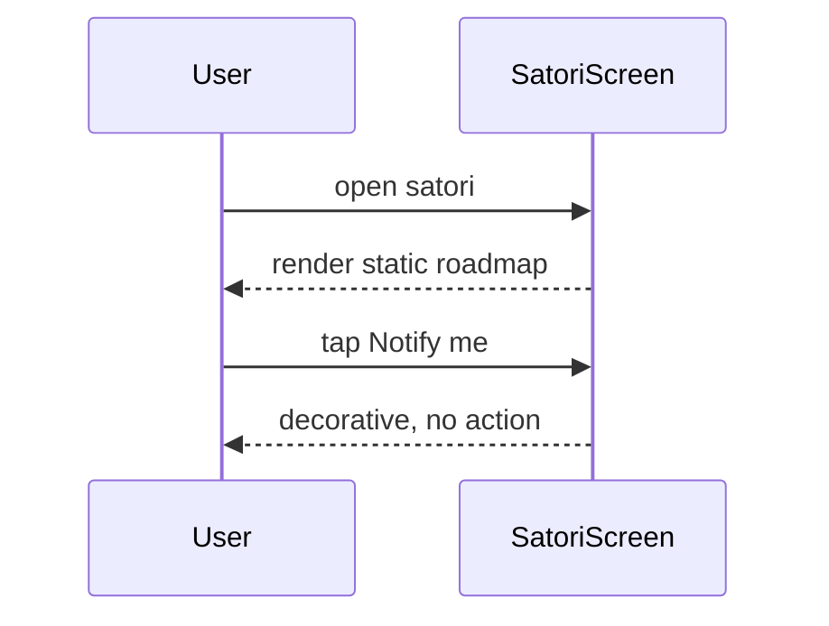

# UC-12 — View AI roadmap (Satori)

> Part of the [Matome use-case catalog](../use-cases.md). Foundations:
> [PRD](../internal/prd.md) · [Architecture](../internal/architecture.md) ·
> [Requirements](../internal/requirements.md).

## Summary
Satori is an informational roadmap screen available only in the legacy-shell
configuration. It shows planned AI feature status alongside a decorative
“Notify me” action. No live AI interaction ships. In the configured primary app,
`FeatureFlags.newNavShell` is enabled, the Satori branch is omitted, and a
`/satori` deep link safety-redirects to `/inbox`.

## Actors
- **Primary:** User reading the AI roadmap.
- **Secondary:** None.

## Preconditions
- User is signed in.
- The Satori tab is enabled (`FeatureFlags.satori`) and not compiled out (`FeatureFlags.newNavShell` OFF).

## Main flow
1. User opens `/satori`.
2. User reads the roadmap items and their status (shipped / in progress / next).
3. The "Notify me" CTA is decorative and performs no real action today.

## Alternate & exception flows
- Under `FeatureFlags.newNavShell` the Satori shell branch is not registered and
  `/satori` or a subpath safety-redirects to Inbox instead of showing no-match.
- No backend or AI call is made; the roadmap is rendered statically.

## Sequence

## Requirements satisfied
| Requirement | What it covers |
|---|---|
| **FR-SAT-1** | In legacy-shell builds, view the static roadmap; in the primary new-shell build, `/satori` safely redirects to Inbox. |

## Code anchors
- `apps/flutter/lib/app/screens/satori_screen.dart` — `SatoriScreen`: the static roadmap and decorative "Notify me" CTA.
- `apps/flutter/lib/app/router.dart` — route `/satori`.
- `apps/flutter/lib/core/config/feature_flags.dart` — `FeatureFlags.satori`, `FeatureFlags.newNavShell`: the gates (Satori compiled out under the new nav shell).
