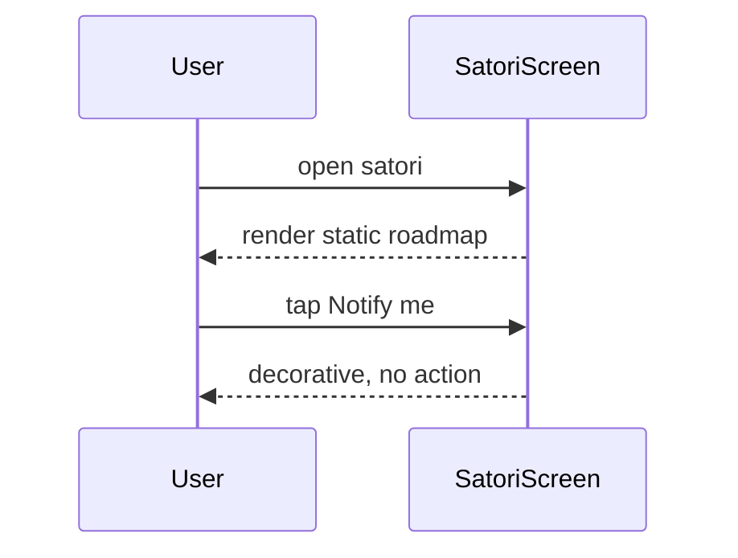

# UC-12 — View AI roadmap (Satori)

> Part of the [Matome use-case catalog](../use-cases.md). Foundations:
> [PRD](../internal/prd.md) · [Architecture](../internal/architecture.md) ·
> [Requirements](../internal/requirements.md).

## Summary
Satori is an informational roadmap screen. It shows the status (shipped / in progress / next) of planned AI features — Search, Q&A over content, Email summaries and Meeting insights — alongside a decorative "Notify me" call to action. No live AI interaction ships today: the screen is a static roadmap placeholder rendered entirely client-side, feature-flagged behind `FeatureFlags.satori` and compiled out under `FeatureFlags.newNavShell`.

## Actors
- **Primary:** User reading the AI roadmap.
- **Secondary:** None.

## Preconditions
- User is signed in.
- The Satori tab is enabled (`FeatureFlags.satori`) and not compiled out (`FeatureFlags.newNavShell` OFF).

## Main flow
1. User opens `/satori`.
2. User reads the roadmap items and their status (shipped / in progress / next).
3. The "Notify me" CTA is decorative and performs no real action today.

## Alternate & exception flows
- Under `FeatureFlags.newNavShell` the Satori route is compiled out of the binary.
- No backend or AI call is made; the roadmap is rendered statically.

## Sequence

## Requirements satisfied
| Requirement | What it covers |
|---|---|
| **FR-SAT-1** | View the Satori roadmap (shipped / in-progress / next for Search, Q&A, Email summaries, Meeting insights); informational only, no real AI interaction ships today. |

## Code anchors
- `apps/flutter/lib/app/screens/satori_screen.dart` — `SatoriScreen`: the static roadmap and decorative "Notify me" CTA.
- `apps/flutter/lib/app/router.dart` — route `/satori`.
- `apps/flutter/lib/core/config/feature_flags.dart` — `FeatureFlags.satori`, `FeatureFlags.newNavShell`: the gates (Satori compiled out under the new nav shell).
